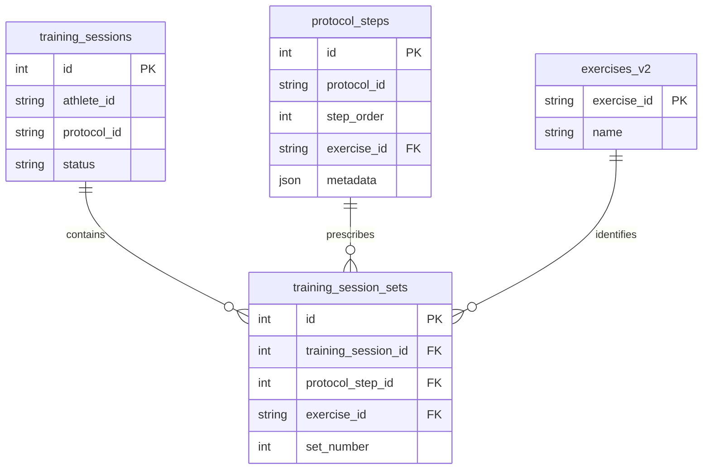
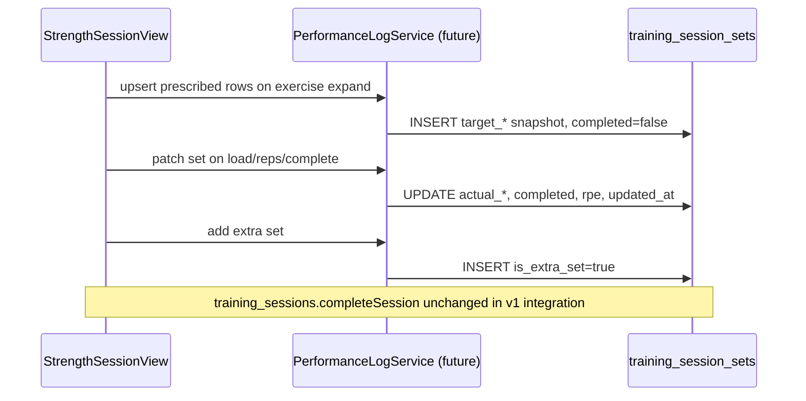

# 35 — Strength Performance Logging

**Status:** Design (v1)  
**Related:** `33_Execution_Engine.md`, `34_Protocol_Builder.md`, `StrengthSessionView`, `training_sessions`, `protocol_steps`, `exercises_v2`

---

## 1. Purpose

Strength Performance Logging records **every performed set** during a structured strength session so Cohort can:

1. Show athletes their **previous performance** for the same exercise before they lift.
2. Detect **progressive overload** over time (load, reps, volume, RPE trends).
3. Preserve an auditable history of what was programmed vs what was actually performed.

This document defines the v1 data model and behaviour rules. It does **not** implement UI, repositories, or migrations.

### Design principles

- **One row per performed set** — prescribed and extra sets are both stored; extras are flagged.
- **Session-scoped writes** — all rows belong to a `training_sessions` record.
- **Exercise-linked history** — previous-performance lookup is primarily keyed by `exercise_id`, not protocol title.
- **Prescribed snapshot** — target values are copied onto the row at log time so later protocol edits do not rewrite history.
- **Actual values only when known** — incomplete or skipped sets may exist with `completed = false`.
- **No change to session completion** — v1 logging is additive; `training_sessions.completed_at` behaviour stays as-is until a later integration milestone.

---

## 2. Entity relationships



### `training_sessions`

Parent execution record. A strength session in progress or completed has exactly one `training_sessions` row.

| Relationship | Cardinality | Notes |
|--------------|-------------|-------|
| `training_sessions` → `training_session_sets` | 1 : many | All set rows for one workout share `training_session_id`. |
| Cascade on delete | — | **v1 recommendation:** `ON DELETE CASCADE` from `training_sessions` so abandoned test sessions do not orphan set rows. |

Set rows should only be written while `training_sessions.status` is `in_progress` or at completion time. Historical rows remain after `completed`.

### `protocol_steps`

Links a performed set back to the programmed step in the protocol.

| Field used | Role |
|------------|------|
| `protocol_steps.id` | Stored as `protocol_step_id` on each set row. |
| `protocol_steps.exercise_id` | Denormalised onto the set row as `exercise_id` for fast previous-performance queries. |
| `protocol_steps.metadata` | Source of prescribed `sets`, `reps`, `load`, `rest` at session start. |

**Why denormalise `exercise_id`?**  
Previous-performance lookup is exercise-centric. Storing `exercise_id` on the set row avoids joining through `protocol_steps` for every history query.

**Protocol versioning:**  
If a coach edits `protocol_steps` after an athlete has logged sets, historical rows keep their snapshotted `target_*` values. The `protocol_step_id` still identifies which step slot was performed.

### `exercises_v2`

Canonical movement identity.

| Field | Role |
|-------|------|
| `exercises_v2.exercise_id` | FK on `training_session_sets.exercise_id`. |
| `exercises_v2.name` | Display only; never stored on the set row. |

Previous performance is grouped by `exercise_id` + `athlete_id` (athlete derived from parent `training_sessions`).

---

## 3. Prescribed vs actual values

| Concept | Storage | Source at log time |
|---------|---------|-------------------|
| Target reps | `target_reps` (text) | `protocol_steps.metadata.reps` — may be `8`, `8-10`, `AMRAP`. |
| Actual reps | `actual_reps` (text) | Athlete entry at set completion. |
| Target load | `target_load_value` + `target_load_unit` (optional v1) | Parsed from `protocol_steps.metadata.load` when present. |
| Actual load | `load_value` + `load_unit` | Athlete entry at set completion. |
| Set count slot | `set_number` | 1…N for prescribed; continues for extras. |
| Extra set flag | `is_extra_set` | `false` for programmed rows; `true` for athlete-added sets. |

### Parsing prescribed load

Protocol `metadata.load` is currently a free-text coach field (e.g. `60 kg`, `135 lb`, `RPE 8`, `BW`).  

**v1 rule:** best-effort parse into `target_load_value` (numeric) + `target_load_unit` (controlled vocabulary). If parsing fails, leave targets null and retain raw prescription only on the protocol step.

### Actual load vocabulary

| `load_unit` | Meaning |
|-------------|---------|
| `kg` | Kilograms |
| `lb` | Pounds |
| `bw` | Bodyweight (value = multiplier or % as documented in UI) |
| `rpe` | Load expressed as target RPE rather than mass |
| `unknown` | Athlete logged load text that could not be normalised |

---

## 4. Extra sets

Extra sets are athlete-initiated additions beyond the programmed prescription.

| Rule | Behaviour |
|------|-----------|
| Identification | `is_extra_set = true` |
| `set_number` | Monotonic within the exercise for that session (e.g. prescribed 1–3, extra 4). |
| `protocol_step_id` | Same step as the parent exercise. |
| Persistence | Saved only when `completed = true` **or** `has_started_data` equivalent (load/reps/note entered). Empty abandoned extras are not written. |
| Progressive overload | Included in session volume totals; excluded from “prescribed completion” metrics. |
| Deletion | Removing an extra set in UI deletes the corresponding row (if already persisted) or never inserts it. |

---

## 5. RPE

| Field | Type | Range | Required |
|-------|------|-------|----------|
| `rpe` | `smallint` | 1–10 | Optional v1 |

**Semantics:** Rate of Perceived Exertion after the set — how hard the set felt.

- `null` — athlete did not record RPE.
- Used in progressive overload heuristics (see §9).
- Not a replacement for `load_value`; both may coexist.

---

## 6. Athlete notes

| Field | Type | Limit |
|-------|------|-------|
| `athlete_note` | `text` | 500 chars recommended |

Free-text per set: pain, tempo issues, equipment constraints, “left shoulder tight”, etc.

- Optional.
- Not shown to coaches in v1 athlete UI unless a later Coach Studio feature requires it.

---

## 7. Rest timer behaviour

Rest timers are **session-execution UI**, not persisted in `training_session_sets` for v1.

| Aspect | v1 behaviour |
|--------|--------------|
| Source | `protocol_steps.metadata.rest` per step |
| Display | Countdown between sets inside `StrengthSessionView` |
| Persistence | **Not stored** — no `rest_seconds_actual` column in v1 |
| Completion | Timer start/skip events are not logged |

### Future scope (post-v1)

- `rest_prescribed_seconds` snapshot per step
- `rest_actual_seconds` per set gap
- Auto-start rest on set completion

---

## 8. Previous-performance lookup

### Primary query (v1)

> “What did this athlete last do for this exercise?”

```sql
SELECT tss.*
FROM training_session_sets tss
JOIN training_sessions ts ON ts.id = tss.training_session_id
WHERE ts.athlete_id = :athlete_id
  AND tss.exercise_id = :exercise_id
  AND tss.completed = true
  AND ts.status = 'completed'
  AND ts.id != :current_training_session_id  -- exclude in-progress session
ORDER BY ts.completed_at DESC, tss.set_number ASC
LIMIT :limit;
```

### Secondary query — same protocol step

Useful when exercise swaps are rare and step slot matters:

```sql
-- Same as above, plus:
AND tss.protocol_step_id = :protocol_step_id
```

### Presentation rules (v1)

When an athlete opens an exercise in `StrengthSessionView`:

1. Fetch last completed session’s sets for `exercise_id`.
2. Show summary card: **last load**, **last reps**, **date**, **set count**.
3. Per prescribed set row, show ghost text: e.g. `Last: 60 kg × 8`.

### Index recommendation

```sql
CREATE INDEX idx_training_session_sets_exercise_history
  ON training_session_sets (exercise_id, completed, training_session_id);

CREATE INDEX idx_training_sessions_athlete_completed
  ON training_sessions (athlete_id, status, completed_at DESC);
```

---

## 9. Progressive overload rules

Cohort detects overload from **completed** sets on **completed** sessions.

### Set-level signals

| Signal | Condition | Interpretation |
|--------|-----------|----------------|
| Load PR | `load_value` > previous max for same `exercise_id` at same `actual_reps` | Strength gain |
| Rep PR | `actual_reps` > previous max at same `load_value` (±2% tolerance) | Hypertrophy / capacity |
| Volume PR | Σ(`load_value` × `actual_reps`) for session exercise > previous | Total work increase |
| RPE drop | Same `load_value` + `actual_reps`, lower `rpe` than last time | Improved efficiency |
| Prescribed beat | `actual_reps` ≥ lower bound of `target_reps` at prescribed load | Session goal met |

### Exercise-level aggregation

For each `exercise_id` in a session:

```
top_set_load     = MAX(load_value) WHERE completed
top_set_reps     = reps at top_set_load
total_volume     = SUM(load_value * actual_reps)  -- numeric reps only
prescribed_done  = COUNT(*) WHERE completed AND NOT is_extra_set
```

### Athlete-facing v1 messaging

| Result | Copy example |
|--------|--------------|
| Load PR | “New top set: 62.5 kg × 8 (+2.5 kg)” |
| Matched last | “Matched last session: 60 kg × 8” |
| Below last | “Below last performance — review recovery or load” |

### Out of scope v1

- Automatic load suggestions for next session
- Fatigue-adjusted overload scoring
- Multi-exercise superset volume

---

## 10. Supabase schema — `training_session_sets`

### Table definition (proposed)

```sql
CREATE TABLE training_session_sets (
  id                  BIGSERIAL PRIMARY KEY,
  training_session_id BIGINT NOT NULL
                        REFERENCES training_sessions(id) ON DELETE CASCADE,
  protocol_step_id    BIGINT NOT NULL
                        REFERENCES protocol_steps(id) ON DELETE RESTRICT,
  exercise_id         TEXT NOT NULL
                        REFERENCES exercises_v2(exercise_id) ON DELETE RESTRICT,

  set_number          INTEGER NOT NULL CHECK (set_number > 0),

  -- Prescribed snapshot (copied at row creation)
  target_reps         TEXT,
  target_load_value   NUMERIC(10, 2),
  target_load_unit    TEXT,

  -- Actual performance
  actual_reps         TEXT,
  load_value          NUMERIC(10, 2),
  load_unit           TEXT,
  rpe                 SMALLINT CHECK (rpe IS NULL OR (rpe >= 1 AND rpe <= 10)),

  completed           BOOLEAN NOT NULL DEFAULT FALSE,
  is_extra_set        BOOLEAN NOT NULL DEFAULT FALSE,
  athlete_note        TEXT,

  created_at          TIMESTAMPTZ NOT NULL DEFAULT NOW(),
  updated_at          TIMESTAMPTZ NOT NULL DEFAULT NOW(),

  CONSTRAINT training_session_sets_unique_set
    UNIQUE (training_session_id, protocol_step_id, set_number, is_extra_set)
);
```

### Column notes

| Column | Required | Description |
|--------|----------|-------------|
| `id` | auto | Surrogate primary key. |
| `training_session_id` | yes | Parent workout. |
| `protocol_step_id` | yes | Programmed step slot. |
| `exercise_id` | yes | Movement identity for history queries. |
| `set_number` | yes | Display order within the exercise for this session. |
| `target_reps` | no | Snapshotted prescription. |
| `target_load_value` | no | Snapshotted numeric target load. |
| `target_load_unit` | no | Snapshotted load unit. |
| `actual_reps` | no | Performed reps (text for `8`, `8+2`, etc.). |
| `load_value` | no | Performed load numeric value. |
| `load_unit` | no | Performed load unit vocabulary. |
| `rpe` | no | Post-set RPE 1–10. |
| `completed` | yes | Athlete marked set complete. |
| `is_extra_set` | yes | Distinguishes programmed vs added sets. |
| `athlete_note` | no | Per-set free text. |
| `created_at` | auto | Insert timestamp. |
| `updated_at` | auto | Last mutation (load/reps edits during session). |

### Row lifecycle



### Mapping from `StrengthSetEntry` (in-memory v0.2)

| `StrengthSetEntry` | `training_session_sets` |
|--------------------|-------------------------|
| `setNumber` | `set_number` |
| `targetReps` | `target_reps` |
| `actualReps` | `actual_reps` |
| `load` (parsed) | `load_value` + `load_unit` |
| `completed` | `completed` |
| `isExtraSet` | `is_extra_set` |
| `localId` | not persisted — client-only |

---

## 11. V1 scope

### In scope (design + next implementation milestone)

- [ ] `training_session_sets` table migration
- [ ] `StrengthSetPerformance` Dart model
- [ ] `TrainingSessionSetRepository` (insert / update / list by session)
- [ ] Upsert set rows during `StrengthSessionView` execution
- [ ] Previous-performance read per `exercise_id`
- [ ] Basic overload flags (load PR, rep PR) in session summary

### Explicitly out of scope v1

- UI redesign beyond wiring existing set rows to persistence
- Changes to `completeSession()` flow or `training_sessions` schema
- Circuit / interval / recovery set logging
- Coach analytics dashboard
- Rest timer persistence
- Automatic programme progression
- Supabase RLS policies (document separately when auth lands)

---

## 12. Future scope

| Feature | Description |
|---------|-------------|
| Rest logging | `rest_actual_seconds` per set gap |
| Tempo tracking | `tempo_actual` per rep |
| Velocity / power | External device integrations |
| Session-level RPE | Whole-session sRPE |
| Coach review | Coach Studio view of athlete set history |
| Export | CSV / API for sports science workflows |
| Normalised load | e1RM estimation from submax sets |
| Programme auto-progression | Suggest next-session load from overload rules |

---

## 13. Open questions

1. **Unique constraint** — should `is_extra_set` be part of the unique key, or use a separate `extra_set_index`? Current proposal: include `is_extra_set` so prescribed set 3 and extra set 3 cannot collide.
2. **Partial sessions** — persist in-progress sets if athlete backgrounds the app? **v1 recommendation:** yes, upsert on each change while `in_progress`.
3. **Load parsing** — shared `LoadParser` utility vs inline in repository? **Recommendation:** shared utility in `lib/features/session/services/`.
4. **RLS** — athletes may only read/write their own session sets via `training_sessions.athlete_id`.

---

## 14. Related code (current)

| Artifact | Role today |
|----------|------------|
| `StrengthSetEntry` | In-memory set row (v0.2) |
| `StrengthSessionView` | Local execution UI — not yet wired to Supabase |
| `TrainingSessionRepository` | Session lifecycle only |
| `protocol_steps.metadata` | Prescription source (`sets`, `reps`, `load`, `rest`) |

This document is the source of truth until migrations and repositories are implemented.
