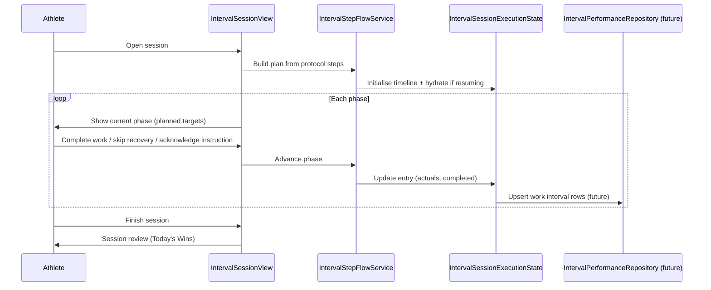
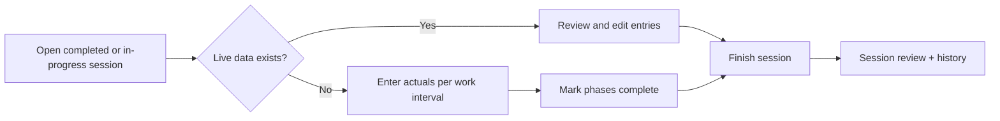
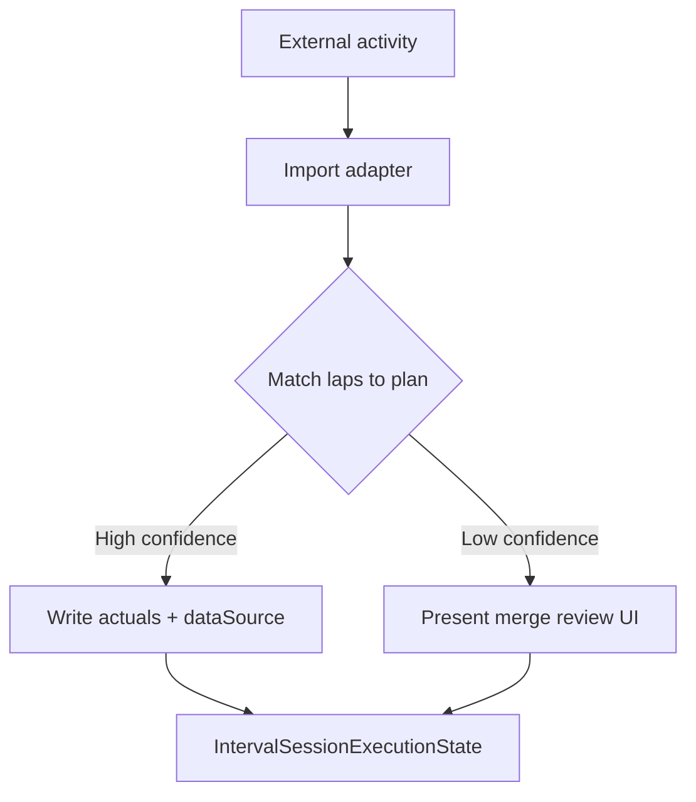
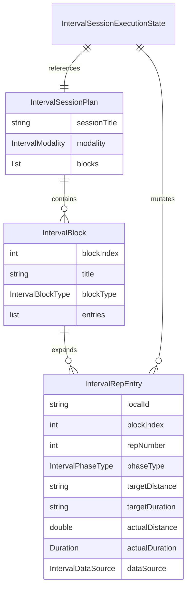

# 37 — Interval Execution Engine

**Status:** Design (v0.1)  
**Related:** `33_Execution_Engine.md`, `34_Protocol_Builder.md`, `35_Strength_Performance_Logging.md`, `SessionExecutionRouter`, `training_sessions`, `protocol_steps`

---

## 1. Purpose

The Interval Execution Engine records **every performed work interval** during structured interval sessions (running, cycling, rowing, skiing, and other modalities) so Cohort can:

1. Guide athletes through warm-up → work → recovery → cool-down with a clear phase model.
2. Show **previous performance** for comparable work intervals before effort begins.
3. Detect **observational progress** over time (pace, duration, distance, RPE, heart rate trends).
4. Preserve an auditable history of what was programmed vs what was actually performed.
5. Support **manual entry today** and **device import tomorrow** without redesigning the core model.

This document defines v0.1 architecture, behaviour, and Dart models. It does **not** implement UI, repositories, or database migrations.

### Design principles

- **Device-neutral core** — the execution model does not assume a watch, GPS, or heart-rate strap.
- **One timeline of phases** — warm-up, work, recovery, instruction, and cool-down are all `IntervalRepEntry` rows in a single ordered list.
- **Planned vs actual separation** — targets are coach prescription snapshots (text); actuals are normalized numerics when known.
- **Manual first, import later** — v1 is fully usable with thumb entry; `IntervalDataSource` marks provenance for future pipelines.
- **Session-scoped writes** — all persisted rows belong to a `training_sessions` record (future milestone).
- **Evidence over prescription** — progress language is observational, never prescriptive.
- **Reuse platform session lifecycle** — completion context, session review, early finish, and preview non-persistence mirror strength patterns without duplicating strength set logic.

---

## 2. Athlete workflows

### 2.1 Live interval execution

The primary workflow. The athlete opens a programmed interval session and moves through phases in order.



**Live execution steps:**

1. **Session overview** — full-session arc visible before and during execution (see §4).
2. **Phase focus** — current phase prominent; completed and upcoming phases visible but de-emphasised (see §5).
3. **Previous performance** — before each work phase, show last comparable effort when history exists (see §11).
4. **Work interval completion** — athlete enters or confirms actual distance, duration, pace, optional RPE and heart rate.
5. **Recovery interval** — countdown from prescribed recovery; skip or extend allowed; recovery compliance not scored in v1.
6. **Advance** — flow service moves `activeLocalId` to next incomplete phase.
7. **Finish** — when all required work is complete, or athlete ends early (see §10).

### 2.2 Post-session entry

For athletes who trained without live logging (watch-only, track session, or interrupted app use).



**Post-session rules (v1 design):**

- Only **work phases** require actual performance for a complete historical record. Recovery and instruction may remain unlogged.
- Athlete can backfill work intervals in timeline order or jump to incomplete work phases.
- `dataSource` remains `manual` unless values are merged from an import pipeline.
- Post-session entry uses the same `IntervalRepEntry` model as live execution — no parallel DTO.

---

## 3. Session structure

Interval sessions are compiled from `protocol_steps` into an **`IntervalSessionPlan`** containing ordered **`IntervalBlock`** groups.

### 3.1 Phase types

| Phase | `IntervalPhaseType` | Typical programming | Persisted in v1 |
|-------|----------------------|---------------------|---------------|
| Warm-up | `warmUp` | Easy jog, spin, ski, or row | Optional |
| Work interval | `work` | Distance, duration, or pace target | **Yes** |
| Recovery interval | `recovery` | Timed rest or easy jog | No (timer only) |
| Instruction | `instruction` | Brief coach note | No |
| Cool-down | `coolDown` | Easy aerobic close | Optional |

### 3.2 Block types

| Block | `IntervalBlockType` | Structure |
|-------|---------------------|-----------|
| Warm-up | `warmUp` | Single or multi-step warm-up phases |
| Repeated block | `repeated` | N × (work + recovery) cycles |
| Single work | `single` | One-off work phase (e.g. tempo continuous) |
| Cool-down | `coolDown` | Single or multi-step cool-down |
| Instruction | `instruction` | Non-effort acknowledgement step |

### 3.3 Repeated block expansion

A programmed step such as `6 × 400 m, rest 90 s` expands into:

```
work rep 1  →  recovery  →  work rep 2  →  recovery  →  …  →  work rep 6
```

- `repNumber` is 1-based within the block.
- Work entries carry `recoveryDuration` when recovery is prescribed inline.
- Recovery entries use `targetDuration` for the countdown prescription.
- The final work rep may omit recovery when no rest follows.

### 3.4 Modality neutrality

`IntervalModality` (`running`, `cycling`, `rowing`, `skiing`, `other`) affects **display defaults** only:

| Modality | Default pace display | Distance examples |
|----------|---------------------|-------------------|
| Running | min/km or min/mi | 400 m, 1 km |
| Cycling | W/kg, FTP %, or km/h | 5 km, 20 min |
| Rowing | /500 m | 500 m, 2 k |
| Skiing | min/km | 1 km, 3 km |
| Other | Coach text | Any |

The core model stores pace as **seconds per kilometre** internally; services format for modality at display time.

### 3.5 Mapping from protocol steps

| `protocol_steps` signal | Interval compilation |
|-------------------------|----------------------|
| `step_type: Run` | Work phase (or warm-up/cool-down by section/title heuristics) |
| `step_type: Rest` | Recovery phase |
| `step_type: Instruction` | Instruction phase |
| `metadata.distance` | `targetDistance` snapshot |
| `metadata.duration` | `targetDuration` snapshot |
| `metadata.pace` | `targetPace` snapshot when present |
| `metadata.intensity` | `targetIntensity` snapshot when present |
| `metadata.load` | `targetPace` when pace-like; otherwise `targetIntensity` |
| `notes` | `targetIntensity` when no explicit intensity metadata |
| `metadata.rest` | `recoveryDuration` on work entries; recovery `targetDuration` when expanded |
| `metadata.sets` / `repeats` / `rounds` | Repetition count for repeated block expansion |

Compilation is implemented by **`IntervalSessionPlanBuilder`**
(`lib/features/session/services/interval_session_plan_builder.dart`).

### 3.6 Compilation rules (v0.1)

#### Input

```dart
IntervalSessionPlan build({
  required Protocol protocol,
  required List<ProtocolStep> steps,
})
```

Steps are sorted by `step_order` before compilation. Protocol title is **not**
used for phase detection.

#### Phase detection priority

Detection uses `step_type`, `section`, `title`, and `display_style` only:

| Priority | Signal | `IntervalPhaseType` |
|----------|--------|---------------------|
| 1 | `step_type` or `display_style` is Instruction | `instruction` |
| 2 | `step_type` or `display_style` is Rest | `recovery` |
| 3 | Title contains recovery/rest interval keywords | `recovery` |
| 4 | Section or title indicates warm-up | `warmUp` |
| 5 | Section or title indicates cool-down | `coolDown` |
| 6 | `step_type` or `display_style` is Run | `work` |
| 7 | Exercise step with distance/duration/pace/intensity prescription | `work` |
| 8 | Any other step with aerobic prescription | `work` |
| 9 | Fallback | `instruction` |

#### Repeated work expansion

When a detected **work** step has `metadata.sets`, `metadata.repeats`, or
`metadata.rounds` greater than 1:

1. Create one `IntervalBlock` with `IntervalBlockType.repeated`.
2. Emit N work entries (`repNumber` 1…N).
3. When `metadata.rest` is present, insert a **recovery** entry after each work
   rep **except** the final rep.
4. Populate `recoveryDuration` on work entries 1…N−1 for overview display.

Example — RN-006 Classic Threshold:

| Order | Phase | Targets |
|-------|-------|---------|
| 1 | Warm-up | 10 min |
| 2 | Work rep 1 | 10 min · Threshold |
| 3 | Recovery | 2 min |
| 4 | Work rep 2 | 10 min · Threshold |
| 5 | Recovery | 2 min |
| 6 | Work rep 3 | 10 min · Threshold |
| 7 | Cool-down | 5 min |

#### Standalone recovery steps

A programmed `Rest` step becomes a recovery `IntervalRepEntry`. When it follows
work in the same main-set block, it appends to the current block rather than
starting a new one.

#### Block grouping

| Consecutive phases | Block type |
|--------------------|------------|
| Warm-up steps | `warmUp` |
| Expanded work + inline recoveries | `repeated` |
| Single work / recovery in same section | `single` (merged) |
| Cool-down steps | `coolDown` |
| Instruction steps | `instruction` |

#### Modality derivation

Centralised in `_deriveModality`. Priority:

1. `protocol.session_type == running` or `running_required == true` → `running`
2. Required/optional equipment or environment text → cycling / rowing / skiing
3. Step titles/types (`run`, `erg`, `ski`, etc.)
4. `session_type == intervals` → `running` (default for generic interval sessions)
5. Fallback → `other`

#### Validation

- Plan must contain **at least one** `IntervalPhaseType.work` entry.
- Throws `StateError` when steps are empty or no work phases are detected.
- Instruction-only steps are preserved but do not count as work.

#### Diagnostics

`IntervalSessionPlanBuilder.debugPrintPlan(plan)` logs modality, block count,
phase count, and each phase in order with target distance/duration/intensity.

Temporary Home debug hook: **Compile RN-006 Interval Plan** fetches `RN-006`
from Supabase and prints the compiled plan.

#### Planned value mapping

| Target field | Source |
|--------------|--------|
| `targetDistance` | `metadata.distance` |
| `targetDuration` | `metadata.duration` |
| `targetPace` | `metadata.pace`, or pace-like `metadata.load` |
| `targetIntensity` | `metadata.intensity`, `notes`, or non-pace `metadata.load` |
| `recoveryDuration` | `metadata.rest` on work entries before final rep |

---

## 4. Full-session overview behaviour

The overview is always available during execution (collapsed strip or expandable sheet).

**Shows:**

- Session title and modality
- Block list with completion fraction (e.g. `Main Set 4/6`)
- Total work phases completed vs total work phases
- Elapsed session time (from `training_sessions.started_at` — platform level)
- Early-end indicator when applicable

**Does not show in v1:**

- Predicted finish time
- Prescriptive pacing advice
- Compliance scores or red/green judgement

**Interaction:**

- Tapping a **completed** work phase opens read-only actuals.
- Tapping a **future** work phase is informational only — no skip-ahead completion in live mode (post-session entry excepted).
- Overview scroll position follows `activeLocalId` but does not auto-scroll aggressively during recovery timers.

---

## 5. Current / completed / upcoming phase display

### 5.1 Phase states

| State | Condition | UI emphasis |
|-------|-----------|-------------|
| **Current** | `activeLocalId` points to incomplete entry, or first incomplete | Primary card, timer controls, input fields |
| **Completed** | `entry.completed == true` | Compact summary: planned vs actual one-liner |
| **Upcoming** | Timeline index after current, not completed | Muted prescription preview |

Derived from `IntervalSessionExecutionState`:

- `currentPhase` — active or first incomplete
- `completedPhases` — filtered completed list
- `upcomingPhases` — entries after current, not completed

### 5.2 Work phase card (current)

- Title and rep label (`400 m — rep 3 of 6`)
- Planned: distance, duration, pace, intensity
- Previous performance summary (when available)
- Actual entry fields (manual v1)
- Optional RPE chips (1–10)
- Complete button

### 5.3 Recovery phase card (current)

- Prescribed recovery duration
- Countdown timer (start / pause / skip / +15 s)
- No persistence of actual rest in v1

### 5.4 Instruction / warm-up / cool-down

- Acknowledge and continue
- Optional note field on work-adjacent phases (future)

---

## 6. Planned vs actual values

### 6.1 Planned (targets)

Targets are **text snapshots** copied from protocol programming at plan build time:

| Field | Example | Notes |
|-------|---------|-------|
| `targetDistance` | `400 m` | As programmed |
| `targetDuration` | `3:00` | As programmed |
| `targetPace` | `4:30 / km` | As programmed |
| `targetIntensity` | `RPE 8`, `Z4`, `300 W` | Free-text intensity |
| `recoveryDuration` | `90 s` | On work entries when rest follows |

Targets are never overwritten by actuals. Protocol edits after a session do not rewrite historical snapshots (future DB: store on row at first write).

### 6.2 Actual (performed)

Actuals use **normalized numerics** when known:

| Field | Canonical unit | Entry methods (v1) |
|-------|----------------|-------------------|
| `actualDistance` | metres | Manual numeric entry |
| `actualDuration` | `Duration` | Manual entry or phase timer |
| `actualPace` | seconds per km | Calculated from distance + duration, or manual override |
| `averageHeartRate` | bpm | Manual optional; import later |
| `maxHeartRate` | bpm | Manual optional; import later |
| `rpe` | 1–10 integer | Manual optional chips |

**Pace calculation (service layer):**

```
actualPace = actualDuration.inSeconds / (actualDistance / 1000)
```

When only duration or only distance is known, pace may remain null — progress detection degrades gracefully.

### 6.3 Comparison display

Show planned and actual **side by side** without judgement language:

```
Planned   400 m · 4:30 / km
Actual    412 m · 4:22 / km
```

---

## 7. Manual vs imported performance data

### 7.1 Data source vocabulary

| `IntervalDataSource` | `dbValue` | Meaning |
|---------------------|-----------|---------|
| `manual` | `manual` | Athlete entered in Cohort |
| `importedGarmin` | `imported_garmin` | Merged from Garmin activity/lap |
| `importedStrava` | `imported_strava` | Merged from Strava segment/lap |
| `importedAppleHealth` | `imported_apple_health` | Merged from HealthKit workout |
| `other` | `other` | Other integration |

### 7.2 v1 behaviour

- All entries default to `manual`.
- Import pipelines are **out of scope** for v1 implementation but the field is required on every `IntervalRepEntry` now.

### 7.3 Future import merge rules

When multiple sources exist for one work phase:

1. **Imported values fill gaps** — manual entries are not overwritten unless athlete confirms.
2. **Provenance preserved** — changing a value after import resets `dataSource` to `manual` unless re-imported.
3. **Lap matching** — import services match external laps to `localId` / `protocol_step_id` + `repNumber` by time order and distance tolerance.
4. **Partial imports** — distance without HR is valid; heart rate fields remain null.

---

## 8. Future workout export

v0.1 designs for export without implementing it.

**Goal:** Send programmed session structure to devices before the athlete starts.

| Target | Export payload | Notes |
|--------|----------------|-------|
| Garmin | FIT workout steps or Connect API structured workout | Map work/recovery to device intervals |
| Apple Watch | `HKWorkoutConfiguration` + custom intervals via companion app | Requires native bridge |
| Wahoo / other | Vendor-specific | `IntervalModality` selects profile |

**Export DTO (future):** derived from `IntervalSessionPlan.timelineEntries` — not a separate programming model.

**Fields exported:**

- Phase type, duration, distance, intensity target
- Repetition structure
- Session title and modality

**Not exported in early integrations:**

- Previous performance (device-local)
- Cohort decision engine context

---

## 9. Future performance import

v0.1 designs for import without implementing it.

**Goal:** After an external workout, merge lap/segment data into `IntervalRepEntry` actuals.



| Source | Typical match key |
|--------|-------------------|
| Garmin | Activity laps ↔ work `repNumber` by order |
| Strava | Split/lap API ↔ distance tolerance |
| Apple Health | `HKWorkoutEvent` intervals ↔ phase timeline |

**Post-import:**

- Progress detection runs on merged actuals.
- History and Today's Wins treat imported rows identically to manual rows for display; provenance available for coach audit.

---

## 10. Resume and end-early behaviour

Mirrors structured strength session lifecycle. Reuses `training_sessions` completion context fields.

### 10.1 Resume

When `trainingSessionId` is provided and persisted rows exist (future repository):

1. `IntervalSessionHydrator` loads work interval rows.
2. Merges into `IntervalSessionExecutionState.entries` by `localId` / natural key.
3. `activeLocalId` set to first incomplete phase.
4. In-progress actuals and `hasStartedData` entries are preserved.

**Leave dialog (when `hasRecordedProgress`):**

- Resume later → pop without completing session
- End session early → partial completion flow
- Cancel → stay in session

### 10.2 End early

| Field | Value |
|-------|-------|
| `endedEarly` | `true` |
| `completionReason` | Athlete-selected label (reuse `EarlySessionEndReason`) |
| `completed_exercise_count` | Completed **work phases** (platform field name unchanged) |
| `total_exercise_count` | Total programmed **work phases** |
| `session_note` | Optional reflection |

Partial work phases with `hasStartedData` but `completed == false` are persisted (future) but do not count toward completed work phase totals.

### 10.3 Preview mode

`trainingSessionId == null` → no persistence, no resume, exit on finish. Same rule as strength and session preview.

---

## 11. Previous-performance display

### 11.1 Lookup key (v1 recommendation)

**Primary:** `protocol_step_id` + `rep_number` — same programmed slot in the same protocol.

**Secondary:** `exercise_id` when the step links to a canonical movement.

```sql
-- Future query shape (illustrative)
SELECT *
FROM training_session_intervals tsi
JOIN training_sessions ts ON ts.id = tsi.training_session_id
WHERE ts.athlete_id = :athlete_id
  AND tsi.protocol_step_id = :protocol_step_id
  AND tsi.rep_number = :rep_number
  AND tsi.completed = true
  AND ts.status = 'completed'
ORDER BY ts.completed_at DESC
LIMIT 1;
```

### 11.2 Display rules

Before a work phase, when history exists:

```
Last time   4:18 / km · 402 m · 14 Mar
```

Per-field ghost hints on input:

- Duration placeholder from last `actualDuration`
- Distance placeholder from last `actualDistance`

**Language:** observational only — "Last time" not "You should hit".

### 11.3 Insufficient history

First performance copy:

```
First recorded effort for this interval.
```

---

## 12. Interval progress detection

Observational comparison of today's completed work phase vs previous comparable effort. Implemented in a future **`IntervalProgressService`** — not in widgets.

### 12.1 Comparable signals

| Signal | Condition | `ExerciseProgressType` mapping (shared UI) |
|--------|-----------|------------------------------------------|
| Pace improvement | Faster `actualPace` at comparable distance (±2%) | New: `paceProgress` (future enum) |
| Duration improvement | Shorter `actualDuration` at comparable distance | New: `durationProgress` |
| Distance improvement | Longer `actualDistance` in comparable duration | New: `distanceProgress` |
| Matched performance | Pace and distance within tolerance | `matchedPerformance` |
| RPE improvement | Same work, lower `rpe` | `rpeProgress` |
| First effort | No prior history | `firstPerformance` |
| Insufficient data | Missing comparable actuals | `insufficientData` |

### 12.2 Tolerance

- Distance: ±2% or ±10 m (whichever is larger)
- Pace: ±1 s/km or ±0.5% (modality service may adjust for rowing /500 m display)
- Duration: ±2 s for sub-5-min efforts, ±1% otherwise

### 12.3 Messaging examples

| Result | Copy |
|--------|------|
| Pace improvement | "Faster pace over a comparable distance." |
| Matched | "Performance in line with your last session." |
| Mixed | "Some metrics shifted from your last session." |
| First | "A strong baseline to build from." |

No automatic load or pace prescription for the next session in v1.

---

## 13. Today's Wins

Reuse **`SessionWin`** and **`SessionReviewScreen`** with an **`IntervalSessionWinsBuilder`** (future service).

**Win sources:**

- Per-work-phase progress results (pace, duration, matched, first, RPE)
- Session-level: completed as programmed
- Early end: "Completed the work that was available today."

**Priority (highest first):**

1. Pace / duration / distance progress
2. RPE progress
3. Matched performance
4. First performance
5. Completed as planned

Maximum five wins displayed. Finish summary is in-memory — no second DB read at review.

---

## 14. Dart models (v0.1)

| Model | File | Role |
|-------|------|------|
| `IntervalModality` | `lib/models/interval_modality.dart` | Running, bike, row, ski, other |
| `IntervalPhaseType` | `lib/models/interval_phase_type.dart` | warmUp, work, recovery, coolDown, instruction |
| `IntervalDataSource` | `lib/models/interval_data_source.dart` | manual + import provenance |
| `IntervalRepEntry` | `lib/models/interval_rep_entry.dart` | Single executable phase |
| `IntervalBlock` | `lib/models/interval_block.dart` | Structural session grouping |
| `IntervalSessionPlan` | `lib/models/interval_session_plan.dart` | Immutable compiled programme |
| `IntervalSessionExecutionState` | `lib/models/interval_session_execution_state.dart` | Mutable in-session state |

### Entity relationships



---

## 15. V1 scope

### In scope (design + next implementation milestones)

- [x] v0.1 design document (this file)
- [x] Dart plan and execution state models
- [x] `IntervalSessionPlanBuilder` — compile `protocol_steps` → plan
- [ ] `IntervalSessionView` — thin widget orchestrator
- [ ] `IntervalStepFlowService` — phase advancement rules
- [ ] `IntervalPhaseTimerController` — recovery countdown
- [ ] `training_session_intervals` migration (additive)
- [ ] `IntervalPerformance` persisted model + repository
- [ ] Live manual logging for work phases
- [ ] Resume hydration
- [ ] End early + completion context (reuse `TrainingSessionCompletionContext`)
- [ ] Previous performance read
- [ ] `IntervalProgressService` + `IntervalSessionWinsBuilder`
- [ ] Session review integration
- [ ] Post-session entry for incomplete work phases

### Explicitly out of scope v1

- Garmin / Strava / Apple Health import or export implementation
- GPS live tracking map
- Automatic lap detection from phone sensors
- Coach analytics dashboard
- Changes to strength execution or `training_session_sets`
- Circuit / recovery-flow execution
- Decision engine integration (future: interval completion enriches decisions)
- Supabase RLS policies (document when auth lands)

---

## 16. Future scope

| Feature | Description |
|---------|-------------|
| Device export | Push `IntervalSessionPlan` to Garmin / Apple Watch |
| Activity import | Merge lap data into `IntervalRepEntry` with `dataSource` |
| Live HR / GPS | Stream samples; attach to work phases |
| Rest persistence | `rest_actual_seconds` on recovery phases |
| Interval history screen | Notebook-style history per protocol step or movement |
| Modality parsers | Rowing /500 m, cycling FTP % normalisation |
| Programme auto-progression | Suggest next interval targets from trends |
| Coach Studio review | Coach view of athlete interval history |
| Weather / terrain context | Attach to session metadata for decision engine |

---

## 17. Future persistence sketch (not migrated in v0.1)

Illustrative table for planning only:

```sql
-- FUTURE — not applied in v0.1
CREATE TABLE training_session_intervals (
  id                      BIGSERIAL PRIMARY KEY,
  training_session_id     BIGINT NOT NULL REFERENCES training_sessions(id),
  protocol_step_id        BIGINT NOT NULL REFERENCES protocol_steps(id),
  exercise_id             TEXT,
  block_index             INTEGER NOT NULL,
  rep_number              INTEGER NOT NULL,
  phase_type              TEXT NOT NULL,
  target_distance         TEXT,
  target_duration         TEXT,
  target_pace             TEXT,
  target_intensity        TEXT,
  actual_distance_m       NUMERIC(10, 2),
  actual_duration_seconds INTEGER,
  actual_pace_seconds_km  NUMERIC(10, 2),
  average_heart_rate      INTEGER,
  max_heart_rate          INTEGER,
  rpe                     SMALLINT,
  completed               BOOLEAN NOT NULL DEFAULT FALSE,
  data_source             TEXT NOT NULL DEFAULT 'manual',
  athlete_note            TEXT,
  created_at              TIMESTAMPTZ NOT NULL DEFAULT NOW(),
  updated_at              TIMESTAMPTZ NOT NULL DEFAULT NOW()
);
```

---

## 18. Related code (current)

| Artifact | Role today |
|----------|------------|
| `SessionExecutionRouter` | Routes `running` session type → `intervals` mode |
| `SessionPlayerScreen` | Legacy guided player placeholder for intervals |
| `IntervalSessionPlan` | v0.1 compiled programme model |
| `IntervalSessionExecutionState` | v0.1 in-session state model |
| `IntervalSessionPlanBuilder` | v0.1 protocol → plan compiler |
| `TrainingSessionCompletionContext` | Reusable session close payload |
| `SessionReviewScreen` | Reusable post-session review UI |
| `StrengthSessionView` | Reference architecture — **not modified** |

This document is the source of truth for interval execution until repositories and UI are implemented.
