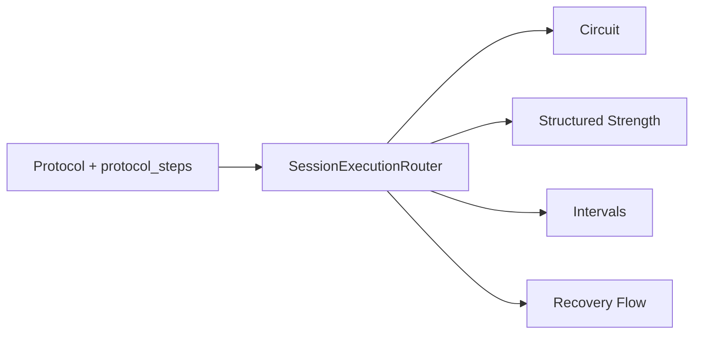
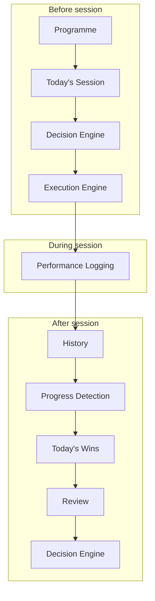
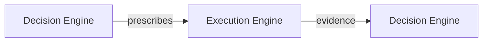
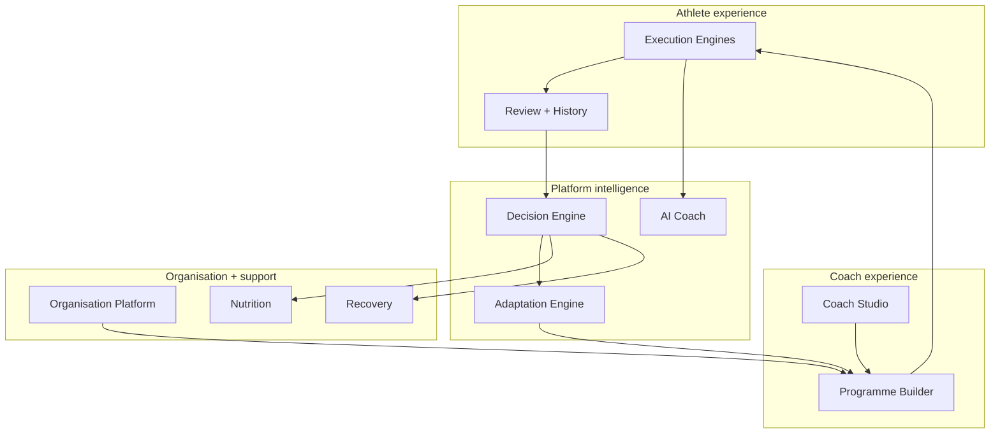

# 38 — Execution Engine Architecture

**Status:** Canonical architecture (v1)  
**Related:** `35_Strength_Performance_Logging.md`, `37_Interval_Execution_Engine.md`, `34_Protocol_Builder.md`, `SessionExecutionRouter`, `SessionPlayerScreen`, `training_sessions`

---

## 1. Philosophy

Cohort is **not** a workout tracker.

A workout tracker records what happened. Cohort is a **coaching platform** — it exists to help athletes move forward over months and years, not merely to log today's session.

Every execution engine in Cohort serves one long-term goal: **maximise progression through better decisions over time.**

That requires more than a timer and a save button. It requires a system that remembers context, respects history, reduces friction in the moment, and produces evidence the platform can learn from.

### Why an execution engine exists

Coaches programme with intent. Athletes execute under real-world constraints — fatigue, time pressure, equipment, life. The gap between **what was programmed** and **what was performed** is where coaching actually happens.

Cohort's execution engines exist to close that gap deliberately:

| Principle | What it means in practice |
|-----------|---------------------------|
| **Preserve context** | A session is never an isolated screen. It belongs to a programme, a week, a goal, and a training history. Execution must carry that context forward. |
| **Preserve history** | What the athlete did last time — on this exercise, this interval, this protocol — informs today's effort without requiring memory or spreadsheets. |
| **Minimise athlete friction** | Logging must be fast, optional where reasonable, and resilient to interruption. Athletes should coach themselves through the session, not fight the UI. |
| **Support adaptation** | Sessions end early, plans change, and bodies respond unpredictably. Execution must tolerate partial completion and resume without punishment. |
| **Produce better future decisions** | Every completed session should leave structured evidence for progress detection, review, and eventually the Decision Engine — not just a timestamp. |

### What execution engines are not

- They are **not** generic CRUD forms for training data.
- They are **not** prescriptive robots that tell athletes exactly what to lift or run today.
- They are **not** mode-specific silos — strength and intervals are implementations of a shared lifecycle, not separate products.

When in doubt, favour **evidence and continuity** over features.

---

## 2. Supported execution modes

`SessionExecutionRouter` maps a programmed protocol to one of four **execution modes**. Each mode exists because a different kind of training requires a different athlete experience — but all modes share the lifecycle in §3.



### Circuit

**What it is:** Multi-station or multi-step conditioning sessions where the athlete moves through a sequence — often time-boxed, often mixed-modal — without deep per-set or per-interval analytics.

**Why it exists:** Many field sessions (bootcamps, hybrid circuits, general conditioning blocks) do not need set-by-set load tracking. The athlete needs **orientation, order, and completion** — not a spreadsheet.

**Current state:** Routed and playable via a lightweight guided player. Not yet a full reference implementation.

### Structured Strength

**What it is:** Exercise-by-exercise resistance training with prescribed sets, reps, load, rest, RPE, and optional notes.

**Why it exists:** Strength progression depends on **granular, repeatable evidence** — load, reps, volume, effort — tied to specific movements. This is Cohort's most mature execution mode and the architectural template for persistence, resume, progress detection, and review.

**Reference implementation:** `StrengthSessionView`, `training_session_sets`, `StrengthProgressService`.

### Intervals

**What it is:** Phase-based endurance work — warm-up, work, recovery, instruction, cool-down — compiled from protocol steps into a single timeline.

**Why it exists:** Interval training is not "one exercise with sets." It is a **choreographed sequence of efforts** where pace, duration, distance, and consistency matter. The execution model must reflect phases, not gym sets.

**Reference implementation:** `IntervalSessionView`, `training_session_intervals`, `IntervalProgressService`.

### Recovery

**What it is:** Low-structure restorative sessions — mobility flows, breath work, easy movement, coach-prescribed recovery protocols.

**Why it exists:** Not every programmed day is a performance day. Recovery sessions still belong in the programme arc and should complete cleanly, but they should not force strength- or interval-grade logging.

**Current state:** Routed; dedicated recovery execution UI is not yet built.

### Mode selection rule

Execution mode is a **property of the protocol**, not a user toggle. The athlete opens today's session; the platform chooses the correct engine. This keeps programming honest and prevents mode drift mid-session.

---

## 3. Shared execution lifecycle

Every training session in Cohort — regardless of mode — participates in the same platform lifecycle. Mode-specific views are interchangeable stages in one pipeline, not separate apps.

```
Programme
    ↓
Today's Session
    ↓
Decision Engine
    ↓
Execution Engine
    ↓
Performance Logging
    ↓
History
    ↓
Progress Detection
    ↓
Today's Wins
    ↓
Review
    ↓
Decision Engine
```

### Programme

The long arc. An athlete is on a programme with a current week, goal, and assigned protocol. Execution never starts from a blank screen — it starts from **what the coach (or programme) intended for today**.

### Today's Session

Home surfaces the athlete's scheduled work: planned, in progress, or completed today. **Production Home (v0.1)** resolves today's work from `TodaySessionService` using the active `ProgrammeAssignment` cursor — not from manual `athlete_state.current_protocol_id` alone. Manual protocol selection remains available when the athlete has no active programme assignment (ad-hoc sessions).

| Home state | Source | Begin/Resume |
|------------|--------|--------------|
| Programme executable slot | `TodaySessionService` → effective protocol | Yes — passes `ProgrammeExecutionContext` |
| Rest day | `TodaySessionService` | No — optional manual continue to next day (V0.1) |
| Day complete | `TodaySessionService` + `suggestedNextCursor` | Continue programme action only |
| Programme complete | `TodaySessionService` | No session |
| No active programme | `athlete_state.current_protocol_id` fallback | Yes — manual session (no programme context) |

Beginning creates (or resumes) a `training_sessions` row in `in_progress`. Programme-backed begins also call `ProgrammeProgressionService.markSessionStarted` to upsert `in_progress` slot outcome. Returning to Home after session completion re-resolves via `TodaySessionService` so the next programme state appears immediately.

The session is the **parent record** for all performance data written during execution.

### Decision Engine

*Before* execution, the Decision Engine (present and future) may influence which protocol variant, intensity, or session type the athlete sees. Execution does not own programming — it **consumes** it. See §7.

### Execution Engine

The mode-specific player (`StrengthSessionView`, `IntervalSessionView`, future views). Responsibilities:

- Compile protocol steps into an executable plan.
- Guide the athlete through the session with minimal friction.
- Maintain in-memory execution state.
- Write performance rows as effort is recorded.
- Support resume, end-early, and preview boundaries.

### Performance Logging

Structured records of what was performed — sets, intervals, or future mode equivalents — always scoped to `training_session_id`. Prescribed snapshots and actual values are stored so later protocol edits do not rewrite history.

### History

Prior sessions become queryable evidence: previous performance before effort, exercise notebooks, interval comparables, coach review (future). History is **read-mostly** and keyed by meaningful coaching identifiers (exercise, protocol, phase), not UI state.

### Progress Detection

Observational comparison of today's performance against the latest comparable prior session. Outputs are conservative, human-readable, and never prescriptive. See §6.

### Today's Wins

A small set of prioritised highlights derived from progress detection — framed as encouragement and evidence, not grades. Early-ended sessions still earn neutral wins ("Completed the work that was available today.").

### Review

`SessionReviewScreen` closes the emotional loop: session complete, optional note, wins, early-end context. The athlete leaves with clarity, not ambiguity.

### Decision Engine (again)

Completed sessions feed back into the Decision Engine. Adaptation may change **the route** (next session's shape, recovery emphasis, programme emphasis) without changing **the destination** (long-term goal). Execution supplies the evidence; the Decision Engine supplies the next prescription.



---

## 4. Shared athlete experience

Every execution mode should **eventually** offer the same athlete-facing capabilities. Maturity varies by mode; the platform contract does not.

| Capability | Intent |
|------------|--------|
| **Previous performance** | Show the last comparable effort before work begins — reduces guesswork, builds confidence. |
| **Session overview** | Orient the athlete to the full arc (exercises, phases, or stations) before and during execution. |
| **Progress display** | Surface observational comparison when enough work is complete — never a prescribed target pace or load. |
| **Logging** | Capture actuals with the minimum fields required for meaningful history. |
| **Persistence** | Write progress incrementally; never rely on a single fragile save at the end. |
| **Resume** | Leave and return without losing completed work; session stays `in_progress` until explicitly closed. |
| **End early** | Honour real life; persist completed work; complete session with neutral review language. |
| **Review** | Close with wins and optional session note. |
| **Today's wins** | Short, prioritised highlights — never "No progress." |
| **History** | Longitudinal view of performance for coach and athlete reflection. |

### Reference implementations

**Structured Strength** and **Intervals** are the two engines that define the contract today:

| Capability | Strength | Intervals |
|------------|----------|-----------|
| Previous performance | Per exercise | Per protocol (last comparable session) |
| Session overview | Exercise list | Full phase timeline |
| Progress display | Per exercise on completion | Session-level when work complete |
| Logging | Per set | Per work phase |
| Persistence | `training_session_sets` | `training_session_intervals` |
| Resume | Hydrate sets + leave dialog | Hydrate intervals + leave dialog |
| End early | Reason + completion context | Reason + completion context |
| Review | `SessionReviewScreen` | `SessionReviewScreen` |
| Today's wins | `SessionWinsBuilder.build` | `SessionWinsBuilder.buildInterval` |
| History | Exercise history cards | Comparable session read (history UI future) |

Circuit and Recovery inherit the lifecycle and shared session shell (`SessionPlayerScreen`) but do not yet fulfil the full experience matrix.

---

## 5. Persistence philosophy

Training data moves through three session states:

```
Preview
    ↓
In Progress
    ↓
Completed
```

### Preview

Coach or athlete opens a protocol in **preview mode** — no `training_sessions` write, no performance persistence, no history reads that imply a real attempt. Preview exists to **rehearse programming**, not to produce evidence.

### In Progress

A real `training_sessions` row exists. Performance rows upsert as the athlete works. The session remains resumable until explicitly completed or ended early. Home shows **Resume** for today's in-progress session.

### Completed

`training_sessions.status` becomes `completed`. Completion context captures:

- `ended_early` — whether the athlete finished the full programmed work.
- `completion_reason` — optional athlete-selected reason when ending early.
- `completed_exercise_count` / `total_exercise_count` — work-units completed vs programmed (exercises for strength, work intervals for intervals).
- `session_note` — optional free-text reflection.

Performance rows written during `in_progress` remain immutable historical evidence.

### Hydration

On resume, the execution engine loads persisted rows for `training_session_id` and merges them into in-memory execution state. The active step/phase resolves to the **first incomplete executable unit**.

Hydration is **async**. The UI may render before the network returns.

### Local edits

While hydration is in flight, the athlete may already be editing. **Conflict protection** preserves locally touched units (e.g. `preserveLocalIds`, session-note edit flags) so async restore does not clobber in-progress input.

### Async sync

Persistence uses upsert-on-change where possible — each completed set or phase writes immediately. Finish and end-early perform a defensive final sync of all completed units before session completion. Sync failures surface non-blocking errors; local state is retained.

### Design rule

> The database is the source of truth for completed work. In-memory state is the source of truth for work in flight until it is successfully persisted.

---

## 6. Progress philosophy

Cohort does **not** tell athletes what they should have lifted or run today.

Progress detection is **observational**, not prescriptive:

| We do | We do not |
|-------|-----------|
| Show evidence from prior sessions | Set arbitrary target paces or loads |
| Explain what changed | Say "beat this" or claim a PR without clarity |
| Encourage continued progression | Frame early finish as failure |
| Use conservative thresholds | Declare progress on thin or ambiguous data |

### Strength examples

- **Load progress** — more load at the same or greater rep count vs last session.
- **Rep progress** — more total reps at comparable load.
- **RPE progress** — same work at lower reported effort.
- **First performance** — no prior history; establish a baseline.
- **Matched performance** — comparable load and reps; strong consistency.
- **Mixed result** — some metrics up, some down — honest, not punitive.
- **Insufficient data** — logged successfully; not enough to compare.

### Interval examples

- **Average pace improved** — faster mean pace with equal or greater completed work.
- **Consistency improved** — tighter pacing spread across work phases.
- **Effort improved** — comparable work at lower average RPE.
- **More work completed** — more valid work phases than last comparable session.
- **Matched performance** — similar rep count and average pace.
- **First recorded interval performance** — baseline session.

### Today's Wins

Wins translate progress results into short athlete-facing highlights. When a session ends early, a **neutral win** still appears — completing available work is valued. The app never displays "No progress."

---

## 7. Decision Engine relationship

The Decision Engine and the Execution Engine are separate concerns that form a loop:



**Execution produces evidence.** Load, reps, pace, duration, RPE, completion context, session notes — these are inputs to future decisions.

**The Decision Engine consumes evidence.** It may adjust tomorrow's session type, volume, recovery emphasis, or programme emphasis.

**Adaptation changes the route, not the destination.** A lighter week, a swapped session, or an early-ended day does not abandon the athlete's goal — it navigates toward it with updated information.

Execution engines must never embed programme-level adaptation logic. They record truthfully, compare conservatively, and hand off.

---

## 8. Platform principles

These rules apply to every execution mode — present and future.

| Principle | Rule |
|-----------|------|
| **Reusable components** | Session shell, review screen, progress bar patterns, completion context, and wins infrastructure are shared. Mode views plug in; they do not fork the lifecycle. |
| **Repositories fetch only** | Repositories read and write data. No business rules, no progress logic, no plan compilation. |
| **Services contain business logic** | Plan builders, hydrators, progress services, metric calculators, and wins builders live in `lib/features/session/services/`. |
| **Widgets remain thin** | Views orchestrate state, call services, and render. They do not own comparison rules or persistence semantics. |
| **Additive schema evolution** | New modes add tables or columns; they do not rewrite existing performance history. |
| **Architecture before speed** | A mode ships when it honours the lifecycle contract — not when a minimal tracker demo exists. |

### File organisation (conceptual)

```
lib/features/session/
  services/     ← business logic (progress, hydration, plan build, wins)
  widgets/      ← thin mode views (strength, intervals, future)
  models/       ← finish summaries, timer state, mode-local DTOs
lib/data/repositories/
                ← Supabase fetch/upsert only
lib/models/     ← domain models shared across features
```

---

## 9. Future execution modes

New modes plug into the **same lifecycle** (§3) and **same experience contract** (§4). They do not require a new app architecture — only a new plan compiler, execution view, performance table (or row shape), and progress service.

| Future mode | Execution focus | Logging unit |
|-------------|-----------------|--------------|
| **Mobility** | Guided flow, hold times, ROM cues | Per drill or per block |
| **Swimming** | Pool intervals, stroke, rest | Per length or per rep |
| **Hyrox Race** | Station sequence + run legs | Per station + split |
| **Skill Practice** | Technique reps, quality flags | Per attempt cluster |
| **Assessment** | Fixed test battery | Per test item |
| **Testing** | Max efforts, formal retest windows | Per test attempt |

### Integration checklist for any new mode

1. **Router entry** — extend `SessionExecutionRouter` with a deterministic mapping from protocol metadata.
2. **Plan compilation** — protocol steps → executable in-memory plan.
3. **Execution view** — thin widget; preview vs real session boundaries.
4. **Performance persistence** — additive schema; upsert on recorded units.
5. **Hydration + resume** — merge persisted rows; protect local edits.
6. **Previous performance read** — comparable prior session lookup.
7. **Progress service** — observational comparison rules.
8. **Wins + review** — reuse `SessionReviewScreen` and wins builder patterns.
9. **Completion context** — reuse `TrainingSessionCompletionContext`.

The lifecycle does not change. Only the shape of the performance row and the athlete UI do.

---

## 10. Current implementation status

Snapshot as of v0.1 / v1 strength and interval milestones. Detail lives in `35_Strength_Performance_Logging.md` and `37_Interval_Execution_Engine.md`.

| Dimension | Structured Strength | Intervals | Circuit | Recovery |
|-----------|---------------------|-----------|---------|----------|
| **Planning** | Protocol steps → session steps | `IntervalSessionPlanBuilder` | Basic step list | Routed only |
| **Execution** | `StrengthSessionView` | `IntervalSessionView` | Legacy guided player | Legacy guided player |
| **Persistence** | `training_session_sets` | `training_session_intervals` | None | None |
| **History** | Exercise history | Comparable session read | None | None |
| **Progress Detection** | `StrengthProgressService` | `IntervalProgressService` | None | None |
| **Review** | `SessionReviewScreen` + wins | `SessionReviewScreen` + interval wins | Pop / exit | Pop / exit |
| **Status** | **Reference implementation** | **Reference implementation (v0.1)** | Placeholder | Not started |

### Shared platform (all modes)

| Component | Status |
|-----------|--------|
| `SessionPlayerScreen` | Live — routes by mode |
| `SessionExecutionRouter` | Live |
| `training_sessions` lifecycle | Live — planned / in_progress / completed |
| `TrainingSessionCompletionContext` | Live — early end + session note |
| `SessionReviewScreen` | Live |
| Preview non-persistence | Live |
| Programme progression bridge (v0.1) | Live — optional `ProgrammeExecutionContext` via coordinator |
| Home programme resolution (v0.1) | Live — `HomeTodaySessionSection` + manual fallback |
| Resume + leave dialog (strength & intervals) | Live |
| Decision Engine integration | Future |

---

## 10.1 Programme progression bridge (v0.1)

Completed execution now feeds the Programme Engine through a **shared coordinator** — not through mode-specific views.

```
SessionPlayerScreen (shared shell)
  → training_sessions.complete
  → ProgrammeSessionProgressionCoordinator
      → ProgrammeProgressionService
          1. programme_slot_outcome upsert
          2. programme_assignments cursor advance
          3. TodaySessionService resolve next
          4. athlete_state projection sync
  → SessionReviewScreen
```

**Design constraints:**
- Strength, interval, and circuit views are unchanged — completion still flows through `SessionPlayerScreen._finish*Session`
- Programme logic lives in `lib/features/programme/services/`, not in execution views
- Optional `ProgrammeExecutionContext` on `SessionPlayerScreen` links a session to an assignment slot
- Manual sessions (no context) preserve pre-programme behaviour
- Preview mode never creates training sessions or programme outcomes

`ProgrammeAssignment` remains source of truth. `athlete_state` is updated only as a denormalised projection after resolve/progression — Home does not read it as the programme cursor when an active assignment exists.

**Home handoff:** `ProgrammeExecutionContext.fromResolvedSession` is built from the executable `ResolvedTodaySession` and passed into `SessionPlayerScreen`. Manual sessions omit `programmeContext` and preserve pre-programme behaviour.

See `43_Programme_Engine_Service_Contracts.md` §3.5–3.7 for resolution kinds, progression rules, idempotency, stale-resolution protection, and the temporary lack of a single DB transaction.

---

## 11. Long-term vision

Execution engines are one layer in Cohort's coaching operating system. They are the **moment of truth** — where programmed intent meets performed reality — but they are not the whole platform.



### How execution connects outward

| System | Relationship to execution |
|--------|---------------------------|
| **Decision Engine** | Consumes session evidence; influences what appears on Today's Session. |
| **Coach Studio** | Reviews athlete history produced by execution logging. |
| **Programme Builder** | Authors the protocols that execution engines compile and run. |
| **Adaptation Engine** | Translates decision outputs into programme changes over weeks. |
| **Nutrition** | Informed by training load and session completion context (future). |
| **Recovery** | Informed by session density, early ends, and modality (future). |
| **AI Coach** | Natural-language layer over the same evidence execution already structures. |
| **Organisation Platform** | Multi-athlete, multi-coach deployment of the same execution contract. |

### Closing principle

Cohort's execution architecture is deliberately boring at the centre and expressive at the edges. The lifecycle is stable. The modes are specialised. The evidence is honest. Everything else — adaptation, coaching, intelligence — builds on that foundation.

---

## Related documents

| Document | Scope |
|----------|-------|
| `35_Strength_Performance_Logging.md` | Strength persistence, sets, overload rules |
| `37_Interval_Execution_Engine.md` | Interval phases, plan compilation, interval progress |
| `34_Protocol_Builder.md` | How protocols are authored (coach side) |

This document is the **canonical reference** for all future execution work. When adding a mode, extend the matrix in §10 — do not fork the lifecycle in §3.
