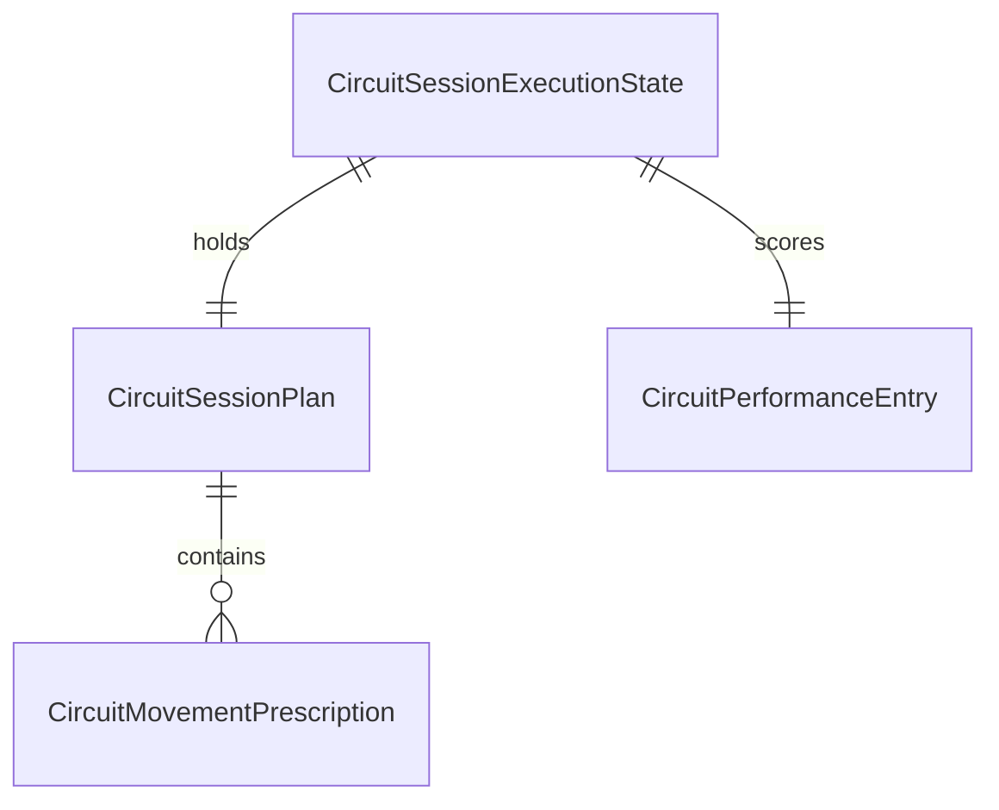

# 39 — Circuit Execution Engine

**Status:** Design (v0.1)  
**Related:** `38_Execution_Engine_Architecture.md`, `35_Strength_Performance_Logging.md`, `37_Interval_Execution_Engine.md`, `SessionExecutionRouter`, `training_sessions`, `protocol_steps`

---

## 1. Purpose

The Circuit Execution Engine records **how an athlete performed a programmed conditioning session** — AMRAPs, for-time work, EMOMs, chippers, benchmarks, and mixed-modal circuits — so Cohort can:

1. Orient athletes with the **full workout visible** at all times.
2. Explain **how today is scored** without prescribing a required target result.
3. Support **minimal-interaction live execution** and **post-session score entry**.
4. Show **previous performance** for the same protocol before work begins.
5. Detect **observational progress** over time (faster times, more rounds/reps, heavier loads at equal score, lower RPE).
6. Fit the **shared execution lifecycle** in `38_Execution_Engine_Architecture.md` — preview, persistence, resume, early finish, Today's Wins, review.

This document defines v0.1 architecture, behaviour, and Dart models. It does **not** implement UI, repositories, or database migrations.

### Design principles

- **Progression-first** — every design choice should make long-term improvement visible, not just today's suffering legible.
- **Low friction** — circuits are often performed under fatigue; the UI should stay out of the way during work.
- **Session-level scoring** — v0.1 captures one primary score per attempt, not per-movement set logging (strength owns that).
- **Format-aware** — AMRAP, for-time, and EMOM are different animals; one timer UX does not fit all.
- **Planned vs actual separation** — prescriptions are text snapshots; actuals are normalised fields when known.
- **Manual first, import later** — `CircuitDataSource` marks provenance for future watch and competition imports.
- **Evidence over prescription** — progress language is observational; Cohort never tells the athlete what time or round count they *should* hit today.
- **Shared lifecycle reuse** — completion context, session review, early finish, and preview boundaries mirror strength and intervals.

### Why circuits are not intervals

Intervals advance through a **phase timeline** (work → recovery → work). Circuits advance through a **movement list** under a **scoring clock**. The athlete cares about **one result** — rounds+reps, finish time, or intervals completed — not per-lap pace on rep 4 of 6.

Circuits also tolerate **coarser logging**: the score is the evidence; movement-level granularity is optional future scope.

---

## 2. Supported formats

`CircuitFormat` maps programmed session metadata to execution semantics.

| Format | `CircuitFormat` | Typical programming | Primary score (`CircuitScoreType`) |
|--------|-----------------|---------------------|-----------------------------------|
| **AMRAP** | `amrap` | As many rounds as possible in fixed time | `roundsAndReps` |
| **For time** | `forTime` | Complete prescribed work ASAP | `elapsedTime` |
| **Rounds for time** | `roundsForTime` | N rounds of a circuit ASAP | `elapsedTime` |
| **EMOM** | `emom` | Start each round every minute | `roundsCompleted` |
| **E2MOM / E3MOM / custom** | `intervalClock` | Start each round on a custom interval | `roundsCompleted` |
| **Chipper** | `chipper` | Long sequential movement list, usually for time | `elapsedTime` or `movementsCompleted` at cap |
| **Fixed duration** | `fixedDuration` | Max reps or work in fixed window | `totalReps` |
| **Benchmark** | `benchmark` | Named test workout (hero WOD, erg test, etc.) | `benchmarkScore` |

### Format notes

**AMRAP** — Athlete repeats the movement list until time expires. Score is `rounds + additional reps` (e.g. `5+12`). Clock counts down from time cap; optional count-up display for elapsed.

**For time / Rounds for time** — Clock counts up from start. Score is total elapsed when the athlete finishes (or time cap reached). `roundsForTime` adds an explicit `prescribedRounds` on the plan.

**EMOM / Interval clock** — `workInterval` on the plan defines the period (60 s, 120 s, 180 s, or custom). Athlete completes the round before the next beep. Score is rounds successfully completed within the programmed number of intervals or total session duration.

**Chipper** — Movements are performed once each in order. Score is finish time, or `completedMovements` + elapsed time if capped early.

**Fixed duration** — Cousin to AMRAP but may score **total reps** rather than full rounds (e.g. max calories, max wall balls in 12:00).

**Benchmark** — Uses `benchmarkName` on the plan. Score type follows programmed rules; comparison is always against the same named benchmark prescription.

### Modalities

Plans are **modality-agnostic**. Movement prescriptions use text snapshots suitable for:

- Running / bodyweight
- Dumbbells / kettlebells
- Barbells
- Ergs (row, ski, bike)
- Mixed-modal hybrids (Hyrox-style stations)

Load and distance remain display strings in v0.1; parsers are a future service concern.

---

## 3. Athlete experience

### 3.1 Full workout always visible

The movement list is **never hidden** during execution. Current round or movement may be highlighted, but the athlete can see the full arc — critical for pacing decisions in AMRAPs and chippers.

```
┌─────────────────────────────────────┐
│  AMRAP 12:00 • Score: rounds + reps   │
├─────────────────────────────────────┤
│  ⏱  8:42 remaining                  │
├─────────────────────────────────────┤
│  1  10 Burpees                      │
│  2  15 KB Swings  24 kg             │
│  3  200 m Run                       │
│  4  10 Pull-ups                     │
│  ... full list scrollable ...       │
└─────────────────────────────────────┘
```

### 3.2 Scoring method clearly explained

Before and during execution, the plan's `scoringMethodLabel` (or `CircuitScoreType.athleteSummary`) answers: **"How is today scored?"**

Examples:

- *"Score is rounds plus extra reps, e.g. 5+12."*
- *"Score is total time to finish."*
- *"Score is rounds completed before the clock ends."*

No target time or round count is prescribed in this copy.

### 3.3 Minimal interaction during work

Live mode prioritises:

- Start / pause / resume clock
- Optional quick round counter (EMOM)
- Finish or time-cap stop
- **No per-rep tapping** in v0.1

Score fields are completed at finish or in post-session entry — not after every burpee.

### 3.4 Live execution vs post-session entry

| Mode | `CircuitEntryMode` | When used |
|------|-------------------|-----------|
| **Live** | `live` | Athlete runs the session in the app with timer support |
| **Post-session** | `postSession` | Athlete trained elsewhere; enters score after the fact |

Both modes write the same `CircuitPerformanceEntry`. Post-session skips timer orchestration but uses identical persistence and progress detection.

### 3.5 Pause / resume rules

| Rule | Behaviour |
|------|-----------|
| **Pause** | Stops the active clock; elapsed does not advance |
| **Resume** | Continues from paused elapsed |
| **Leave session** | Completed score data persists; session stays `in_progress` until finish or early end |
| **App background** | Timer state should reconcile on resume (implementation milestone) |
| **EMOM pause** | Pauses interval clock; does not auto-advance rounds while paused |

### 3.6 End-early behaviour

Mirrors strength and intervals:

- Available once any score data exists or work has started.
- Confirmation shows progress context (e.g. partial chipper, EMOM rounds completed).
- Optional reason selection (reuse `EarlySessionEndReason`).
- Persists partial `CircuitPerformanceEntry` with `timeCapped` or `endedEarly` as appropriate.
- Completes `training_sessions` with `TrainingSessionCompletionContext`.
- Review shows neutral language plus genuine progress wins when comparable.

Ending early is **not failure** — it is an honest record of work available today.

---

## 4. Planned session structure

`CircuitSessionPlan` is the immutable compiled programme.

### 4.1 Plan-level fields

| Field | Purpose |
|-------|---------|
| `sessionTitle` | Display name |
| `protocolId` | Link to programmed protocol |
| `format` | `CircuitFormat` |
| `scoreType` | `CircuitScoreType` — may override format default |
| `movements` | Ordered `CircuitMovementPrescription` list |
| `prescribedRounds` | Fixed round count when applicable |
| `timeCap` | Maximum duration |
| `totalDuration` | Programmed session duration when distinct from cap |
| `workInterval` | EMOM / interval-clock period |
| `restInterval` | Optional rest between rounds |
| `intervalCount` | Programmed interval count for EMOM / interval clock |
| `scoringMethodLabel` | Athlete-facing score explanation |
| `instructions` | Compiled coaching / overview copy |
| `benchmarkName` | Named benchmark identifier |

### 4.2 Movement prescription

`CircuitMovementPrescription` per row:

| Field | Example |
|-------|---------|
| `title` | `Row`, `Burpees`, `Front Squat` |
| `reps` | `10`, `Max` |
| `distance` | `500 m`, `0.4 km` |
| `duration` | `30 sec`, `1 min` |
| `load` | `43 kg`, `2×22.5 kg`, `Bodyweight` |
| `coachCue` | `Unbroken if possible` |
| `exerciseId` / `protocolStepId` | Links for history and builder |

### 4.3 Compilation rules (v0.1)

Compilation is implemented by **`CircuitSessionPlanBuilder`**
(`lib/features/session/services/circuit_session_plan_builder.dart`).

#### Input

```dart
CircuitSessionPlan build({
  required Protocol protocol,
  required List<ProtocolStep> steps,
})
```

Steps are sorted by `step_order` before compilation. Protocol title and
`original_workout` text are **not** used for movement or format detection except
in the isolated `_inferFormatFromTitleFallback` helper.

#### Step preparation

| Rule | Behaviour |
|------|-----------|
| Sort | `step_order` ascending |
| Exclude | Warm-up / cool-down sections, rest steps, empty non-executable rows |
| Config steps | Instruction / overview steps supply session metadata but do not become movements unless they carry movement prescription |
| Movement output | One `CircuitMovementPrescription` per executable step |

Preserved per movement:

| Source | Target |
|--------|--------|
| `exercise_id` | `exerciseId` |
| `id` | `protocolStepId` |
| `title` | `title` |
| `metadata.reps` | `reps` |
| `metadata.distance` | `distance` |
| `metadata.duration` | `duration` |
| `metadata.load` | `load` |
| `notes` | `coachCue` |
| Executable order | `orderIndex` (1-based) |

#### Mapping from protocol steps

| `protocol_steps` signal | Circuit compilation |
|-------------------------|---------------------|
| `session_type: amrap` | `CircuitFormat.amrap` |
| `session_type: emom` | `CircuitFormat.emom` |
| `session_type: chipper` | `CircuitFormat.chipper` |
| `session_type: benchmark` | `CircuitFormat.benchmark` |
| `session_type: circuit` / `conditioning` | Structural refinement (see below) |
| `metadata.format` | Explicit `CircuitFormat` override |
| `metadata.score_type` | Explicit `CircuitScoreType` override |
| `metadata.rounds` / `repeats` | `prescribedRounds` |
| `metadata.time_cap` | `timeCap` |
| `metadata.duration` | `totalDuration` |
| `metadata.work` / `work_interval` | `workInterval` |
| `metadata.rest` / `rest_interval` | `restInterval` |
| `metadata.intervals` / `interval_count` / `sets` | `intervalCount` |
| `metadata.scoring_method` | `scoringMethodLabel` |
| `metadata.benchmark_name` | `benchmarkName` |
| `protocol.coaching_notes` + instruction steps | `instructions` |

#### Format detection priority

| Priority | Signal | Result |
|----------|--------|--------|
| 1 | `metadata.format` on config steps | Explicit `CircuitFormat` |
| 2 | `protocol.session_type` | Base format, then structural refinement |
| 3 | `step_type` / `display_style` / `section` on config steps | `amrap`, `emom`, `chipper`, `benchmark` |
| 4 | Structural metadata | `work` interval → EMOM / interval clock; `time_cap` without rounds → AMRAP; `rounds` + movements → rounds for time |
| 5 | Title / `original_workout` fallback (isolated) | Last-resort format inference |

Structural refinement for generic `circuit` / `conditioning`:

- `metadata.work` present → `emom` when 60 s, otherwise `intervalClock`
- `metadata.time_cap` without `rounds` → `amrap`
- `metadata.rounds` with executable movements → `roundsForTime`
- Long movement list without rounds → `chipper`
- Otherwise → `forTime`

#### Score type mapping

| Format | Default `CircuitScoreType` | Allowed overrides |
|--------|--------------------------|-------------------|
| `amrap` | `roundsAndReps` | `totalReps` |
| `forTime` / `roundsForTime` | `elapsedTime` | — |
| `emom` / `intervalClock` | `roundsCompleted` | — |
| `chipper` | `elapsedTime` | `movementsCompleted` when `time_cap` present |
| `fixedDuration` | `totalReps` | `roundsAndReps` via `score_mode` |
| `benchmark` | `benchmarkScore` | Any score type when explicitly set |

Incompatible explicit `metadata.score_type` values throw `StateError`.

#### Validation

- At least one executable movement required.
- Format and score type must be compatible.
- Throws `StateError` with protocol ID and name when compilation is unsafe.
- Missing metadata is left `null` — the builder does not invent values.

#### Diagnostics

`CircuitSessionPlanBuilder.debugPrintPlan(plan)` prints protocol identity,
format, score type, timing fields, and each movement in order.

Temporary Home debug hook compiles and prints:

- `BW-001` Bodyweight Grinder
- `BD-001` Bike Burner
- `FG-009` Full Gym Chipper

This hook is DEBUG-only and does not change athlete behaviour.

---

## 5. Actual performance

`CircuitPerformanceEntry` is the **session score** — one primary evidence row per attempt in v0.1.

| Field | Type | Use |
|-------|------|-----|
| `elapsedDuration` | `Duration?` | For-time, chipper, capped AMRAP |
| `completedRounds` | `int?` | AMRAP / EMOM full rounds |
| `additionalReps` | `int?` | AMRAP reps into next round |
| `totalReps` | `int?` | Fixed-duration rep totals |
| `completedMovements` | `int?` | Chipper progress at cap |
| `prescribedLoad` | `String?` | Snapshot for load-comparison |
| `actualLoad` | `String?` | Heavier or modified loading |
| `rpe` | `int?` | Post-effort 1–10 |
| `completed` | `bool` | Final score submitted |
| `timeCapped` | `bool` | Stopped by programmed cap |
| `athleteNote` | `String?` | Per-session movement note |
| `dataSource` | `CircuitDataSource` | Manual vs imported |

### Display helpers

`displayScoreSummary` produces athlete-facing shorthand:

- `5+12` for AMRAP
- `14:32` for for-time
- `8 rounds` for EMOM
- `6 movements` for capped chipper

---

## 6. Previous performance

Before work begins, show the last **completed comparable session** for the same `protocolId` (and `benchmarkName` when set).

| Format | Previous display example |
|--------|--------------------------|
| AMRAP | `Last time: 5+12 @ 2×22.5 kg` |
| For time | `Last time: 14:32` |
| Rounds for time | `Last time: 12:05 (5 rounds)` |
| EMOM | `Last time: 10 rounds completed` |
| Interval clock | `Last time: 8 / 10 intervals` |
| Chipper | `Last time: 18:40` or `Last time: 7/9 movements at cap` |
| Fixed duration | `Last time: 187 reps` |
| Benchmark | `Last time: 6+15 — Fran` |

Previous performance is **evidence**, not a target. Copy never says "beat this."

---

## 7. Progress detection

`CircuitProgressService` (future) compares today's `CircuitPerformanceEntry` against the latest prior comparable session.

### Progress types (observational)

| Type | When |
|------|------|
| **First performance** | No prior comparable session |
| **Faster completion** | Same prescription, lower `elapsedDuration` |
| **More rounds/reps** | Same time cap or duration, higher `roundsAndReps` or `totalReps` |
| **Heavier load, equal score** | Same score with higher documented load |
| **More work before cap** | Same time cap, more rounds/reps/movements |
| **Same score, lower RPE** | Comparable result at lower effort |
| **Matched performance** | Score within conservative equivalence band |
| **Mixed result** | Some metrics improved, others declined |
| **Insufficient data** | Missing fields prevent reliable comparison |

### Conservative comparison rules (v0.1 design)

- Compare only when `format`, `scoreType`, and movement count match (or benchmark name matches).
- Time improvements require meaningful margin (implementation threshold — not 1 s noise).
- Load comparisons require parseable or normalised load strings (future parser).
- Never label a personal record without unambiguous evidence.
- Never prescribe a required pace, time, or round target.

### Today's Wins (future)

Reuse `SessionReviewScreen` and wins-builder patterns from `38_Execution_Engine_Architecture.md`. Early finish still earns neutral wins.

---

## 8. Timer behaviour

Timer orchestration lives in a future `CircuitTimerController` service — not in widgets.

| Mode | Clock behaviour |
|------|-----------------|
| **AMRAP / fixed duration** | Countdown from `timeCap`; optional elapsed display |
| **For time / chipper** | Count-up from start |
| **EMOM** | Repeating countdown per `workInterval`; round index advances |
| **Interval clock** | Same as EMOM with configurable period (120 s, 180 s, etc.) |
| **Time cap on for-time** | Count-up with cap warning; auto-stop marks `timeCapped` |

### Pause rules

- Pause freezes displayed time and interval advancement.
- Resume continues; no credit for paused time in scored elapsed.
- Multiple pause cycles accumulate in controller state (not on `CircuitPerformanceEntry` until finish).

### Preview behaviour

Preview mode runs timers locally **without persistence**. Stopping preview discards all state.

### Future watch integration

- Push `CircuitSessionPlan` + timer profile to Garmin / Apple Watch.
- Import finished workout elapsed and round counts via `CircuitDataSource.importedGarmin` etc.
- Watch is a **data source**, not the execution owner — phone/session record remains canonical.

---

## 9. Persistence and resume

Follows the platform persistence philosophy in `38_Execution_Engine_Architecture.md` §5.

```
Preview  →  no training_sessions write
In Progress  →  upsert circuit performance row(s)
Completed  →  training_sessions.completed + completion context
```

### Local execution state

`CircuitSessionExecutionState` holds:

- Immutable `CircuitSessionPlan`
- Mutable `CircuitPerformanceEntry`
- Timer flags (`isClockRunning`, `isClockPaused`, `currentRound`)
- `sessionNote`, `endedEarly`, `trainingSessionId`

### Database source of truth (future table)

Illustrative — **not migrated in v0.1**:

```sql
-- FUTURE — planning only
CREATE TABLE training_session_circuits (
  id                      BIGSERIAL PRIMARY KEY,
  training_session_id     BIGINT NOT NULL REFERENCES training_sessions(id),
  protocol_id             TEXT NOT NULL,
  format                  TEXT NOT NULL,
  score_type              TEXT NOT NULL,
  elapsed_seconds         INTEGER,
  completed_rounds        INTEGER,
  additional_reps         INTEGER,
  total_reps              INTEGER,
  completed_movements     INTEGER,
  prescribed_load         TEXT,
  actual_load             TEXT,
  rpe                     SMALLINT,
  completed               BOOLEAN NOT NULL DEFAULT FALSE,
  time_capped             BOOLEAN NOT NULL DEFAULT FALSE,
  athlete_note            TEXT,
  data_source             TEXT NOT NULL DEFAULT 'manual',
  created_at              TIMESTAMPTZ NOT NULL DEFAULT NOW(),
  updated_at              TIMESTAMPTZ NOT NULL DEFAULT NOW()
);
```

Movement list snapshots may be stored as JSON on the row or derived from `protocol_steps` at read time — decision deferred to implementation.

### Hydration and conflict protection

On resume with `trainingSessionId`:

1. Load persisted circuit row for session.
2. Merge into `CircuitPerformanceEntry`.
3. Restore timer-elapsed from stored `elapsedDuration` where applicable.
4. Respect `preserveLocalIds` / edit flags if async hydration races with local score entry.

### Post-session editing

Athlete may correct rounds, time, or RPE after live finish before final session completion. Edits upsert the same row; `dataSource` stays `manual` unless imported.

### Partial and early-finished sessions

- Partial chipper: `completedMovements` + `elapsedDuration`, `timeCapped = true`
- Partial AMRAP: score whatever rounds+reps were logged at stop
- Early end: `endedEarly` on session; performance row still stores partial truth

---

## 10. Future integration

| Integration | Direction | Notes |
|-------------|-----------|-------|
| **Garmin / watch timers** | Import + optional push | `CircuitDataSource.importedGarmin` |
| **Imported activity scores** | Merge into performance row | Strava, Apple Health |
| **External competition results** | `importedCompetition` | Hyrox, CrossFit Open, etc. |
| **Leaderboards** | Optional future | Organisation-level; never required for progression |
| **Decision Engine** | Consumes circuit evidence | Same loop as strength/intervals |
| **Coach Studio** | Review athlete benchmark history | Read-only analytics |

Leaderboards are explicitly **optional future** functionality — progression detection does not depend on them.

---

## 11. V1 scope and future scope

### V1 scope (design + next milestones)

- [x] v0.1 design document (this file)
- [x] Dart plan and execution state models
- [x] `CircuitSessionPlanBuilder` — compile `protocol_steps` → plan
- [ ] `CircuitSessionView` — thin widget orchestrator
- [ ] `CircuitTimerController` — format-aware clocks
- [ ] `training_session_circuits` migration (additive)
- [ ] `CircuitPerformance` persisted model + repository
- [ ] Live execution + post-session entry
- [ ] Previous performance read
- [ ] Resume hydration + leave dialog
- [ ] End early + `TrainingSessionCompletionContext`
- [ ] `CircuitProgressService` + circuit wins in `SessionWinsBuilder`
- [ ] `SessionReviewScreen` integration

### Explicitly out of scope v0.1

- UI implementation
- Database migration
- Per-movement split timing
- Leaderboards
- Changes to strength or interval execution
- Automatic target prescription
- Coach analytics dashboard
- Supabase RLS policies

### Future scope

| Feature | Description |
|---------|-------------|
| Per-movement splits | Optional segment times in chipper/for-time |
| Load normalisation | Parse `actualLoad` for kg comparison |
| Station videos | Coach cues with movement demos |
| Hyrox race mode | Multi-segment race layout on circuit engine |
| Programme auto-suggestion | Decision Engine proposes benchmark retests |
| Organisation leaderboards | Opt-in cohort comparison |

---

## 12. Dart models (v0.1)

| Model | Role |
|-------|------|
| `CircuitFormat` | Programmed workout format |
| `CircuitScoreType` | How the session is scored and compared |
| `CircuitDataSource` | Manual vs imported provenance |
| `CircuitMovementPrescription` | One movement in the plan |
| `CircuitSessionPlan` | Immutable compiled session |
| `CircuitPerformanceEntry` | Session score actuals |
| `CircuitSessionExecutionState` | Mutable in-session state |

### Model relationships



---

## 13. Related code (current)

| Artifact | Role today |
|----------|------------|
| `SessionExecutionRouter` | Routes `circuit` session type → `circuit` mode |
| `SessionPlayerScreen` | Legacy `CircuitSessionCard` placeholder |
| `CircuitSessionCard` | Step list + basic timer stub — **to be replaced** |
| `CircuitSessionPlan` | v0.1 compiled programme model |
| `CircuitSessionPlanBuilder` | Compiles protocol + steps → plan |
| `CircuitSessionExecutionState` | v0.1 in-session state model |
| `StrengthSessionView` / `IntervalSessionView` | Reference lifecycle implementations — **not modified** |

This document is the source of truth until repository and view are implemented.
