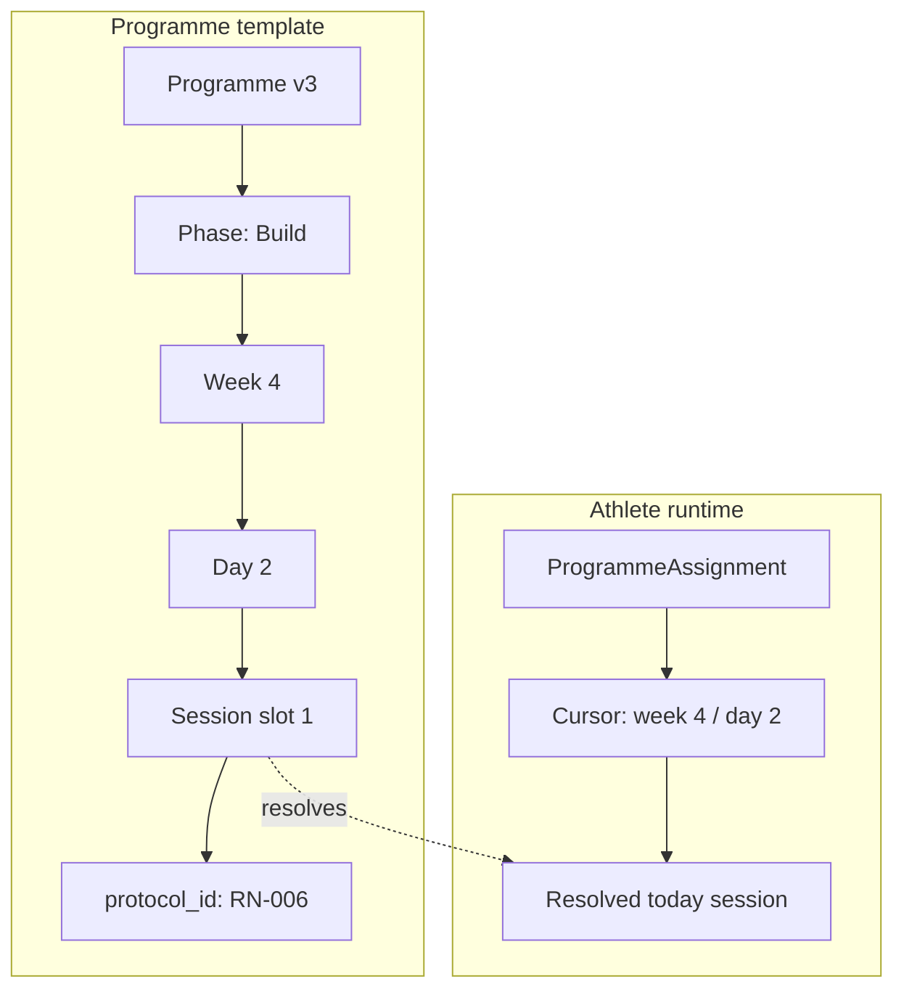
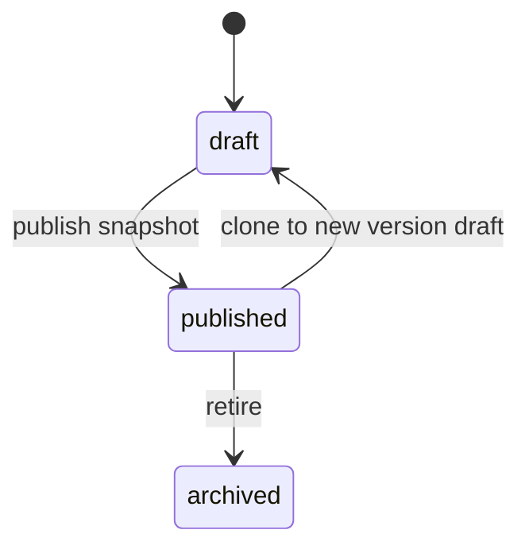
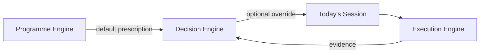

# 41 — Programme Engine

**Status:** Canonical architecture (v0.1 design)  
**Related:** `38_Execution_Engine_Architecture.md`, `34_Protocol_Builder.md`, `44_Programme_Builder.md`, `SessionPlayerScreen`, `athlete_state`, `programmes`, `programme_weeks`, `programme_sessions`, `training_sessions`

---

## 1. Philosophy

Cohort exists to help athletes make the **best possible decision today** to maximise **long-term progression**.

The Programme Engine owns the **long arc** — the structured multi-week plan that gives today's session meaning. It does not execute workouts, log performance, or compare progress. Those are Execution Engine responsibilities.

| Layer | Owns |
|-------|------|
| **Programme Builder** | Draft authoring, validation, publishing (see `44_Programme_Builder.md`) |
| **Programme Engine** | What the athlete is training toward, where they are in the plan, and which protocol is prescribed today |
| **Decision Engine** | Whether today's prescribed route should change given constraints, recovery, and evidence |
| **Execution Engine** | How the athlete performs today's protocol and what evidence is recorded |

### Design principles

- **Reusable platform systems** — not athlete-specific shortcuts
- **Repositories fetch only** — no business rules in data access
- **Services contain business logic** — schedule resolution, assignment, progression, publishing
- **Widgets remain thin** — Home and Coach Studio render resolved state
- **Additive schema evolution** — new tables and columns; no destructive rewrites
- **Cohort Global content is curated** — `published` does not automatically mean globally visible
- **Coach content is private by default** — explicit approval required for global catalogue inclusion

---

## 2. Programme hierarchy

A programme is a **versioned template** composed of nested scheduling units. Athletes are assigned to a **specific published version**; execution consumes **protocol references** at session slots.

```
Programme (versioned template)
    └── Phase / block (optional macro structure)
            └── Week
                    └── Day
                            └── Session slot (0..n per day)
                                    └── Protocol reference
```

### Programme

The top-level curriculum identity: name, metadata, ownership, lifecycle, and version. A programme is **authored** as a draft and **published** as an immutable version snapshot.

### Phase / block

Optional macro grouping across weeks — e.g. *Accumulation*, *Intensification*, *Deload*, *Test*. Phases carry **programme intent** labels that guide adaptation and coach review. A programme may have zero phases (flat week list) in v1.

### Week

Numbered training week within the programme (1-based). Weeks may repeat protocol patterns, introduce new protocols, or mark deload/test windows. Week-level notes and intent labels are allowed.

### Day

A day within a week — not a calendar weekday. Identified by a stable **ordinal day key** (`day_1`, `day_2`, …). Weekday labels are **derived at resolution time** from assignment `started_at` + `timezone`; they are never stored as the programme cursor. Days may be:

- **Training days** — one or more session slots
- **Rest days** — no slots; athlete sees recovery guidance
- **Optional days** — slots marked optional; completion not required for progression

### Session slot

The schedulable unit that maps to execution. Each slot references exactly one **protocol** and carries ordering, time-of-day hints, optional flag, notes, and completion expectations.

### Protocol reference

A foreign key to `performance_protocols.protocol_id`. The Programme Engine never embeds protocol steps — compilation and execution remain in the Execution Engine via `SessionExecutionRouter` and plan builders.



---

## 3. Programme metadata

Metadata supports catalogue discovery, coach authoring, assignment, and Decision Engine context.

| Field | Purpose |
|-------|---------|
| **name** | Athlete- and coach-facing title |
| **description** | Long-form summary of the programme arc |
| **duration** | Planned length in weeks (may differ from authored week count during draft) |
| **target athlete** | Intended population — e.g. intermediate hybrid, advanced runner |
| **difficulty** | Coarse difficulty band for catalogue filtering |
| **primary goal** | Main adaptation target — e.g. strength, aerobic base, body comp |
| **equipment requirements** | Summary equipment expectations across the programme |
| **sessions per week** | Typical training frequency (informational; actual slots may vary by week) |
| **lifecycle status** | `draft` \| `published` \| `archived` |
| **library scope** | Where the programme may appear — see §7 |
| **owner** | Global, coach, or organisation identity |
| **version** | Monotonic version number per programme lineage |

### Typed model

Authoring uses `ProgrammeDraft` (see §13). Persisted rows will mirror these fields when schema lands.

---

## 4. Session scheduling

### Sessions per day

- **One session** — default; maps cleanly to Today's Session card
- **Multiple sessions** — ordered by `session_order` within the day; v1 may surface primary session first; future UI may show full day plan

### Rest days

Days with **no session slots** and `day_type = rest`. Resolution returns a rest state — not an executable protocol. Home may show recovery copy instead of Begin.

### Optional sessions

Slots with `is_optional = true`. Completion is encouraged but not required for programme progression in v1.

### Time of day

Informational hints: `morning`, `afternoon`, `evening`, or `any`. Used for coach preview and future calendar integration — not hard scheduling constraints in v1.

### Ordering

`session_order` (1-based) within a day. Multiple slots sort ascending.

### Notes

Coach-facing and athlete-facing notes at programme, phase, week, day, or slot level.

### Completion expectations

Per slot:

- **required** — expected for progression
- **optional** — supplementary work
- **recommended** — expected under normal circumstances; adaptation may demote

v1 progression treats **required** slots as the default completion unit.

---

## 5. Programme intent

Intent labels describe **why** a phase, week, or day exists. They inform Decision Engine substitutions — adaptations must preserve intent.

| Intent | Meaning |
|--------|---------|
| **build** | Progressive overload or expanding training stimulus |
| **maintain** | Hold adaptations; consolidate |
| **deload** | Reduced volume/intensity; recovery emphasis |
| **test** | Assessment or benchmark windows |
| **recover** | Restorative work; low structural load |
| **technique** | Skill, movement quality, or positional work |

Intent may be set at phase, week, or day granularity. More specific labels override general ones for adaptation policy (future).

### Progression patterns (authoring, not automation)

v1 requires **explicit** programme structure — no automatic progression engine.

| Pattern | How it appears in the template |
|---------|-------------------------------|
| **Explicit protocol changes by week** | Different `protocol_id` per week/day slot |
| **Repeated protocols** | Same `protocol_id` across multiple slots |
| **Load/reps/duration changes** | Encoded in protocol content or alternate protocol variants — not computed by Programme Engine |
| **Deload weeks** | Week intent = `deload`; lighter protocols assigned |
| **Testing weeks** | Week intent = `test`; benchmark protocols assigned |

Automatic load progression, RPE-driven week morphing, and AI week rewrites are **future scope**.

---

## 6. Programme ownership and scope

| Scope | Owner | Visibility | Notes |
|-------|-------|------------|-------|
| **Cohort Global** | `owner_type = global` | Curated global library | Requires explicit curation approval |
| **Coach Private** | `owner_type = coach` | Coach and assigned athletes only | Default for coach-authored programmes |
| **Organisation** | `owner_type = organisation` | Organisation coaches and athletes | Future multi-tenant support |

### Key rules

- **`published` ≠ global** — a coach may publish to their own library without global visibility
- **`approved_for_global`** — separate flag; only Cohort admins set this for global catalogue inclusion
- **`approved_for_adaptation`** — protocols/programmes eligible for Decision Engine substitution pools (future constraint surface)

Athletes only resolve programmes and protocols they **have access to** via assignment or catalogue policy.

---

## 7. Publishing and versioning

### Lifecycle states

```
draft → published → archived
```

| State | Meaning |
|-------|---------|
| **draft** | Mutable authoring; not assignable |
| **published** | Immutable version snapshot; assignable |
| **archived** | No new assignments; existing assignments may continue |

### Immutable published versions

Publishing creates a **frozen snapshot** — `programme_id` + `version`. Authoring edits after publish create a **new version** (v2, v3, …). Prior versions remain addressable for athletes already assigned.

### Assignment pinning

When an athlete is assigned:

- They are pinned to `programme_id` + `version`
- Cursor advances within that version's week/day structure
- Migrating to a newer version is an explicit coach action (future)



---

## 8. Athlete assignment

`ProgrammeAssignment` links an athlete to a published programme version with a cursor and lifecycle.

| Field / concept | Purpose |
|-----------------|---------|
| **start_date** | Calendar anchor for optional date-based resolution |
| **active programme** | The assignment currently driving Today's Session |
| **current week** | Cursor position |
| **current day** | Cursor day key within week |
| **current session order** | Which slot when multiple exist |
| **status** | `active` \| `paused` \| `completed` \| `reassigned` |
| **paused** | Temporarily halt progression and today resolution |
| **completed** | Programme arc finished |
| **reassigned** | Superseded by a new assignment |

### v1 constraints

- **One active assignment per athlete** — simplifies Home and Today resolution
- **Multiple assignments** — future; requires explicit active-assignment selection

### Relationship to `athlete_state`

`athlete_state` is a **denormalised read cache** for fast Home rendering. `ProgrammeAssignment` is the **source of truth**. `AthleteStateSyncService` projects assignment cursor and resolved protocol into `athlete_state` — there must not be two independent programme cursors.

### Slot outcomes vs execution status

Programme slot resolution uses a separate vocabulary (`scheduled`, `in_progress`, `completed`, `completed_partial`, `skipped`, `rescheduled`, `replaced`) from `training_sessions.status`. Ended early maps to `completed_partial` and does **not** automatically advance the programme day. Day advances only when all **required** slots are resolved; optional slots never block advancement.

See `42_Programme_Engine_Schema.md` for persistence design.

---

## 9. Today's session resolution

Today's Session is a **resolved view** — not a stored programme row.

### Inputs

| Input | Source |
|-------|--------|
| Active assignment | `ProgrammeAssignment` |
| Current week / day | Assignment cursor |
| Session slot | `ProgrammeSessionSlot` for week+day (+ order) |
| Protocol | Slot's `protocol_id` |
| Execution state | Latest `training_sessions` for athlete+protocol today |
| Timezone | Athlete timezone (future); device local date in v1 |
| Missed sessions | Uncompleted prior slots — v1: informational only |
| Manual reschedule | Coach override of cursor or slot — future |

### Resolution algorithm (conceptual)

```
1. Load active ProgrammeAssignment (not paused)
2. If rest day → return RestDayResult
3. Load session slot(s) for assignment.version + current_week + current_day
4. Select slot by current_session_order (default: first required)
5. Load protocol metadata for display
6. Query training_sessions for athlete + protocol_id
7. If in_progress today → Resume
8. If completed today → Completed
9. Else → Planned (Begin)
```

### Missed sessions (v1)

Missed work is **not auto-skipped**. Cursor advances only on explicit progression after completion (or coach policy later). Decision Engine may recommend catch-up or move-on strategies in future.

### Manual rescheduling (future)

Coach moves cursor or swaps slot protocol within intent constraints. Logged as assignment events for audit.

---

## 10. Decision Engine relationship



| Principle | Rule |
|-----------|------|
| **Programme defines destination** | Long-term goal and week structure remain the arc |
| **Adaptation changes route** | Today's protocol may be substituted, not the programme goal |
| **Substitutions preserve intent** | A `build` day cannot become unrelated random work |
| **Recovery decisions** | May reduce volume, swap to recovery protocol, or recommend rest within intent |

Programme Engine outputs `programme_default` prescription. Decision Engine may output `adapted` prescription with reason. Execution Engine receives final `protocol_id` only.

Existing `AdaptationDecisionService` (protocol-level) will gain programme context constraints in a later milestone.

---

## 11. Launch programme workflow (Coach Studio)

End-to-end coach journey — **Programme Builder UI** future; architecture in `44_Programme_Builder.md`.

```
1. Create programme (draft) — ProgrammeBuilderService
2. Define phases (optional — UI deferred)
3. Add weeks / days / session slots
4. Assign protocol references per slot — Protocol picker
5. Set metadata and intent labels
6. Preview weeks (structural + athlete-facing display)
7. Publish → immutable version snapshot — ProgrammePublishingService
8. Assign athlete → ProgrammeAssignmentService (not Home, not Builder)
9. Athlete sees Today's Session on Home — TodaySessionService
```

**Assignment rule:** `ProgrammeAssignmentService` is the sole production entry point for athlete assignment. **Home never creates assignments.**

### Copy workflows

| Workflow | Lineage | Version | Service |
|----------|---------|---------|---------|
| **Clone Version** | Unchanged | N → N+1 draft | `ProgrammePublishingService.cloneToNewDraft` |
| **Duplicate Programme** | New code | v1 draft | `ProgrammeBuilderService.duplicateProgramme` |

### Preview

Coach preview compiles draft to a read-only week grid — similar to protocol preview. No `training_sessions` writes.

---

## 12. V1 scope and future scope

### V1 (architecture + typed models — this document)

| In scope | Out of scope |
|----------|--------------|
| Canonical hierarchy and metadata model | Coach Studio UI |
| Draft typed models for authoring | Programme builder UI |
| Assignment model design | Automatic progression rules |
| Today resolution specification | Multi-assignment per athlete |
| Publishing/versioning rules | Calendar / timezone scheduling |
| Decision Engine hook points | Organisation RBAC implementation |
| Schema + service contracts (`42`, `43`) | Migration application (next milestone) |
| Persistence models + store interfaces | Service implementations |
| Relationship to Execution Engine | Execution Engine modifications |

### V1 implementation milestones (after schema approval)

1. Apply migration `42_Programme_Engine_Schema.md` §9
2. Implement stores (Supabase repositories)
3. `ProgrammeScheduleResolver` + `TodaySessionService`
4. `ProgrammeAssignmentService` — **done (v0.1)**; outcome seeding deferred to progression
5. Home refactor: resolve today from assignment — **done (v0.1)**; Home never creates assignments
6. Progression hooks from session review
7. Legacy data migration from `programmes` / `programme_sessions`
8. Global catalogue + enrolment

### Future scope

| Feature | Description |
|---------|-------------|
| `45_Coach_Studio_Programme_Catalogue.md` | Coach Studio Programme Catalogue UI |
| Phase macros | Visual block periodisation |
| Calendar-aware scheduling | Real weekday mapping from `start_date` |
| Missed-session policies | Skip, compress, extend programme |
| Version migration tools | Move athletes to new published version |
| Multi-assignment | Concurrent or sequential programmes |
| Organisation libraries | Shared coach programme catalogues |
| Decision Engine integration | Intent-preserving substitutions |
| Auto-progression | Evidence-driven week morphing (long-term) |

---

## 13. Dart models (v0.1 design)

Typed models are **authoring and assignment shapes** — persistence-ready, no `fromMap` until schema lands.

| Model | Role |
|-------|------|
| `ProgrammeVocabulary` | Shared enums — scope, lifecycle, intent, assignment status |
| `ProgrammeDraft` | Root authoring object with metadata and nested tree |
| `ProgrammePhaseDraft` | Optional macro block |
| `ProgrammeWeekDraft` | Week within phase or programme |
| `ProgrammeDayDraft` | Day with slots or rest marker |
| `ProgrammeSessionSlotDraft` | Protocol reference + scheduling metadata |
| `ProgrammeAssignment` | Athlete runtime assignment and cursor |
| `ProgrammeLineage` … `ProgrammeSlotOutcome` | Persistence models — see `42_Programme_Engine_Schema.md` §12 |
| Store + service interfaces | See `43_Programme_Engine_Service_Contracts.md` |

### File organisation (planned)

```
lib/models/
  programme_vocabulary.dart
  programme_draft.dart
  programme_phase_draft.dart
  programme_week_draft.dart
  programme_day_draft.dart
  programme_session_slot_draft.dart
  programme_assignment.dart
```

### Service organisation (future)

```
lib/features/programme/
  models/       ← resolved DTOs (ResolvedTodaySession, etc.)
  services/     ← schedule resolver, today session, progression, assignment
  widgets/      ← thin Coach Studio and catalogue screens
```

---

## 14. Relationship to Execution Engine

The Programme Engine stops at **protocol_id resolution**. Execution Engine responsibilities are unchanged:

| Execution capability | Programme Engine interaction |
|---------------------|------------------------------|
| Plan compilation | Consumes protocol steps, not programme tree |
| Persistence | `training_sessions` carries `programme_id`, `week_number`, `day` |
| Resume / review / wins | Unaffected |
| Progress detection | Uses protocol-scoped history; programme provides context labels only |

---

## 15. Platform principles (recap)

| Principle | Programme Engine rule |
|-----------|----------------------|
| Repositories fetch only | Schedule resolution lives in services |
| Services contain business logic | Publishing, assignment, resolution, progression |
| Widgets remain thin | Home calls `TodaySessionService` |
| Additive schema | New tables; existing execution tables untouched |
| Curated global content | `library_scope` + `approved_for_global` |
| Private coach content | Default scope is coach-private |

---

## Related documents

| Document | Scope |
|----------|-------|
| `42_Programme_Engine_Schema.md` | Database tables, indexes, RLS, legacy migration |
| `43_Programme_Engine_Service_Contracts.md` | Store and service interfaces |
| `38_Execution_Engine_Architecture.md` | Session lifecycle and mode contract |
| `44_Programme_Builder.md` | Coach Studio authoring, publishing, clone/duplicate |
| `45_Coach_Studio_Programme_Catalogue.md` | Programme Catalogue UI and orchestration |
| `34_Protocol_Builder.md` | Protocol authoring (referenced by session slots) |
| `35_Strength_Performance_Logging.md` | Strength execution persistence |
| `37_Interval_Execution_Engine.md` | Interval execution |
| `39_Circuit_Execution_Engine.md` | Circuit execution |

This document is the **canonical reference** for all Programme Engine work. When implementing schema or services, extend §12 — do not fork the hierarchy in §2.
