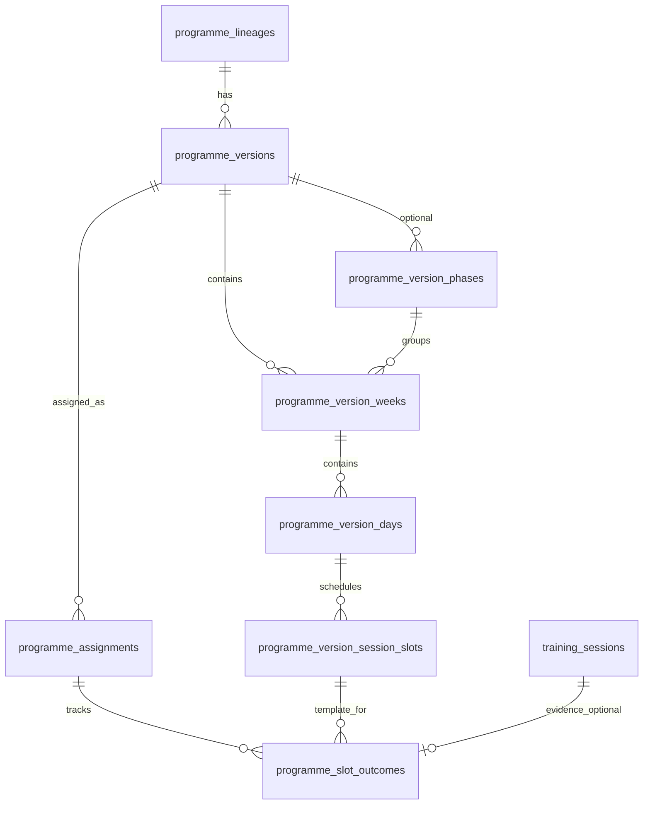

# 42 — Programme Engine Schema

**Status:** Canonical schema (v0.1 implemented)  
**Migrations:**
- `supabase/migrations/20260715120000_add_programme_engine_v1.sql`
- `supabase/migrations/20260715130000_add_programme_engine_dev_policies.sql`  
**Seed:** `supabase/seed/cohort_foundation_test_programme.sql`  
**Related:** `41_Programme_Engine.md`, `38_Execution_Engine_Architecture.md`, `43_Programme_Engine_Service_Contracts.md`

---

## 1. Approved architecture decisions

| Decision | Rule |
|----------|------|
| **Day model** | Canonical cursor keys are ordinal: `day_1`, `day_2`, … Weekday labels are derived from `assignment.started_at` + `assignment.timezone` at resolution time. |
| **Athlete state** | `programme_assignments` is source of truth. `athlete_state` is a denormalised read cache updated by `AthleteStateSyncService`. |
| **Ended early** | Maps to slot outcome `completed_partial`. Does not advance the programme day. Day advances only when all **required** slots are resolved. Optional slots never block advancement. |
| **Structure** | Flat weeks are the V1 default. Phases are optional. Coach Studio does not require phases. |
| **Slot outcomes** | Separate vocabulary from `training_sessions.status`. Programme Engine owns slot resolution; Execution Engine owns session execution. |

---

## 2. Legacy schema assessment

The app currently reads three legacy tables (no migrations in-repo; live Supabase data may exist):

| Table | Inferred shape | Sufficiency |
|-------|----------------|-------------|
| `programmes` | `id` (serial), `programme_id` (text code), metadata, `published` boolean | **Insufficient** — no versioning, ownership, lifecycle, or UUID PK |
| `programme_weeks` | `programme_id`, `week_number`, `title` | **Insufficient** — no version pin, no intent, no FK integrity |
| `programme_sessions` | `programme_id`, `week_number`, `day`, `protocol_id`, `session_order` | **Insufficient** — flattens day+slot; no optional/time-of-day/completion metadata |

### Preservation strategy

- **Keep legacy tables readable** during cutover. No destructive drops.
- **New canonical tables** (below) become the Programme Engine source of truth.
- **One-time data migration** (future): map each legacy `programmes.programme_id` → `programme_lineages.code`, materialise `version_number = 1` published snapshot from `programme_weeks` + `programme_sessions`, normalise `day` values to `day_N` ordinals.
- **Repository cutover**: `ProgrammeRepository` continues serving legacy reads until Home and Coach Studio switch to `ProgrammeVersionStore`.
- **`training_sessions.programme_id`** continues storing the human lineage **code** (not UUID) for execution context compatibility.

---

## 3. Entity relationship



---

## 4. Table definitions

### 4.1 `programme_lineages`

Stable human-readable programme identity across versions.

| Column | Type | Notes |
|--------|------|-------|
| `id` | `UUID` PK | `gen_random_uuid()` |
| `code` | `TEXT` UNIQUE NOT NULL | Human code — e.g. `PROG-HYROX-12`. Maps from legacy `programmes.programme_id`. |
| `created_by` | `TEXT` | Coach or admin that created the lineage |
| `created_at` | `TIMESTAMPTZ` | |
| `updated_at` | `TIMESTAMPTZ` | Trigger-maintained |

**Indexes:** `UNIQUE (code)`

---

### 4.2 `programme_versions`

Versioned programme template. Draft rows are mutable; published rows are immutable snapshots.

| Column | Type | Notes |
|--------|------|-------|
| `id` | `UUID` PK | |
| `lineage_id` | `UUID` FK → `programme_lineages.id` | |
| `version_number` | `INT` NOT NULL | Monotonic per lineage; starts at 1 |
| `lifecycle_status` | `TEXT` NOT NULL | `draft` \| `published` \| `archived` |
| `library_scope` | `TEXT` NOT NULL | `cohort_global` \| `coach_private` \| `organisation` |
| `owner_type` | `TEXT` NOT NULL | `global` \| `coach` \| `organisation` |
| `owner_id` | `TEXT` | Coach user id; null for global |
| `organisation_id` | `TEXT` | Organisation scope identifier when relevant |
| `created_by` | `TEXT` | Coach user id that authored this version |
| `name` | `TEXT` NOT NULL | |
| `description` | `TEXT` | |
| `duration_weeks` | `INT` | Planned duration |
| `target_athlete` | `TEXT` | |
| `difficulty` | `TEXT` | |
| `primary_goal` | `TEXT` | |
| `equipment_requirements` | `TEXT` | |
| `sessions_per_week` | `INT` | Informational |
| `approved_for_global` | `BOOLEAN` DEFAULT false | Curation gate — separate from `published` |
| `approved_for_adaptation` | `BOOLEAN` DEFAULT false | Decision Engine pool eligibility |
| `published_at` | `TIMESTAMPTZ` | Set on publish |
| `archived_at` | `TIMESTAMPTZ` | Set on archive |
| `created_at` | `TIMESTAMPTZ` | |
| `updated_at` | `TIMESTAMPTZ` | |

**Constraints:** `UNIQUE (lineage_id, version_number)`

**Indexes:**
- `(lineage_id, version_number)` — version lookup
- `(lifecycle_status, library_scope)` — catalogue queries
- `(owner_type, owner_id)` — coach/org libraries
- `(lifecycle_status)` WHERE `lifecycle_status = 'published'` — assignable catalogue

---

### 4.3 `programme_version_phases` (optional)

Macro blocks. V1 default: zero rows (flat weeks on version).

| Column | Type | Notes |
|--------|------|-------|
| `id` | `UUID` PK | |
| `version_id` | `UUID` FK → `programme_versions.id` ON DELETE CASCADE | |
| `phase_order` | `INT` NOT NULL | 1-based |
| `title` | `TEXT` NOT NULL | e.g. Accumulation |
| `intent` | `TEXT` | `build` \| `maintain` \| `deload` \| `test` \| `recover` \| `technique` |
| `coach_note` | `TEXT` | |
| `created_at` | `TIMESTAMPTZ` | |

**Constraints:** `UNIQUE (version_id, phase_order)`

---

### 4.4 `programme_version_weeks`

| Column | Type | Notes |
|--------|------|-------|
| `id` | `UUID` PK | |
| `version_id` | `UUID` FK → `programme_versions.id` ON DELETE CASCADE | |
| `phase_id` | `UUID` FK → `programme_version_phases.id` NULLABLE | Null = flat week |
| `week_number` | `INT` NOT NULL | 1-based within programme |
| `title` | `TEXT` | |
| `intent` | `TEXT` | |
| `coach_note` | `TEXT` | |
| `athlete_note` | `TEXT` | |
| `created_at` | `TIMESTAMPTZ` | |

**Constraints:** `UNIQUE (version_id, week_number)`

**Indexes:** `(version_id, week_number)`

---

### 4.5 `programme_version_days`

| Column | Type | Notes |
|--------|------|-------|
| `id` | `UUID` PK | |
| `week_id` | `UUID` FK → `programme_version_weeks.id` ON DELETE CASCADE | |
| `day_key` | `TEXT` NOT NULL | Ordinal: `day_1`, `day_2`, … (`CHECK` enforces `^day_[1-9][0-9]*$`) |
| `day_order` | `INT` NOT NULL | Display order within week (1-based) |
| `title` | `TEXT` | |
| `day_type` | `TEXT` NOT NULL | `training` \| `rest` \| `optional` |
| `intent` | `TEXT` | |
| `coach_note` | `TEXT` | |
| `athlete_note` | `TEXT` | |
| `created_at` | `TIMESTAMPTZ` | |

**Constraints:** `UNIQUE (week_id, day_key)`, `UNIQUE (week_id, day_order)`

**Indexes:** `(week_id, day_order)`

---

### 4.6 `programme_version_session_slots`

| Column | Type | Notes |
|--------|------|-------|
| `id` | `UUID` PK | |
| `day_id` | `UUID` FK → `programme_version_days.id` ON DELETE CASCADE | |
| `session_order` | `INT` NOT NULL | 1-based within day |
| `protocol_id` | `TEXT` NOT NULL | FK → `performance_protocols.protocol_id` (logical) |
| `display_title` | `TEXT` | Optional Today's Session override |
| `time_of_day` | `TEXT` DEFAULT `any` | `morning` \| `afternoon` \| `evening` \| `any` |
| `is_optional` | `BOOLEAN` DEFAULT false | |
| `completion_expectation` | `TEXT` DEFAULT `required` | `required` \| `optional` \| `recommended` |
| `coach_note` | `TEXT` | |
| `athlete_note` | `TEXT` | |
| `created_at` | `TIMESTAMPTZ` | |

**Constraints:** `UNIQUE (day_id, session_order)`

**Indexes:**
- `(day_id, session_order)`
- `(protocol_id)` — protocol usage queries

---

### 4.7 `programme_assignments`

Athlete enrolment on a pinned published version. **Source of truth** for programme cursor.

| Column | Type | Notes |
|--------|------|-------|
| `id` | `UUID` PK | |
| `athlete_id` | `TEXT` NOT NULL | |
| `programme_version_id` | `UUID` FK → `programme_versions.id` ON DELETE RESTRICT | Pinned immutable version |
| `lineage_code` | `TEXT` NOT NULL | Denormalised from `programme_lineages.code` |
| `status` | `TEXT` NOT NULL | `active` \| `paused` \| `completed` \| `reassigned` |
| `started_at` | `DATE` NOT NULL | Calendar anchor for weekday derivation |
| `timezone` | `TEXT` | IANA — e.g. `Europe/London` |
| `current_week_number` | `INT` NOT NULL DEFAULT 1 | Cursor |
| `current_day_key` | `TEXT` NOT NULL DEFAULT `day_1` | Ordinal cursor |
| `current_slot_order` | `INT` NOT NULL DEFAULT 1 | Slot cursor |
| `paused_at` | `TIMESTAMPTZ` | |
| `completed_at` | `TIMESTAMPTZ` | |
| `superseded_by_assignment_id` | `UUID` FK → `programme_assignments.id` NULLABLE | Set when `reassigned` |
| `last_progressed_training_session_id` | `BIGINT` NULLABLE | Idempotency guard; FK → `training_sessions.id` |
| `created_at` | `TIMESTAMPTZ` | |
| `updated_at` | `TIMESTAMPTZ` | |

**Constraints:**
- Partial unique: one `active` assignment per athlete  
  `CREATE UNIQUE INDEX programme_assignments_one_active_per_athlete ON programme_assignments (athlete_id) WHERE status = 'active';`

**Indexes:**
- `(athlete_id, status)`
- `(programme_version_id)`
- `(lineage_code)` — joins with `training_sessions.programme_id`

---

### 4.8 `programme_slot_outcomes`

Per-assignment resolution of each schedulable slot. **Separate from** `training_sessions.status`.

| Column | Type | Notes |
|--------|------|-------|
| `id` | `UUID` PK | |
| `assignment_id` | `UUID` FK → `programme_assignments.id` ON DELETE CASCADE | |
| `session_slot_id` | `UUID` FK → `programme_version_session_slots.id` ON DELETE RESTRICT | Template slot |
| `week_number` | `INT` NOT NULL | Denormalised for query |
| `day_key` | `TEXT` NOT NULL | Denormalised ordinal |
| `session_order` | `INT` NOT NULL | Denormalised |
| `outcome_status` | `TEXT` NOT NULL | See §5 — column named `outcome_status` to distinguish from `training_sessions.status` |
| `training_session_id` | `BIGINT` NULLABLE ON DELETE SET NULL | Execution evidence link |
| `replacement_protocol_id` | `TEXT` NULLABLE | For `replaced` substitutions |
| `resolution_note` | `TEXT` NULLABLE | Coach/athlete note on resolution |
| `resolved_at` | `TIMESTAMPTZ` | |
| `created_at` | `TIMESTAMPTZ` | |
| `updated_at` | `TIMESTAMPTZ` | Trigger-maintained |

**Constraints:** `UNIQUE (assignment_id, session_slot_id)`

**Indexes:**
- `(assignment_id, outcome_status)`
- `(assignment_id, week_number, day_key, session_order)`
- `(training_session_id)` WHERE `training_session_id IS NOT NULL`

---

## 5. Slot outcome vocabulary

| Status | Meaning | Typical trigger |
|--------|---------|-----------------|
| `scheduled` | Prescribed; not yet started | Assignment created or day opened |
| `in_progress` | Athlete has an open execution session | `training_sessions.status = in_progress` |
| `completed` | Required work satisfied | Session completed normally |
| `completed_partial` | Slot touched but not fully satisfied | Session `ended_early = true` |
| `skipped` | Slot intentionally bypassed | Coach or athlete skip policy |
| `rescheduled` | Moved off default calendar position | Manual reschedule (future) |
| `replaced` | Different protocol executed | Decision Engine substitution |

### Mapping from Execution Engine

| Execution signal | Slot outcome | Advances day? |
|------------------|--------------|---------------|
| Session completed | `completed` | Only if all required slots resolved |
| Session ended early | `completed_partial` | No |
| Session in progress | `in_progress` | No |
| No session yet | `scheduled` | No |

`training_sessions.status` remains: `planned`, `in_progress`, `completed`, `skipped`, `cancelled`.

---

## 6. Day advancement rules

A programme **day** advances when every **required** slot on that day has a terminal outcome:

```
terminal = completed | completed_partial | skipped | replaced
```

Optional slots (`is_optional = true` or `completion_expectation = optional`) do not block advancement.

After day advance:
1. Move `current_day_key` to next `day_order` in week, or
2. If last day of week → increment `current_week`, reset to first day, or
3. If last week → set assignment `status = completed`

`ProgrammeProgressionService` enforces these rules; Execution Engine is not modified.

---

## 7. Weekday derivation (display only)

```dart
// Conceptual — lives in ProgrammeScheduleResolver
calendarDate = startedAt + ((currentWeek - 1) * 7) + (dayOrder - 1)
weekdayLabel = formatInTimeZone(calendarDate, assignment.timezone)
```

`current_day_key` remains `day_N`. Weekday labels never persist as cursor values.

---

## 8. `athlete_state` denormalisation

`athlete_state` columns map from active assignment:

| athlete_state column | Source |
|---------------------|--------|
| `current_programme_id` | `programme_assignments.lineage_code` |
| `current_week` | `programme_assignments.current_week_number` |
| `current_day` | `programme_assignments.current_day_key` |
| `current_protocol_id` | Resolved slot `protocol_id` (or `replacement_protocol_id`) |
| `session_status` | Derived from slot outcome + `training_sessions` |

`AthleteStateSyncService` writes these fields after assignment changes, progression, or today resolution. Home may read `athlete_state` for speed but must not maintain an independent cursor.

### One row per athlete

`athlete_state` is a **projection cache only** — `programme_assignments` remains source of truth. The table enforces **one row per `athlete_id`** via constraint `athlete_state_athlete_id_unique`. `AthleteStateSupabaseStore.upsertProjection` uses `onConflict: 'athlete_id'`, which requires that unique constraint (PostgreSQL `42P10` otherwise).

**Migration:** `supabase/migrations/20260715150000_add_athlete_state_athlete_unique.sql`

Before applying, run the duplicate diagnostic queries in that file. The migration aborts if any `athlete_id` has more than one row — consolidate manually, then re-apply.

---

## 9. Migration file

**Applied by:** `supabase/migrations/20260715120000_add_programme_engine_v1.sql`

### Implementation notes

| Topic | Choice |
|-------|--------|
| **UUID PKs** | `gen_random_uuid()` via `pgcrypto` extension |
| **Lineage delete** | `ON DELETE RESTRICT` from versions — no silent athlete history loss |
| **Version delete** | `ON DELETE RESTRICT` from assignments; `CASCADE` to phases/weeks/days/slots |
| **Assignment delete** | `ON DELETE CASCADE` to slot outcomes |
| **Slot template delete** | `ON DELETE RESTRICT` from outcomes |
| **Ordinal day keys** | `CHECK (day_key ~ '^day_[1-9][0-9]*$')` on days and assignments |
| **updated_at** | `cohort_set_updated_at()` trigger on lineages, versions, assignments, outcomes |
| **RLS** | Enabled on all 8 tables; production policies deferred |
| **Legacy tables** | `programmes`, `programme_weeks`, `programme_sessions` untouched |

### Justified naming deviations from v0.1 design draft

| Draft name | Implemented name | Reason |
|------------|------------------|--------|
| `current_week` | `current_week_number` | Explicit cursor semantics |
| `current_session_order` | `current_slot_order` | Aligns with session slot vocabulary |
| `resolved_protocol_id` | `replacement_protocol_id` | Clearer Decision Engine substitution intent |
| `coach_note` / `athlete_note` on outcomes | `resolution_note` | Single nullable note on slot resolution |

Dart models accept both legacy and implemented column names in `fromMap` during cutover.

Validation queries are included as SQL comments at the bottom of the migration file.

---

## 10. Legacy data migration (future script)

```
FOR EACH legacy programmes row:
  1. INSERT programme_lineages (code = programmes.programme_id)
  2. INSERT programme_versions (version_number = 1, lifecycle_status = published if programmes.published)
  3. FOR EACH programme_weeks row → programme_version_weeks
  4. FOR EACH programme_sessions row:
       a. Ensure programme_version_days exists (normalise day → day_N)
       b. INSERT programme_version_session_slots
```

Normalisation rule: map legacy `day` strings to `day_1`…`day_7` by first-seen order per week.

---

## 11. RLS considerations

### Production target (pre-beta)

| Table | Policy sketch |
|-------|---------------|
| `programme_lineages` | Readable if any child version is visible to caller |
| `programme_versions` | Published + `cohort_global` + `approved_for_global` → all authenticated athletes/coaches. `coach_private` → owner coach + assigned athletes. `organisation` → org members. Draft → owner only. |
| Template children | Inherit parent version visibility |
| `programme_assignments` | Athlete reads own; coach reads/writes for their athletes |
| `programme_slot_outcomes` | Same as parent assignment |
| Published immutability | `UPDATE`/`DELETE` denied on `programme_versions` and children where `lifecycle_status = 'published'` except service-role migration |

Service-role bypass for batch migration only — **never in Flutter**.

### Current development policies (implemented)

**Migrations:**
- `supabase/migrations/20260715130000_add_programme_engine_dev_policies.sql`
- `supabase/migrations/20260715140000_fix_programme_dev_rls_recursion.sql` — fixes PostgreSQL `54001` infinite recursion
- `supabase/migrations/20260715160000_allow_dev_programme_outcome_reset.sql` — temporary DELETE for dev athlete outcome reset
- `supabase/migrations/20260716150000_allow_dev_coach_programme_authoring.sql` — temporary dev-coach Coach Studio authoring (lineage → draft tree)

RLS is **enabled** on all Programme Engine tables. Temporary `dev_programme_*` policies allow:

- **Catalogue reads:** published Cohort Global (`approved_for_global = true`)
- **Draft reads/writes:** unpublished Cohort Global templates (`owner_type = global`, `lifecycle_status = draft`)
- **Coach Studio authoring:** coach_private drafts owned by `dev-coach` (see below)
- **Assignment access:** athlete allowlist `['lee']` via `cohort_programme_dev_athlete_ids()`
- **Slot outcomes:** scoped through assignment athlete allowlist (SELECT/INSERT/UPDATE/DELETE for dev reset)

Organisation content has **no policies** and remains inaccessible via anon key.

#### Dev-coach Coach Studio authoring (`20260716150000`)

**Gap fixed:** New Programme creates `coach_private` + `owner_type = coach` + `owner_id = dev-coach` rows. Prior dev policies only covered Cohort Global templates. Lineage INSERT could also fail with `42501` when no permissive INSERT policy was present.

**Additive `dev_programme_*_coach` policies** (temporary, owner-scoped):

| Table | Dev-coach access |
|-------|------------------|
| `programme_lineages` | INSERT/SELECT/UPDATE when `created_by = dev-coach`; DELETE only when no published versions and no assignments |
| `programme_versions` | INSERT/UPDATE/DELETE coach_private drafts owned by `dev-coach`; SELECT draft + published coach catalogue rows |
| Template children | Read/write when parent version passes `cohort_programme_version_is_dev_coach_*` SECURITY DEFINER helpers |

Helpers use `SECURITY DEFINER`, `STABLE`, `SET search_path = public, pg_temp`, no dynamic SQL. Execute revoked from `PUBLIC`, granted to `anon`/`authenticated` only.

**Before beta:** drop `dev_programme_*_coach` policies and `cohort_programme_*_coach_*` helpers; replace anon writes with `auth.uid()` ownership. Published versions remain immutable in place.

#### RLS recursion fix (54001)

**Problem:** The original `dev_programme_versions_select_catalogue` policy called `cohort_programme_version_is_dev_readable(id)`, which queried `programme_versions` under the caller's RLS context. That re-entered the same policy → infinite recursion → PostgREST/PostgreSQL error `54001`.

The same cycle affected `dev_programme_versions_update_draft_global` via `cohort_programme_version_is_dev_draft_global()`.

**Fix (`20260715140000`):**

| Layer | Approach |
|-------|----------|
| `programme_versions` SELECT/UPDATE | **Direct row predicates** — no helper function calls in policies |
| Child tables + lineages | **Narrow `SECURITY DEFINER` helpers** (`STABLE`, `SET search_path = public, pg_temp`) that check parent version visibility without re-entering RLS loops |
| Identity allowlists | Remain `SECURITY INVOKER` (`cohort_programme_dev_athlete_ids`, `cohort_programme_dev_coach_id`) |

`SECURITY DEFINER` is used only for parent-lookup bridges (version/week/day). Execute is revoked from `PUBLIC` and granted to `anon` / `authenticated` only. These helpers are **temporary** and must be dropped when Supabase Auth ownership policies replace the dev model.

**Temporary limitations (unchanged where noted):**
- No blanket public write — draft writes are owner-scoped (`dev-coach` or Cohort Global templates)
- Organisation access remains denied
- Anon key still used (no Supabase Auth session) — **replace with `auth.uid()` before beta**
- Service-role key never used in Flutter
- Published versions are not mutable in place (coach or global)

**Before beta:** drop dev policies/functions; replace with `auth.uid()` ownership model. See `43_Programme_Engine_Service_Contracts.md` §8.

---

## 12. Dart persistence models

| Model | Table |
|-------|-------|
| `ProgrammeLineage` | `programme_lineages` |
| `ProgrammeVersion` | `programme_versions` |
| `ProgrammeVersionPhase` | `programme_version_phases` |
| `ProgrammeVersionWeek` | `programme_version_weeks` |
| `ProgrammeVersionDay` | `programme_version_days` |
| `ProgrammeVersionSessionSlot` | `programme_version_session_slots` |
| `ProgrammeAssignment` | `programme_assignments` |
| `ProgrammeSlotOutcome` | `programme_slot_outcomes` |

Authoring drafts (`ProgrammeDraft` tree) map to version + child rows on save/publish.

---

## Related documents

| Document | Scope |
|----------|-------|
| `41_Programme_Engine.md` | Canonical architecture |
| `43_Programme_Engine_Service_Contracts.md` | Service interfaces and DTOs |
