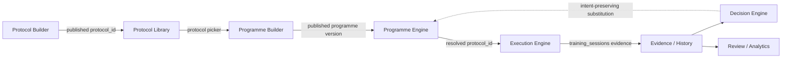
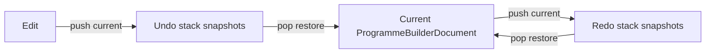
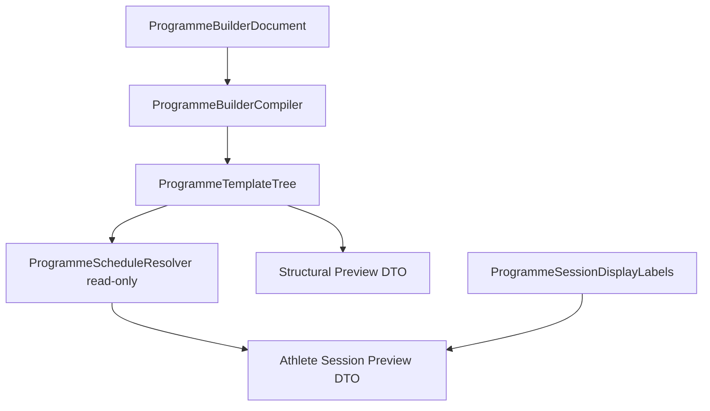
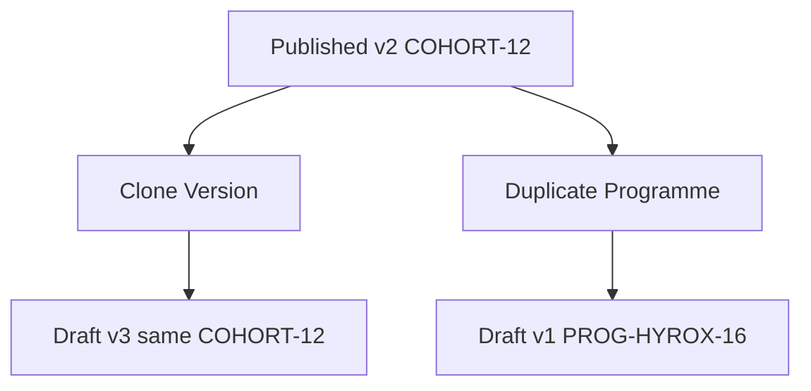

# 44 — Programme Builder

**Status:** Canonical architecture (v0.1 implemented)  
**Related:** `41_Programme_Engine.md`, `42_Programme_Engine_Schema.md`, `45_Coach_Studio_Programme_Catalogue.md`, `46_Programme_Editor.md`, `47_Embedded_Session_Authoring.md`  
**Runtime boundary:** Programme Builder authors template versions. Programme Engine assigns, resolves, and progresses athletes.

---

## Canonical terminology

- **Protocol** — Cohort-endorsed official training content.
- **Session** — Coach-authored or customised workout.
- **Template** — Reusable starting structure copied on use.
- **Programme Session** — Executable content occupying a programme slot.

Programme slots store `protocol_id` references. M1 picker surfaces official Cohort Protocols via `ProtocolRepository.listCohortProtocols()`. **M2** adds **Build New Session**. **M3** adds **Save & Attach** — Session content saves immediately; slot assignment is in-memory until the normal programme Save.

### Save & Attach (M3)

Embedded Session Builder uses `ProgrammeSessionAuthoringCoordinator`:

1. **Save Session** — `ProtocolBuilderService.saveDraft` persists the programme-only Session row immediately (`content_kind=session`, `authoring_scope=programme_only`, `published=false`).
2. **Attach to slot** — `ProgrammeEditorController.assignProtocol` updates the in-memory `ProgrammeBuilderDocument` (protocol id + display title).
3. **Mark dirty** — document `hasUnsavedChanges=true`; coach must use normal **Save programme** to persist the slot assignment to Supabase.

Session save success does **not** guarantee programme document save success. Partial attach failures offer **Retry adding to programme** without creating a second Session row.

Internal Session IDs are opaque UUIDs — not coach-facing catalogue codes. Slot display uses the Session **name**.

### Use Session Library (M4)

Empty programme slots offer **Use Session Library** alongside Use Cohort Protocol and Build New Session.

- Opens reusable Session picker (`SessionLibraryPickerSheet`)
- Attaches existing Session by **live reference** — no copy, no new row
- `ProgrammeSessionAuthoringCoordinator.attachExistingSession` validates ownership/classification
- Document marked dirty; programme Save persists slot assignment

**Live reference consequence:** editing a reusable Session updates all referencing programme slots. See `48_Training_Library.md`.

### Copy and customise Cohort Protocol (M5)

From the Cohort Protocol picker or an assigned Cohort slot:

- **Add unchanged** attaches the official Protocol by reference (no editable copy)
- **Copy and customise** opens embedded Session Builder with a deep-cloned draft

Save destinations in embedded builder:

| Destination | Classification | Notes |
|-------------|----------------|-------|
| This programme only | `programme_only`, `published=false` | Independent row; slot shows Session title |
| Session Library | `coach_private`, `published=true` | One reusable row; attached by live reference; warning shown |

Lineage stored in `source_content_id` — does not imply Cohort endorsement.

---

## 1. Builder philosophy

Programme Builder is the **Coach Studio authoring system** for multi-week training curricula. It answers: *what structure should athletes follow over time?* It does not execute sessions, advance cursors, or project `athlete_state`.

| Layer | Owns |
|-------|------|
| **Programme Builder** | Draft authoring, validation, publishing, catalogue management |
| **Programme Engine** | Assignment, today's session resolution, slot outcomes, progression |
| **Protocol Builder** | Single-session protocol content (steps, metadata) |
| **Execution Engine** | Performing a resolved `protocol_id` today |

### Design principles

- **Drafts are mutable; published versions are immutable** — editing after publish creates a new draft version via **Clone Version**, never mutates assigned snapshots.
- **Repositories fetch only** — tree load/save via `ProgrammeVersionStore`; no validation or publish rules in stores.
- **Services own authoring logic** — structural edits, validation, publish gates, draft ↔ tree compilation.
- **Widgets remain thin** — editor screens hold UI state; mutations go through `ProgrammeBuilderService`.
- **Protocol references only** — slots store `protocol_id`; Builder never embeds protocol steps.
- **Resolver is read-only in Builder** — preview and validation compile to `ProgrammeTemplateTree` and call `ProgrammeScheduleResolver` without assignment side effects.
- **Undo/redo is client-only** — bounded in-memory document snapshots; no revision history in Supabase.
- **Additive evolution** — extend existing draft node models; do not fork a parallel programme schema.

### Platform ecosystem



| Handoff | Data passed | Boundary rule |
|---------|-------------|---------------|
| Protocol Builder → Library | `protocol_id`, steps, metadata | Protocols are authored independently of programmes |
| Library → Programme Builder | Published Cohort `protocol_id` references | `listCohortProtocols()` — official catalogue only in M1 |
| Programme Builder → Programme Engine | Published `programme_versions` + template tree | Only **published** versions are assignable |
| Programme Engine → Execution Engine | `effectiveProtocolId` from resolution | Engine never reads draft rows |
| Execution Engine → Evidence | `training_sessions`, sets, intervals | Programme slot outcomes are separate vocabulary |
| Evidence → Decision Engine | Performance history, constraints | Programme defines intent; Decision adapts route |
| Evidence → Review / Analytics | Completed session summaries | Builder has no runtime dependency |

### What Programme Builder is not

- Not an assignment tool (`ProgrammeAssignmentService` assigns published versions; Home never creates assignments).
- Not a session player or progression coordinator.
- Not an automatic periodisation engine in v0.1.
- Not a replacement for Protocol Builder.

---

## 2. Draft lifecycle

### Persistence lifecycle (canonical)

```
draft → published → archived
         ↓
    clone version → new draft (same lineage, version N+1)
```

| State | Builder behaviour | Assignable |
|-------|-------------------|------------|
| **draft** | Fully editable; save replaces template tree rows | No |
| **published** | Read-only in editor; **Clone Version** to edit | Yes |
| **archived** | Read-only; hidden from default catalogue | No |

### Client session states (UI only, not persisted)

| State | Meaning |
|-------|---------|
| `loading` | Fetching lineage/version/tree |
| `editing` | Active document with optional dirty flag |
| `saving` | Persist in flight |
| `saved` | Matches last successful save |
| `validating` | Pre-publish or manual validate |
| `publishBlocked` | `ProgrammePublishReadiness.isReady == false` |
| `publishing` | Publish transaction in flight |

### Dirty state and save metadata

| Field | Scope | Rule |
|-------|-------|------|
| `isDirty` | Client document | Set on structural/metadata edits |
| `hasUnsavedChanges` | Client document | v0.1: mirrors `isDirty` (no autosave) |
| `lastSavedAt` | Client document | Set on successful save |
| `saveGeneration` | Client document | Incremented on each successful save |
| `saving` | UI session only | Never persisted to `programme_versions` |

**Rules:**
- Loading a persisted document starts **clean** (`isDirty = false`).
- Structural edit commands mark dirty and record undo snapshot.
- Successful save clears dirty state and sets `lastSavedAt` / `saveGeneration`.
- Failed save **preserves** dirty state.

### Draft identity

| Key | Source |
|-----|--------|
| `lineageId` | `programme_lineages.id` |
| `lineageCode` | `programme_lineages.code` |
| `versionId` | `programme_versions.id` |
| `versionNumber` | Monotonic per lineage |

### Client localId vs persisted UUID

| Concept | Scope | Example |
|---------|-------|---------|
| `localId` | Editor/session identity on draft nodes (`ProgrammeWeekDraft`, etc.) | `week-1`, `day-2`, `slot-3` |
| Persisted `id` | Supabase UUID primary key on engine rows | `11111111-1111-4111-8111-111111111111` |
| Parent FK | Always the persisted UUID returned by the parent insert (`week_id`, `day_id`) | Set from `.insert().select().single()` |

Seed templates may use deterministic local ids (`week-1`). `ProgrammeBuilderCompiler.toTemplateTree()` copies local ids into in-memory engine models for FK wiring during the session, but `ProgrammeVersionSupabaseStore.saveTemplateTree()` **omits** non-UUID ids from insert payloads so Postgres generates real UUIDs.

**Pre-beta:** replace multi-step New Programme create (lineage → version → tree) with one transactional Supabase RPC. Partial failures currently surface `ProgrammePartialCreationState` diagnostics; no auto-delete yet.

---

## 3. Undo / redo architecture (v0.1)

Lightweight, **client-only**, bounded in-memory history. No Supabase revision table.



| Concept | Implementation |
|---------|----------------|
| **Current document** | `ProgrammeBuilderDocument` in editor session |
| **Undo stack** | `ProgrammeBuilderHistory.undoStack` — prior snapshots |
| **Redo stack** | `ProgrammeBuilderHistory.redoStack` — reverted snapshots |
| **Snapshot content** | Full `ProgrammeBuilderDocument` copy **without** history stacks |
| **Depth limit** | Default 20; oldest dropped |
| **On edit** | Push pre-edit snapshot to undo; clear redo |
| **On undo** | Push current to redo; restore undo top |
| **On redo** | Push current to undo; restore redo top |
| **On save success** | History preserved; document marked clean |
| **On load** | Fresh empty history |

Structural commands are reversible via snapshot restore — no inverse command objects required in v0.1.

**Future:** typed edit history, persisted revisions, collaborative editing.

---

## 4. Programme catalogue

**Canonical UI spec:** `45_Coach_Studio_Programme_Catalogue.md` — implemented in `lib/features/coach_studio/`.

Coach Studio entry point. Uses `ProgrammeCatalogService` (published) + `ProgrammeBuilderService.listCoachDrafts` (drafts).

| View | Query | Actions |
|------|-------|---------|
| **My drafts** | `lifecycle_status = draft`, `owner_id = coach` | Open, publish |
| **My published** | `lifecycle_status = published`, `owner_id = coach` | Preview, **Clone Version**, archive |
| **Templates** | Duplicate Programme from any accessible version | **Duplicate Programme** → new lineage v1 |
| **Cohort Global (read)** | `approved_for_global`, `published` | Preview only (non-admin) |

---

## 5. Programme editor

**Canonical UI spec:** `46_Programme_Editor.md` — implemented in `lib/features/coach_studio/programmes/`.

Hierarchy navigator + inspector. All mutations via `ProgrammeBuilderService` typed commands. Undo/redo is **controller-owned** via `ProgrammeBuilderHistory`.

### Structural operations

| Operation | Reversible (undo) |
|-----------|-------------------|
| `addWeek` | Yes |
| `duplicateWeek` | Yes |
| `removeWeek` | Yes |
| `addDay` / `setDayType` | Yes |
| `addSlot` / `removeSlot` | Yes |
| `assignProtocol` / `updateSlotMetadata` | Yes |
| `updateMetadata` | Yes |

### Metadata panel

Maps to `programme_versions` fields — see `ProgrammeVersionDraftMetadata`.

---

## 6. Week / day / session hierarchy

Canonical tree matches `41_Programme_Engine.md` §2. v0.1 UI uses **flat weeks**; phases exist in model/schema only.

```
ProgrammeVersion (draft)
    └── Week[]
            └── Day[] (ordinal day_key)
                    └── SessionSlot[] (protocol_id)
```

| Level | v0.1 rule |
|-------|-----------|
| Week | `week_number` 1..N contiguous |
| Day | `day_key` unique per week; rest = zero slots |
| Slot | `session_order` unique per day; `protocol_id` required on training days |

---

## 7. Protocol picker

Wraps `ProtocolRepository`. Published protocols only in v0.1.

Selection returns `protocolId` + canonical name. `display_title` is optional slot context — never substitutes protocol name in athlete-facing preview.

---

## 8. Validation rules

Pure, side-effect free. `ProgrammeBuilderValidationService` owns rules. See §9 for publish-readiness derivation.

### Severity

| Level | Publish | Save |
|-------|---------|------|
| `error` | Blocks | Allows with banner |
| `warning` | Allows | Allows |
| `info` | Allows | Allows |

### Core error codes

| Code | Rule |
|------|------|
| `META_NAME_REQUIRED` | name non-empty |
| `META_LINEAGE_CODE_INVALID` | lineage code format |
| `TREE_NO_WEEKS` | ≥1 week |
| `TREE_EMPTY_PROGRAMME` | ≥1 training slot |
| `TREE_REST_DAY_HAS_SLOTS` | rest day has zero slots |
| `TREE_TRAINING_DAY_NO_SLOTS` | training day has ≥1 slot |
| `SLOT_PROTOCOL_REQUIRED` | protocol_id present |
| `SLOT_PROTOCOL_UNKNOWN` | protocol exists |
| `ENGINE_RESOLVER_REJECTS` | `resolveInitialCursor` succeeds |

---

## 9. Publish-readiness checklist

Derived **only** from `ProgrammeBuilderValidationService` — never bypasses validation.

`ProgrammePublishReadiness` is coach-facing summary:

| Check id | Label |
|----------|-------|
| `name_present` | Programme name |
| `lineage_code_valid` | Lineage code |
| `has_week` | At least one week |
| `has_training_session` | At least one training session |
| `rest_days_valid` | No invalid rest days |
| `protocols_valid` | All slots reference valid protocols |
| `ordering_valid` | Week/day/slot ordering |
| `resolver_accepts` | Resolver accepts initial cursor |
| `no_blocking_errors` | No blocking validation errors |

Each check: `id`, `label`, `passed`, `message`, optional `path`.

`isReady` is true when all required checks pass (equivalent to zero blocking errors).

---

## 10. Preview fidelity

Two preview modes — no assignment, no `training_sessions`, no execution persistence.

### A. Structural programme preview

`ProgrammeBuilderPreview` — week/day/slot hierarchy for coach grid navigation.

### B. Athlete-facing preview

`ProgrammeBuilderAthleteSessionPreview` — display DTO using `ProgrammeSessionDisplayLabels`:

| Field | Source |
|-------|--------|
| **Title** | Canonical `Protocol.name` |
| **Subtitle** | Requirement label + slot `display_title` only when distinct |
| **Week label** | Programme name • Week N • Day label |
| **Status** | Static `Planned Session` in preview |

**Dependency rule:** Builder imports `ProgrammeSessionDisplayLabels` (shared display logic), **not** `HomeTodaySessionSection` or Home services.



---

## 11. Copy workflows

### A. Clone Version (same lineage)

| Field | Behaviour |
|-------|-----------|
| Lineage | **Unchanged** |
| Version | `N → N+1` new **draft** |
| Use case | Edit a published programme while preserving identity |
| Service | `ProgrammePublishingService.cloneToNewDraft` via `ProgrammeBuilderPublishCoordinator.cloneVersion` |

### B. Duplicate Programme (new lineage)

| Field | Behaviour |
|-------|-----------|
| Lineage | **New** `programme_lineages` row |
| Lineage code | **New** coach-supplied code |
| Version | **1** draft |
| Use case | Templates, major variants, forked curricula |
| Service | `ProgrammeBuilderService.duplicateProgramme` |



---

## 12. Publishing workflow

```
1. buildPublishReadiness(document)
2. If not ready → show checklist; stop
3. validateForPublish(document)
4. saveDocument if dirty
5. ProgrammePublishingService.publishDraft(versionId, coachId)
6. Published version becomes assignable via ProgrammeAssignmentService
```

Publish does **not** assign athletes. Home never creates assignments.

---

## 13. Relationship to Programme Engine

| Concern | Builder | Engine |
|---------|---------|--------|
| Tables | `programme_lineages`, `programme_versions`, template tree | `programme_assignments`, `programme_slot_outcomes` |
| Mutability | Draft mutable | Cursor mutable; published template immutable |
| Athlete path | After publish + assign | `TodaySessionService` → Home |

**Imports allowed:** Engine models, `ProgrammeScheduleResolver`, store/publishing **contracts**.  
**Imports forbidden:** `ProgrammeProgressionService`, `ProgrammeAssignmentDevelopmentService`, Home widgets.

---

## 14. Typed models (v0.1)

| Model | Role |
|-------|------|
| `ProgrammeBuilderDocument` | Authoring root + dirty/save metadata |
| `ProgrammeVersionDraftMetadata` | Version-level fields |
| `ProgrammeTemplateDraft` | Nested week/day/slot tree |
| `ProgrammeBuilderPath` | Validation/editor addressing |
| `ProgrammeValidationResult` | Validation output |
| `ProgrammePublishReadiness` | Coach-facing checklist (derived) |
| `ProgrammeBuilderHistory` | Client undo/redo stacks |
| `ProgrammeBuilderPreview` | Structural + athlete preview DTOs |
| `ProgrammeSessionDisplayLabels` | Shared title/subtitle rules (mirrors Home precedence) |

Reuses existing: `ProgrammeWeekDraft`, `ProgrammeDayDraft`, `ProgrammeSessionSlotDraft`, `ProgrammePhaseDraft`, `ProgrammeVocabulary`.

Legacy `ProgrammeDraft` (`lib/models/programme_draft.dart`) remains untouched.

---

## 15. Service contracts (v0.1)

| Service | Responsibility |
|---------|----------------|
| `ProgrammeBuilderService` | CRUD, structural edits, undo/redo, duplicate programme |
| `ProgrammeBuilderValidationService` | validate, validateForPublish, buildPublishReadiness |
| `ProgrammeBuilderPreviewService` | Structural + athlete preview |
| `ProgrammeBuilderProtocolPickerService` | Protocol list for picker |
| `ProgrammeBuilderPublishCoordinator` | validate → save → publish; clone version |
| `ProgrammeBuilderCompiler` | Document ↔ `ProgrammeTemplateTree` |

Existing: `ProgrammeVersionStore`, `ProgrammePublishingService`, `ProgrammeCatalogService`.

---

## 16. File organisation

```
lib/features/programme_builder/
  models/
    programme_builder_document.dart
    programme_version_draft_metadata.dart
    programme_template_draft.dart
    programme_builder_path.dart
    programme_validation_result.dart
    programme_publish_readiness.dart
    programme_builder_operation_result.dart
    programme_builder_preview.dart
    programme_builder_history.dart
    programme_session_display_labels.dart
  services/
    programme_builder_service.dart
    programme_builder_validation_service.dart
    programme_builder_validation_service_impl.dart
    programme_builder_preview_service.dart
    programme_builder_protocol_picker_service.dart
    programme_builder_publish_coordinator.dart
    programme_builder_compiler.dart
```

---

## 17. V1 vs future scope

### v0.1 (implemented)

| In scope | Out of scope |
|----------|--------------|
| Models + service contracts | Phase editor UI |
| Compiler + validation impl | Autosave |
| Undo/redo snapshots (controller-owned) | Persisted revision history |
| Publish readiness + coordinator | AI authoring |
| Preview DTOs + preview screen | Athlete assignment from builder |
| Catalogue + editor UI | Coach RLS (beta) |
| Editor service impl + edit operations | Transactional save RPC |

### Future

| Feature | Notes |
|---------|-------|
| Phase editor | Visual periodisation |
| Autosave | Debounced save |
| Persisted revisions | Audit trail |
| AI advisor | Patch proposals |
| Publish + assign wizard | Chains to `ProgrammeAssignmentService` |

---

## 18. Implementation order

| Step | Status |
|------|--------|
| 1. Architecture doc | Done |
| 2. Typed models + compiler | Done |
| 3. Validation + readiness | Done |
| 4. Service contracts | Done |
| 5. Builder service impl + stores | Done (catalogue + editor) |
| 6. Catalogue + editor UI | Done — see `45`, `46` |

---

## Related documents

| Doc | Relationship |
|-----|--------------|
| `41_Programme_Engine.md` | Hierarchy, publishing, assignment semantics |
| `42_Programme_Engine_Schema.md` | Tables Builder reads/writes |
| `43_Programme_Engine_Service_Contracts.md` | Store + engine service contracts |
| `45_Coach_Studio_Programme_Catalogue.md` | Catalogue navigation |
| `46_Programme_Editor.md` | Editor UI, controller, save behaviour |
| `38_Execution_Engine_Architecture.md` | Protocol execution at slots |
