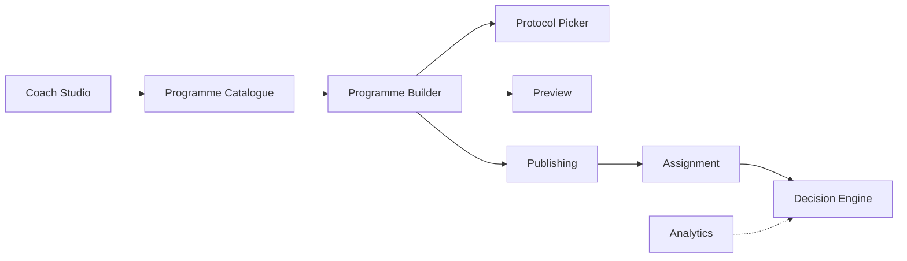

# 45 — Coach Studio Programme Catalogue

**Status:** Canonical architecture (v0.1 implemented)  
**Related:** `44_Programme_Builder.md`, `43_Programme_Engine_Service_Contracts.md`, `41_Programme_Engine.md`, `46_Programme_Editor.md`  
**UI location:** `lib/features/coach_studio/`  
**Boundary:** Catalogue lists and orchestrates — Builder edits, Publishing freezes, Assignment assigns later.

---

## 1. Philosophy

Coach Studio is the **authoring hub**. Programme Catalogue is the first production-facing surface for browsing, creating, duplicating, publishing, and archiving programme versions.

| Layer | Owns |
|-------|------|
| **Programme Catalogue** | List, filter, search, orchestrate lifecycle actions |
| **Programme Builder** | Draft structure editing — see `46_Programme_Editor.md` |
| **ProgrammePublishingService** | Publish, clone version, archive |
| **ProgrammeAssignmentService** | Assign published programmes (future UI) |
| **Home** | Today's session only — **never creates assignments** |

### Coach Studio roadmap



| Handoff | Data passed | Boundary rule |
|---------|-------------|---------------|
| Catalogue → Builder | `versionId` draft document | Catalogue never mutates tree structure directly |
| Builder → Protocol Picker | `protocol_id` selection | Slots reference protocols only |
| Builder → Preview | Compiled preview DTOs | No assignment, no execution persistence |
| Builder → Publishing | Validated draft `versionId` | Publish freezes immutable snapshot |
| Publishing → Assignment | Published `programme_versions.id` | Only published versions assignable |
| Assignment → Decision Engine | Active assignment + outcomes | Programme defines intent; Decision adapts route |
| Evidence → Analytics | Completed sessions | Catalogue has no runtime dependency |

**Published ≠ global:** `lifecycle_status = published` and `approved_for_global = true` are independent. Cohort Global tab shows globally approved published programmes only.

---

## 2. Coach Studio navigation

### Landing (`CoachStudioHomeScreen`)

| Section | v0.1 | Route |
|---------|------|-------|
| Programmes | OPEN | `ProgrammeCatalogueScreen` |
| Protocols | OPEN | Protocol Builder / Drafts / Published hub |
| Exercises | SOON | — |
| Athletes | SOON | — |
| Settings | SOON | — |

### Last-section memory (client-only)

`CoachStudioNavigationState` — in-memory singleton for current app session only.

| Field | Purpose |
|-------|---------|
| `lastSection` | Section coach last opened |
| `currentSection` | Active section while in Coach Studio |

**Behaviour:**
- Home → Coach Studio opens landing.
- If coach previously opened **Programmes** this session, Home can reopen directly to `ProgrammeCatalogueScreen`.
- Landing highlights "Last opened" on the last section card.
- **Not persisted** to Supabase. Not a business-service concern.

---

## 3. Programme Catalogue screen

### Tabs

| Tab | Data source |
|-----|-------------|
| **Drafts** | `ProgrammeBuilderService.listCoachDrafts` |
| **Published** | `ProgrammeCatalogService.listCatalogue` (coach, published) |
| **Cohort Global** | `ProgrammeCatalogService.listCatalogue` (`approved_for_global`) |
| **Archived** | `ProgrammeCatalogService.listCatalogue` (coach, archived) |

### Default sort

**Last edited** (`updatedAt` descending) — newest/most recently edited first.

| Sort mode | Rule |
|-----------|------|
| Last edited | `updatedAt` desc; null sorts last |
| Name A–Z | Case-insensitive name |
| Version newest | Lineage code, then version number desc |

Sorting is **client-side** in v0.1 via `ProgrammeCatalogueListProcessor`. Search/filter applies before sort.

### Card metadata

- Eyebrow: DRAFT / PUBLISHED / GLOBAL / ARCHIVED
- Title: programme name
- Row: `v{n} · {weeks} · {sessions/week}`
- Lineage code
- Owner / scope label
- Updated / published / archived date
- Optional `Needs validation` badge on drafts

---

## 4. Catalogue actions

| Tab | Primary tap | Menu actions |
|-----|-------------|--------------|
| Drafts | Open Editor | Validate, Publish, Duplicate Programme, Delete Draft |
| Published | Preview | Clone Version, Duplicate Programme, Archive |
| Cohort Global | Preview | Duplicate Programme |
| Archived | Preview | Clone |

**Deferred v0.1:** Assign Athlete, Restore from archive.

### Service mapping

| Action | Service |
|--------|---------|
| Open | Navigate with `versionId` |
| Validate | `ProgrammeBuilderValidationService` |
| Publish | `ProgrammeBuilderPublishCoordinator.publish` |
| Clone Version | `ProgrammeBuilderPublishCoordinator.cloneVersion` |
| Duplicate Programme | `ProgrammeBuilderService.duplicateProgramme` |
| Archive | `ProgrammePublishingService.archiveVersion` |
| Delete Draft | `ProgrammeBuilderService.deleteDraft` |
| Preview | Navigate to preview placeholder |

No optimistic publish/archive/delete. Actions disabled while `actionInProgressVersionId` is set.

### Delete draft safety

Allowed only when:
- `lifecycleStatus == draft`
- `ownerId == coachId`
- No assignments reference version (`countAssignmentsForVersion == 0`)
- Never published

Rule enforced in `ProgrammeBuilderServiceImpl` — not in widgets or stores.

---

## 5. New Programme flow

`NewProgrammeScreen` fields:
- Programme name
- Lineage code (auto-suggested, editable)
- Description (optional)
- Library scope
- Duration weeks (optional)
- Primary goal (optional)
- **Seed template** (required)

### Seed templates (`ProgrammeSeedTemplate`)

Structural scaffolds only — **no protocol assignment**. Empty `protocolId` slots surface `slotProtocolRequired` validation until coach assigns protocols in Editor.

| Template | Structure |
|----------|-----------|
| Empty | Week 1, day_1 training, one required empty slot |
| Strength | Week 1, day_1 training slot, day_2 rest |
| Running | Week 1, day_1 running slot, day_2 rest |
| Circuit | Week 1, day_1 circuit slot, day_2 rest |
| Recovery | Week 1, recovery-intent day, optional slot |
| Assessment | Week 1, test-intent day, required slot |
| Hybrid | Week 1, 3 training days + rest |

Built by `ProgrammeSeedTemplateBuilder` in service layer. Persistence uses `__UNASSIGNED__` placeholder for empty protocol slots in Supabase; hydrated back to empty string in documents.

Submit calls `ProgrammeBuilderService.createDraftProgramme(seedTemplate: …)` → navigates to `ProgrammeEditorScreen`.

**RLS requirement:** New Programme persists `programme_lineages` → `programme_versions` → template tree via anon key. Temporary dev-coach policies in `20260716150000_allow_dev_coach_programme_authoring.sql` must be applied. No Supabase Auth session yet — `ProgrammeDevIdentity.coachId` (`dev-coach`) is the authoring owner. Replace with `auth.uid()` before beta.

---

## 6. State architecture

`ProgrammeCatalogueController` — screen-level orchestration, services only, no Supabase imports.

| State | Owner |
|-------|-------|
| Active tab | Controller |
| Loading / ready / empty / error | Controller |
| Search, scope, goal filters | Controller |
| Sort mode | Controller |
| Action in progress | Controller |
| Undo/redo | `ProgrammeEditorController` + `ProgrammeBuilderHistory` |

`ProgrammeCatalogueServices` factory wires Supabase stores at composition root with `ProgrammeDevIdentity.coachId` — no hardcoded coach ID in reusable services.

---

## 7. File organisation

```
lib/features/coach_studio/
  coach_studio_home_screen.dart
  models/
    coach_studio_section.dart
    coach_studio_navigation_state.dart
  programmes/
    programme_catalogue_screen.dart
    new_programme_screen.dart
    programme_editor_screen.dart
    programme_preview_screen.dart
    controllers/programme_catalogue_controller.dart
    models/...
    services/programme_catalogue_services.dart
    utils/...
    widgets/...
```

---

## 8. V1 vs future

| In v0.1 | Future |
|---------|--------|
| Catalogue + New Programme + Editor + Preview | Phase editor |
| Dev coach identity + temporary anon RLS (`dev-coach`) | Supabase Auth `auth.uid()` |
| Client-side sort/filter | Server-side pagination |
| In-memory last section | Optional persisted preference |
| Non-transactional save (documented) | Postgres RPC transactional save |
| — | Athlete assignment UI |

---

## Related documents

| Document | Scope |
|----------|-------|
| `44_Programme_Builder.md` | Builder models, seeds, publishing coordinator |
| `43_Programme_Engine_Service_Contracts.md` | Store and service contracts |
| `46_Programme_Editor.md` | Editor UI, controller, save atomicity |

This document is the **canonical reference** for Coach Studio Programme Catalogue work.
