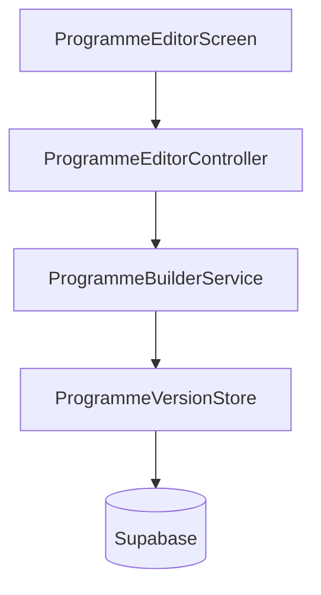

# 46 — Programme Editor

**Status:** Canonical architecture (v0.1 implemented)  
**Related:** `44_Programme_Builder.md`, `45_Coach_Studio_Programme_Catalogue.md`, `43_Programme_Engine_Service_Contracts.md`, `47_Embedded_Session_Authoring.md`  
**UI location:** `lib/features/coach_studio/programmes/`  
**Boundary:** Editor mutates in-memory documents; persistence is explicit via `ProgrammeBuilderService`.

---

## 1. Philosophy

Programme Editor is the **primary Coach Studio authoring workspace** for draft programmes. Coaches edit metadata, weeks, days, and session slots locally; **Save** persists explicitly; **Publish** delegates to `ProgrammeBuilderPublishCoordinator` when validation passes.



| Layer | Owns |
|-------|------|
| **Editor widgets** | Layout, sheets, dialogs |
| **ProgrammeEditorController** | Document, selection, history, validation state, save/publish orchestration |
| **ProgrammeBuilderService** | Pure tree transforms + persistence |
| **ProgrammeVersionStore** | Supabase read/write |

**Widgets and controller must not import Supabase or repositories directly.**

---

## 2. Screen structure

Responsive layout via `LayoutBuilder` (breakpoint 900px).

| Region | Desktop | Mobile |
|--------|---------|--------|
| Header | Programme name, draft badge, unsaved, Undo/Redo, Save, Validate, Preview, Publish | Same |
| Week nav | Left sidebar (240px) | Horizontal chips |
| Week content | Day cards + slot inspector sidebar | Stacked day cards |
| Slot inspector | Right panel when slot selected | Bottom sheet |
| Metadata | Programme details sheet | Same |
| Validation | Validation sheet (grouped issues) | Same |

### Read-only mode

When `document.metadata.lifecycleStatus != draft`:

- Banner: published programmes are read-only; clone to edit
- Disable Save, structural edits, Publish
- Allow Preview and Validate

---

## 3. Controller ownership

`ProgrammeEditorController` owns:

| State | Notes |
|-------|-------|
| `document` | Current `ProgrammeBuilderDocument` |
| `history` | `ProgrammeBuilderHistory` (client-only, max depth 20) |
| `validation` | Latest `ProgrammeValidationResult` |
| `publishReadiness` | Derived on Validate / pre-publish |
| `selection` | Selected week/day/slot |
| `viewState` | loading / ready / saving / error / readOnly |
| `isSaving` | Prevents double-save |

**Edit flow:**

1. `history.recordBeforeEdit(document)` before mutation
2. Call `ProgrammeBuilderService` edit method
3. Apply returned document + validation
4. Notify listeners

Undo/redo call `ProgrammeBuilderHistory` directly — not persisted to Supabase.

### Development RLS (temporary)

Coach Studio authoring uses the anon key with `ProgrammeDevIdentity.coachId` (`dev-coach`). Migrations `20260716150000_allow_dev_coach_programme_authoring.sql`, `20260717110000_fix_dev_coach_lineage_insert_policy.sql`, and `20260717120000_fix_dev_coach_programme_version_authoring_policy.sql` add narrowly scoped dev-coach policies so New Programme can persist:

```
programme_lineages → programme_versions → weeks → days → slots
```

- **No Supabase Auth session yet** — anon writes are temporary and owner-scoped to `dev-coach`
- **Published versions remain immutable** — update/delete policies require `lifecycle_status = draft`
- **Organisation rows remain denied**
- **Before beta:** drop dev-coach policies/helpers; replace with `auth.uid()` ownership

---

## 4. Structural editing

Implemented via `ProgrammeBuilderEditOperations` (pure transforms) and `ProgrammeBuilderServiceImpl`.

| Operation | Service method |
|-----------|----------------|
| Add / duplicate / remove week | `addWeek`, `duplicateWeek`, `removeWeek` |
| Add / remove day | `addDay`, `removeDay` |
| Day title / intent | `updateDayMetadata` |
| Training / rest / optional | `setDayType` |
| Add / remove slot | `addSlot`, `removeSlot` |
| Protocol assign / clear | `assignProtocol`, `clearProtocol` |
| Slot metadata | `updateSlotMetadata` |
| Programme metadata | `updateMetadata` |

**Rules:**

- Week numbers renumbered 1..N after add/remove/duplicate
- Rest days have zero slots (confirmation when converting from training)
- Empty `protocolId` allowed while drafting; validation blocks publish

---

## 5. Protocol picker and session authoring

### Cohort Protocol picker

`ProgrammeBuilderProtocolPickerServiceImpl` loads the official Cohort Protocol catalogue via `ProtocolRepository.listCohortProtocols()`:

- `content_kind = cohort_protocol`
- `authoring_scope = cohort_global`
- `published = true`

Sheet title: **Cohort Protocols**. Empty slot action label: **Use Cohort Protocol**.

After selecting a protocol, coaches choose:

- **Add unchanged** — live reference to official Cohort Protocol (existing M2 behaviour)
- **Copy and customise** — deep-clone → embedded Session Builder → Save & Attach
- **Preview** — read-only `SessionPreviewScreen`

### Copy and customise (M5)

Assigned Cohort Protocol slots show **Preview**, **Copy and customise**, **Change**, **Remove** (not Edit Session).

On successful copy save, the slot references the new coach Session — not the original Protocol. Source Protocol remains in the library unchanged.

Slot conflict: if the slot content changed while the builder was open, save returns a conflict status; saved Session remains available where applicable.

### Build New Session (M2 + M3)

Empty slots offer **Build New Session**, opening `EmbeddedSessionBuilderScreen` with `ProgrammeSessionAuthoringContext`.

- Creates in-memory `ProtocolDraft` (`programme_only` session defaults)
- Preview uses current unsaved draft via `SessionPreviewScreen`
- **Save & Attach** (M3) persists Session + attaches to slot in-memory via coordinator
- Cancel returns without service calls or slot mutation

### Edit Session (M3)

Programme-only Session slots (classified via `ProgrammeSessionSlotContentClassifier`) show **Edit Session**:

- Loads existing draft through coordinator-wrapped `ProtocolBuilderService`
- Preserves durable internal ID on save
- Updates slot display title when Session name changes
- Returns to same slot selection

### Slot action rules (M3)

| Slot content | Actions |
|--------------|---------|
| Empty | Use Cohort Protocol, **Use Session Library**, Build New Session |
| Cohort Protocol | Preview, **Copy and customise**, Change, Remove |
| Programme session | Edit Session, Remove |
| Session Library reference | Change Session, Remove |
| Copied coach Session (programme-only) | Edit Session, Remove |
| Unknown / legacy | Replace, Remove |

Cohort Protocol slots display code + title. Programme session slots display title + “Programme session” label — no internal ID.

### Recovery states (M3)

| Outcome | Coach message |
|---------|---------------|
| Attached | Session added to programme |
| Save failed | Session could not be saved |
| Partial attach | Session saved, but could not be added to the programme → Retry adding to programme |
| Stale slot | Reopen slot guidance |

---

## 6. Validation

Uses `ProgrammeBuilderValidationService`.

| Surface | Behaviour |
|---------|-----------|
| Inline indicators | Error dots on week/day/slot |
| Validation sheet | Errors / warnings / info; tap navigates via `selectPath` |
| Save | Allowed with validation errors |
| Publish | Blocked when `blockingIssueCount > 0` |

---

## 7. Save behaviour

Explicit save only — **no autosave**.

```
saveDocument → saveDraftVersion (metadata) → saveTemplateTree (delete + reinsert weeks/days/slots)
```

### Known limitation: non-transactional save

`saveTemplateTree` performs separate Supabase calls. Failure after metadata save or partial tree insert may leave an inconsistent database snapshot while the controller retains the full local document.

**v0.1 behaviour on failure:**

- Return `storeFailed`
- Preserve dirty local document
- Show retry message
- Disable double-save via `isSaving`

**Recommendation before beta:** Postgres RPC wrapping metadata + tree replace in one transaction.

---

## 8. Preview

`ProgrammeBuilderPreviewServiceImpl` builds structural and athlete-facing preview DTOs from the current document (unsaved changes included).

`ProgrammePreviewScreen` tabs:

- **Structure** — weeks / days / slots
- **Athlete view** — lightweight Today-style card via `ProgrammeSessionDisplayLabels`

No assignment, no execution, no database writes.

---

## 9. Exit protection

`PopScope` when `document.hasUnsavedChanges`:

| Option | Action |
|--------|--------|
| Save and exit | Save → pop (catalogue refreshes) |
| Discard | Pop without save |
| Cancel | Stay in editor |

---

## 10. Navigation

| Source | Destination | On return |
|--------|-------------|-----------|
| New Programme | `ProgrammeEditorScreen(versionId)` | Catalogue drafts refresh |
| Open draft | Same | Refresh if saved |
| Clone / Duplicate | Same (new draft id) | Drafts refresh |
| Preview (editor) | `ProgrammePreviewScreen` | Return to editor |
| Preview (catalogue) | `ProgrammeCataloguePreviewLoader` | Return to catalogue |

---

## 11. File organisation

```
lib/features/coach_studio/programmes/
  programme_editor_screen.dart
  programme_preview_screen.dart
  controllers/programme_editor_controller.dart
  models/programme_editor_view_state.dart
  models/programme_editor_selection.dart
  services/programme_editor_services.dart
  widgets/
    programme_editor_header.dart
    programme_editor_week_nav.dart
    programme_editor_day_card.dart
    programme_editor_slot_inspector.dart
    programme_editor_metadata_sheet.dart
    programme_editor_validation_sheet.dart
    programme_protocol_picker_sheet.dart
    programme_editor_unsaved_dialog.dart
    programme_preview_structure_view.dart
    programme_preview_athlete_card.dart

lib/features/programme_builder/services/
  programme_builder_edit_operations.dart
  programme_builder_protocol_picker_service_impl.dart
  programme_builder_preview_service_impl.dart
  programme_builder_protocol_name_resolver_impl.dart

test/programme_editor/
  programme_builder_edit_operations_test.dart
  programme_editor_controller_test.dart
  programme_editor_widget_test.dart
  programme_builder_preview_service_test.dart
  programme_protocol_picker_service_test.dart
  programme_editor_architecture_test.dart
```

---

## 12. Tests

| Area | Coverage |
|------|----------|
| Edit operations | Metadata, weeks, days, slots, protocol assign/clear |
| Controller | Load, dirty, save, save failure, undo/redo, read-only, round-trip |
| Widgets | Unsaved indicator, save disabled, mobile chips, picker search, exit dialog |
| Preview | Structural + athlete preview DTO |
| Architecture | No Supabase imports in editor UI/controller |

---

## Related documents

| Doc | Relationship |
|-----|--------------|
| `44_Programme_Builder.md` | Builder models, compiler, validation |
| `45_Coach_Studio_Programme_Catalogue.md` | Catalogue → editor navigation |

This document is the **canonical reference** for Programme Editor v0.1.
