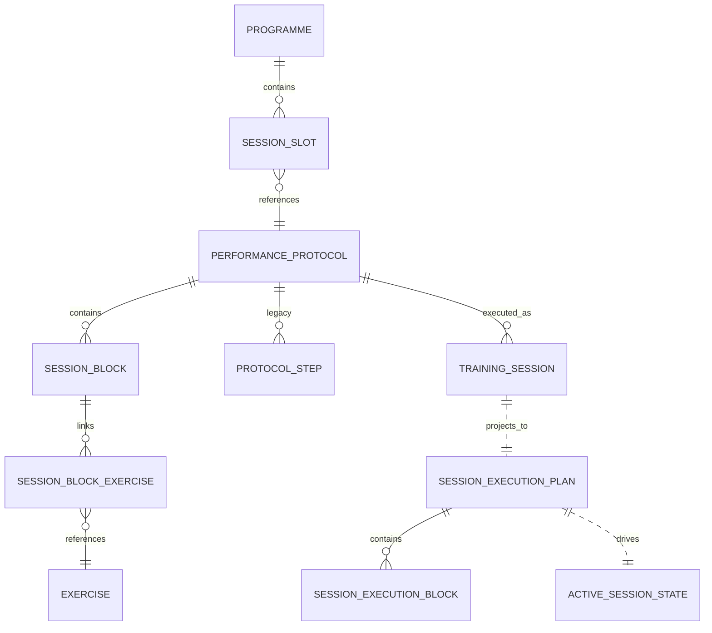
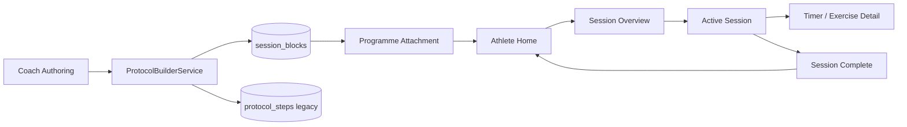

# Cohort Platform v1 Architecture Freeze

## 1. Purpose

This document records the **implemented architecture** of Cohort Platform after consolidating **M6 Modular Session Authoring** and **M7 Athlete Session Experience** on branch `feature/v1-architecture-consolidation`.

**Architecture freeze means:**

- Domain boundaries, persistence shapes, and shared services described here are the **v1 baseline** for M8+ work.
- New milestones should extend this architecture, not fork parallel models or workflows.
- Changes to frozen rules require an explicit architecture decision and migration plan.

**Architecture freeze does not mean:**

- The codebase is feature-complete or launch-ready.
- Schema or APIs are permanently immutable.
- Known limitations or test debt are acceptable to ignore.

Future contributors should treat this document as the map of **how the platform works today**.

---

## 2. Product principles

1. **Structure without restricting creativity** — blocks are typed but editorially flexible.
2. **Coaches should not have to think like software** — free-text workout content is the instruction surface.
3. **Athlete experience reflects coach intent** — execution consumes projections, not raw persistence rows.
4. **One source of truth per domain concept** — one block model, one execution plan, one timer configuration type.
5. **Shared architecture before duplicated workflows** — one Session Builder, one athlete execution UI.
6. **Backward-compatible migrations** — legacy `protocol_steps` remain during transition.
7. **Authoring, execution, and performance data are separate concerns** — M8 logging must not mutate authoring models.

---

## 3. User roles and current scope

| Role | Implemented today | Not yet implemented |
|------|-------------------|---------------------|
| **Coach** | Programme Builder, embedded Session Builder, Session Library, Copy & Customise, block authoring | Athlete management, messaging, analytics |
| **Athlete** | Home today session, block-native execution flow, exercise detail, programme progression hooks | Performance logging, persistent session history, video player |
| **Admin / Cohort content** | Cohort Protocol builder, official protocol immutability guards | Full internal publishing pipeline, versioning |

Routing is imperative (`Navigator` + `MaterialPageRoute`). There is no `go_router` or deep-link layer yet.

---

## 4. Platform domain hierarchy

```
Programme
└── Programme Session Slot
    └── Session (performance_protocols)
        └── Session Block (session_blocks)
            └── Linked Exercise Reference (session_block_exercises → exercises_v2)
```

**Related concepts:**

| Concept | Meaning |
|---------|---------|
| **Cohort Protocol** | Official global content (`content_kind = cohort_protocol`) |
| **Coach Session / Session Library item** | Reusable coach-authored session (`content_kind = session`) |
| **Programme-only Session** | Session scoped to a programme version slot |
| **Assigned training Session** | `training_sessions` row created when athlete begins |
| **Exercise** | Canonical movement record in `exercises_v2` |
| **Athlete execution Session** | In-memory `ActiveSessionState` + immutable `SessionExecutionPlan` |

---

## 5. Canonical domain models

### Persisted content

| Model | Location | Notes |
|-------|----------|-------|
| `Programme` / template tree | `lib/features/programme_builder/` | Weeks, days, slots |
| `Protocol` / Session | `lib/models/protocol.dart` | `performance_protocols` row |
| `SessionBlock` | `lib/models/session_block.dart` | Primary authoring unit |
| `SessionBlockExerciseLink` | `lib/models/session_block_exercise_link.dart` | Reference only, not prescription |
| `Exercise` | `lib/models/exercise.dart` | Canonical exercise metadata |
| `WorkoutFormat` | `lib/models/workout_format.dart` | Execution style enum |
| `TimerConfiguration` | `lib/models/timer_configuration.dart` | Typed timer JSON surface |
| `ProtocolStep` | `lib/models/protocol_step.dart` | **Legacy** execution compatibility |

### Editing drafts

| Model | Location |
|-------|----------|
| `ProtocolDraft` | `lib/models/protocol_draft.dart` — includes `blocks` + projected `steps` |
| `ProtocolStepDraft` | `lib/models/protocol_step_draft.dart` — legacy step editing / projection target |

### Projections

| Model | Location |
|-------|----------|
| `SessionExecutionPlan` | `lib/features/session/models/session_execution_plan.dart` |
| `SessionExecutionBlock` | Same file — athlete/coach preview projection |
| `SessionExecutionPlanBuilder` | `lib/features/session_builder/services/session_execution_plan_builder.dart` |

### Runtime execution state (not persisted in M7)

| Model | Location |
|-------|----------|
| `ActiveSessionState` | `lib/features/session/models/active_session_state.dart` |
| `SessionExecutionController` | `lib/features/session/controllers/session_execution_controller.dart` |
| `AthleteSessionMemoryStore` | Inside `session_execution_controller.dart` |

### Assignment / today resolution

| Model | Location |
|-------|----------|
| `ResolvedTodaySession` | `lib/features/programme/models/resolved_today_session.dart` |
| `ProgrammeExecutionContext` | `lib/features/programme/models/programme_execution_context.dart` |

### Provenance

Lineage fields on `ProtocolDraft` / `performance_protocols`: `source_content_id`, `source_content_kind`, `source_version_id`. See M5 Copy & Customise in `07 Documentation/48_Training_Library.md`.

---

## 6. Coach authoring architecture

**Entry points (shared `SessionBuilderView`):**

- Admin Cohort Protocol builder — `lib/features/admin/protocol_builder_screen.dart`
- Embedded programme Session — `lib/features/programme_builder/screens/embedded_session_builder_screen.dart`
- Session Library — `lib/features/training_library/screens/library_session_builder_screen.dart`

**Core services:**

| Component | Path |
|-----------|------|
| `SessionBuilderEditingState` | `lib/features/session_builder/controllers/session_builder_editing_state.dart` |
| `ProtocolBuilderService` | `lib/features/admin/services/protocol_builder_service.dart` |
| `SessionCloneService` | `lib/features/session_builder/services/session_clone_service.dart` |
| `ProtocolDraftBlockResolver` | `lib/features/session_builder/services/protocol_draft_block_resolver.dart` |
| `SessionBlockValidation` | `lib/features/session_builder/services/session_block_validation.dart` |
| Save & Attach coordinators | `lib/features/programme_builder/services/` |

**Rule:** Host screens provide navigation and save orchestration; `SessionBuilderView` owns presentation only.

---

## 7. Modular Session Authoring (M6)

Blocks support:

- Semantic `SessionBlockType` + editable title
- Free-text `content` via `WorkoutContentEditor`
- `WorkoutFormat` + typed `TimerConfiguration`
- Ordered linked exercises with optional label override
- Add / duplicate / delete / move up-down
- Block-aware validation and preview

**Explicit rules:**

- Workout text is the source of coaching instruction — **not parsed** into prescriptions.
- Linked exercises are metadata references — they do not define sets, reps, or load.

Authoring UI: `lib/features/session_builder/widgets/session_block_editor_card.dart`, `add_block_sheet.dart`.

Documentation: `07 Documentation/49_M6_Modular_Session_Authoring.md`

---

## 8. Athlete execution architecture (M7)

**Navigation flow:**

```
HomeTodaySessionSection
  → SessionOverviewScreen
  → ActiveSessionScreen
  → BlockTimerScreen / ExerciseDetailScreen
  → SessionCompleteScreen
  → Home
```

**Core components:**

| Component | Path |
|-----------|------|
| `SessionExecutionLoader` | `lib/features/session/services/session_execution_loader.dart` |
| `ProtocolStepToBlockConverter` | `lib/features/session/services/protocol_step_to_block_converter.dart` |
| `SessionExecutionController` | `lib/features/session/controllers/session_execution_controller.dart` |
| `BlockTimerController` | `lib/features/session/services/block_timer_controller.dart` |
| Athlete widgets | `lib/features/session/widgets/athlete/` |
| Home entry | `lib/features/home/widgets/home_today_session_section.dart` |

**Continue Session:** `AthleteSessionMemoryStore` restores in-progress state within the app lifecycle (key: `trainingSessionId:protocolId`).

**Legacy `SessionPlayerScreen`** remains for step-native engines and coach-era execution paths but is **not** the athlete Home entry point.

Documentation: `07 Documentation/50_M7_Athlete_Session_Experience.md`

---

## 9. Persistence architecture

**Backend:** Supabase via `SupabaseService`.

**Principal tables:**

| Table | Role |
|-------|------|
| `performance_protocols` | Session / protocol header + M1 training content metadata |
| `session_blocks` | Modular block content (M6) |
| `session_block_exercises` | Block → exercise links |
| `protocol_steps` | Legacy steps — retained for compatibility |
| `exercises_v2` | Canonical exercises |
| `programme_*` | Programme engine tables |
| `training_sessions` | Athlete session instances |

**Migration:** `supabase/migrations/20260719140000_add_session_blocks.sql` — additive backfill from legacy steps.

**Save orchestration (`ProtocolBuilderService`):**

1. Upsert `performance_protocols`
2. Replace `session_blocks` + links
3. Project blocks → `protocol_steps` for legacy execution engines
4. **No multi-table transaction** (Supabase Flutter client limitation)

**Text relationship diagram:**

```
performance_protocols (1) ──< session_blocks (N)
session_blocks (1) ──< session_block_exercises (N) >── exercises_v2
performance_protocols (1) ──< protocol_steps (N) >── exercises_v2 [legacy]
programme slots ──> performance_protocols.protocol_id
training_sessions ──> performance_protocols.protocol_id
```

---

## 10. Content lifecycle

```
Cohort Protocol (official)
  → Copy & Customise (SessionCloneService)
  → Coach Session (independent blocks, new IDs)
  → Session Library and/or Programme slot attachment
  → Athlete loads via SessionExecutionLoader
  → ActiveSessionState execution
```

**Lineage:** Copied sessions record `source_content_id` at session level. Child blocks never retain source block persisted IDs.

**Live-reference limitation:** Editing a reusable Session Library item may affect referencing programmes (M4 accepted limitation). Version pinning is future work (M9).

---

## 11. Execution compatibility layer

| Step | Component |
|------|-----------|
| Load blocks from DB | `SessionBlockRepository` |
| Fallback if no blocks | `ProtocolStepToBlockConverter` (athlete) or `LegacyStepToBlockConverter` (draft authoring) |
| Project for legacy engines | `BlockToLegacyStepProjector` |
| Athlete UI | Single `SessionExecutionPlan` — block-native and legacy sources |

Legacy steps remain until:

1. All content is block-native in production data
2. Legacy execution engines are retired or fully adapted
3. Regression suite passes without step projection

---

## 12. State management boundaries

| State type | Where it lives |
|------------|----------------|
| Persisted content | Supabase via repositories |
| Authoring edits | `SessionBuilderEditingState` → `ProtocolDraft` |
| Navigation | Widget / `Navigator` |
| Athlete execution | `ActiveSessionState` + `SessionExecutionController` |
| Timer runtime | `BlockTimerController` (ephemeral) |
| Performance capture draft (M8) | `ActivePerformanceDraft` + `PerformanceCaptureController` |
| Performance records (M8) | `TrainingSessionRecord` tree via `PerformanceRecordSaveCoordinator` |

---

## 13. UI architecture

**Coach design system:** `lib/core/widgets/` — `CohortCard`, `CohortButton`, `SectionTitle`, Coach Studio helpers.

**Session Builder:** `lib/features/session_builder/widgets/` — shared across all host screens.

**Athlete execution:** `lib/features/session/widgets/athlete/` — execution-only components.

**Terminology:**

- Coach UI may say "blocks" in programme/library contexts.
- Athlete UI shows block titles and friendly format labels — never enum names or DB IDs.

**Loading / error:** Plain text loading in athlete flow; `CoachStudioLoadingState` patterns in coach areas where present.

---

## 14. Testing architecture

**Targeted regression suites (M1–M7):**

| Suite | Path |
|-------|------|
| Session Builder / M6 | `test/session_builder/` |
| Athlete execution / M7 | `test/session/athlete_session_execution_test.dart` |
| Programme Builder | `test/programme_builder/` |
| Training Library | `test/training_library/` |
| Clone / M5 | `test/session_builder/session_clone_service_test.dart` |
| Circuit / interval engines | `test/circuit_*`, `test/interval_*` |

**Consolidated branch results (latest run):**

- Targeted M6/M7/programme/library suites: **57/57 passed**
- Full suite: **411 passed, 20 failed** (pre-existing — no new failures from consolidation)

**Known failing tests (20, pre-existing debt):**

| File | Test |
|------|------|
| `test/coach_studio/programme_catalogue_widget_test.dart` | Coach Studio landing shows sections and SOON labels |
| `test/home_today_session_loader_test.dart` | HomeTodaySessionLoader dayComplete state |
| `test/home_today_session_loader_test.dart` | HomeTodaySessionLoader programme complete state |
| `test/home_today_session_loader_test.dart` | HomeTodaySessionLoader programme-backed executable includes execution context |
| `test/home_today_session_loader_test.dart` | HomeTodaySessionLoader refresh after progression shows next day executable |
| `test/programme_assignment_service_test.dart` | ProgrammeAssignmentDevelopmentServiceImpl development reset clears outcomes only when requested |
| `test/programme_assignment_service_test.dart` | ProgrammeAssignmentServiceImpl initial cursor finds first valid required slot |
| `test/programme_progression_service_test.dart` | ProgrammeProgressionServiceImpl athlete_state sync failure returns partialSuccess |
| `test/programme_progression_service_test.dart` | ProgrammeProgressionServiceImpl completed outcome advances to next day when day has one slot |
| `test/programme_progression_service_test.dart` | ProgrammeProgressionServiceImpl completed_partial advances day but preserves remaining required slots |
| `test/programme_progression_service_test.dart` | ProgrammeProgressionServiceImpl duplicate completion is idempotent |
| `test/programme_progression_service_test.dart` | ProgrammeProgressionServiceImpl in_progress outcome does not advance cursor |
| `test/programme_progression_service_test.dart` | ProgrammeProgressionServiceImpl multiple required slots stay on same day until all resolved |
| `test/programme_progression_service_test.dart` | ProgrammeProgressionServiceImpl optional slot does not block day advancement |
| `test/programme_progression_service_test.dart` | ProgrammeProgressionServiceImpl programme completion marks assignment complete |
| `test/programme_progression_service_test.dart` | ProgrammeProgressionServiceImpl resolve after day_1 complete returns day_2 executable |
| `test/programme_progression_service_test.dart` | ProgrammeProgressionServiceImpl rest day clears current protocol projection |
| `test/programme_progression_service_test.dart` | ProgrammeProgressionServiceImpl skipped outcome advances using required-slot rules |
| `test/programme_progression_service_test.dart` | ProgrammeProgressionServiceImpl week rollover advances to next week first day |
| `test/widget_test.dart` | *(load failure — file does not compile/run)* |

---

## 15. Security and access boundaries

- **RLS:** Dev-coach policies in `supabase/migrations/` for programme authoring and outcomes.
- **Official Cohort Protocols:** Immutability enforced in builder/coordinator layers — coaches cannot mutate official source protocols through coach workflows.
- **Coach ownership:** Session Library content scoped via `owner_id` / authoring scope metadata.
- **Athlete access:** Dev athlete ID hardcoded in Home (`'lee'`) — not production auth.

Unresolved before public beta: production auth, athlete data isolation audit, secrets management.

---

## 16. Known limitations

- Plain-text block content (no rich text)
- Move up/down reordering (no drag-and-drop)
- In-memory athlete execution restoration only
- No detailed performance logging (M8)
- No exercise video player UI
- Session Library live-reference behaviour
- Legacy `protocol_steps` compatibility layer still required
- No guaranteed multi-table atomic save
- 20 pre-existing test failures in full suite
- No public launch infrastructure

---

## 17. Frozen architectural rules

1. Do not create separate Session builders for different host screens.
2. Do not parse coach workout text into required structured prescriptions.
3. Do not store athlete execution state in authoring models.
4. Do not allow copied content to retain source persisted child IDs.
5. Do not create a second canonical timer model.
6. Do not expose persistence rows directly to UI.
7. Do not remove legacy compatibility without migration and regression plan.
8. Do not mutate official Cohort content through coach workflows.
9. Do not fork athlete execution for legacy vs block-native Sessions.
10. Do not add feature-specific repositories where a shared domain boundary exists.

---

## 18. Approved extension points

**M8 Performance Logging (implemented):** `TrainingSessionRecord` domain with snapshot-backed history — see `07 Documentation/52_M8_Performance_Capture_and_Training_History.md`. Do not store results in authoring models or `SessionExecutionPlan`.

**M9 Versioning:** content revisions, snapshots, pinned programme references.

**Future AI:** drafting assistance only — never silently rewrite coach content.

**Future integrations:** wearables, exercise media, notifications, analytics — via extension points above, not parallel models.

---

## 19. Roadmap from the frozen baseline

| Milestone | Focus |
|-----------|-------|
| **M8** | Performance logging and persistent completion |
| **M9** | Content relationship graph and versioning |
| **M10** | Coach and athlete management |
| **Then** | Founder testing → coaching pilot → closed beta → public beta → launch |

---

## 20. Architecture decision log

| Decision | Milestone | Reference |
|----------|-----------|-----------|
| Unified training content on `performance_protocols` | M1 | `07 Documentation/34_Protocol_Builder.md` |
| Shared Session Builder across hosts | M2–M4 | `07 Documentation/47_Embedded_Session_Authoring.md` |
| Session Library + programme attachment | M4 | `07 Documentation/48_Training_Library.md` |
| Copy & Customise with provenance | M5 | M5 docs / clone service |
| First-class Session Blocks | M6 | `07 Documentation/49_M6_Modular_Session_Authoring.md` |
| Free-text workout source of truth | M6 | Block model |
| Typed timer configurations | M6 | `TimerConfiguration` |
| Block-native athlete execution | M7 | `07 Documentation/50_M7_Athlete_Session_Experience.md` |
| Legacy step compatibility layer | M6–M7 | `BlockToLegacyStepProjector`, `ProtocolStepToBlockConverter` |
| v1 consolidation baseline | This doc | `feature/v1-architecture-consolidation` |

---

## Architecture map

### Diagram 1 — Domain relationships (Mermaid)



### Diagram 2 — Coach-to-athlete workflow (Mermaid)



### Plain-text fallback

```
Coach → ProtocolBuilderService → session_blocks (+ legacy protocol_steps)
                                      ↓
Programme slot ──→ Athlete Home ──→ SessionOverview ──→ ActiveSession
                                                              ↓
                                                         Complete → Home
```

---

## Consolidation note (M6 + M7)

Branch `feature/v1-architecture-consolidation` merges:

- **M6** (`8cf6650`) — authoritative for models, migration, authoring, persistence
- **M7** (`5c18c07`) — authoritative for athlete screens, loader, execution state, block timer

**Resolved duplicates:**

| Area | Canonical location |
|------|-------------------|
| Block models, migration, repository | M6 versions |
| `SessionExecutionPlan` | `lib/features/session/models/session_execution_plan.dart` |
| `SessionExecutionPlanBuilder` | Wraps canonical plan (M6 path, updated) |
| Legacy step → block (persisted steps) | `ProtocolStepToBlockConverter` |
| Legacy step → block (draft steps) | `LegacyStepToBlockConverter` in session_builder |
| Block → step projection | `BlockToLegacyStepProjector` in session_builder |

---

## Key implementation entry points

```
lib/models/session_block.dart
lib/models/timer_configuration.dart
lib/data/repositories/session_block_repository.dart
lib/features/admin/services/protocol_builder_service.dart
lib/features/session_builder/controllers/session_builder_editing_state.dart
lib/features/session_builder/services/protocol_draft_block_resolver.dart
lib/features/session/models/session_execution_plan.dart
lib/features/session/services/session_execution_loader.dart
lib/features/session/controllers/session_execution_controller.dart
lib/features/home/widgets/home_today_session_section.dart
supabase/migrations/20260719140000_add_session_blocks.sql
```
