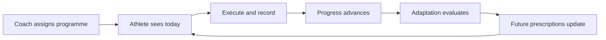
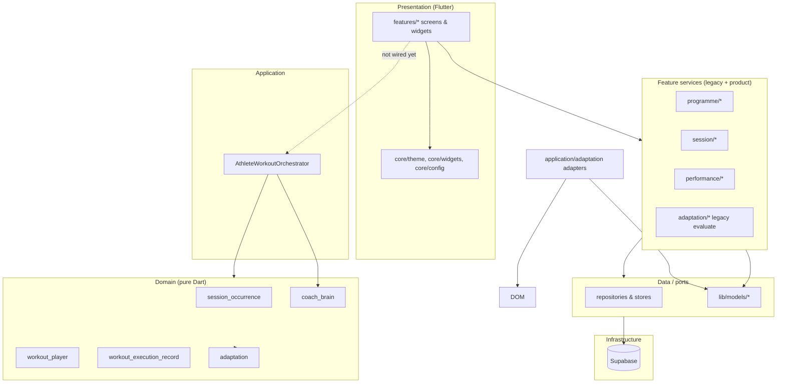
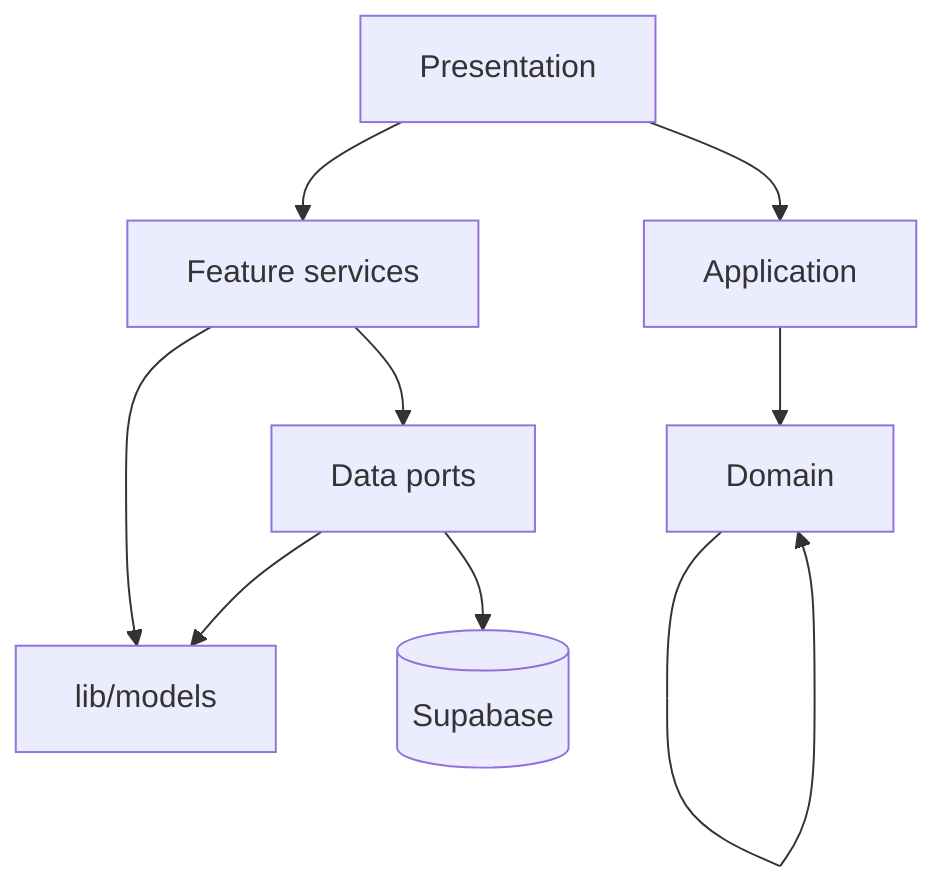
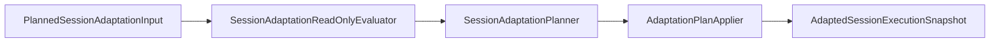
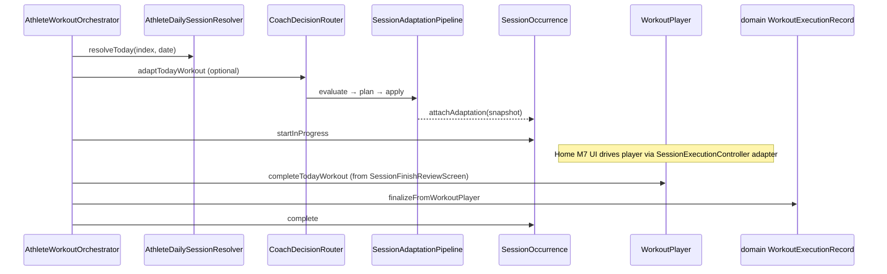
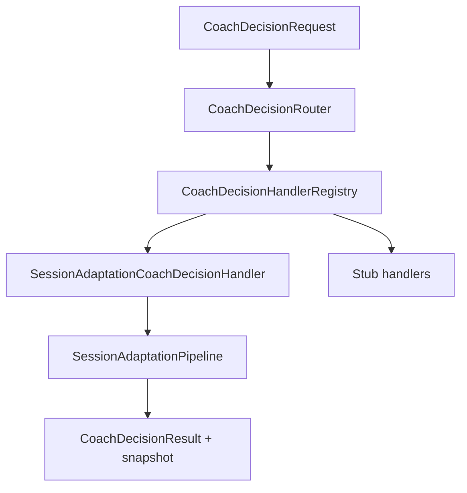
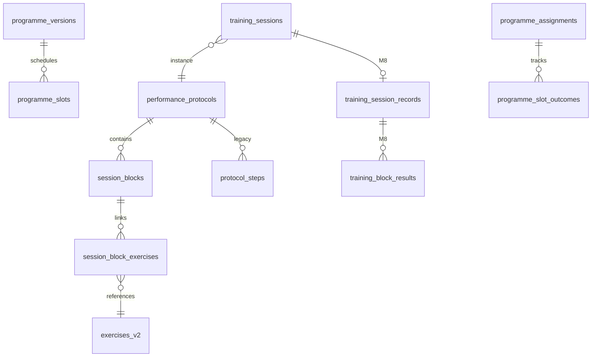
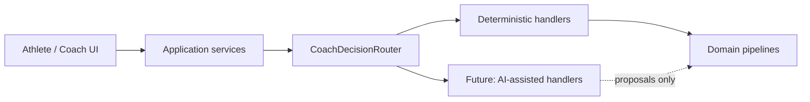
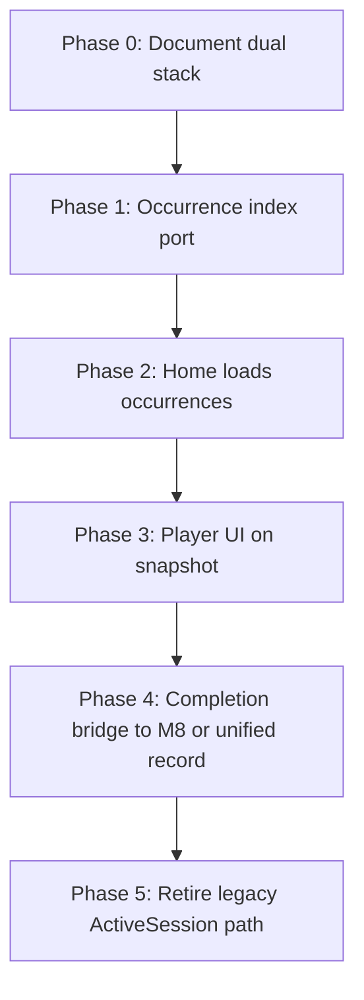

# Cohort Platform — Architecture Blueprint v2

**Status:** Primary technical reference (Phase 2 closed — see [Phase_2_Architecture_Consolidation_Completion.md](./Phase_2_Architecture_Consolidation_Completion.md))  
**Source of truth:** Implemented code on branch `refactor/architecture-alignment` and live Supabase schema  
**Supersedes for orientation:** `07 Documentation/51_Cohort_Platform_v1_Architecture_Freeze.md` (v1 athlete/coach baseline — does not describe the M3–M7 domain execution pipeline)  
**Companion docs:** `07 Documentation/41_Programme_Engine.md`, `43_Programme_Engine_Service_Contracts.md`, `52_M8_Performance_Capture_and_Training_History.md`, `79_Adaptation_Ontology_V1.md`, `66_V2_0_End_To_End_Execution_And_Adaptation.md`, `72_V2_0_Production_Athlete_Experience.md`

---

## Document map

| § | Topic |
|---|--------|
| 1 | Vision |
| 2 | Design philosophy |
| 3 | Architectural principles |
| 4 | Layered architecture |
| 5 | Dependency rules |
| 6 | Domain model overview |
| 7 | Athlete execution pipeline |
| 8 | Aggregate responsibilities |
| 9 | Coach Brain responsibilities |
| 10 | Ports & infrastructure |
| 11 | Persistence strategy |
| 12 | Knowledge Layer strategy |
| 13 | AI integration strategy |
| 14 | Future integrations |
| 15 | Migration from legacy architecture |
| 16 | Glossary |
| 17 | Architecture decision records |
| 18 | Phase 2 closure — canonical vs compatibility |

---

## 1. Vision

Cohort Platform connects **coach-authored training structure** with **athlete execution**, **durable performance history**, and **deterministic programme adaptation** so that today’s session serves long-term progression—not isolated workouts.

The product goal for V2.0 is a closed coaching loop (documented in `64_V2_0_Product_Readiness_First_Slice.md`):



**What the platform is:** a Flutter client backed by Supabase, with a growing **pure-Dart domain layer** for calendar occurrences, in-session execution state, adaptation ontology, and a **Coach Brain** routing framework for coaching decisions.

**What the platform is not (today):** a single unified athlete stack. Production Home still renders the **M7/M8 feature pipeline** for session UI and Supabase persistence, while **domain execution** (`SessionOccurrence` → `WorkoutPlayer` → domain `WorkoutExecutionRecord`) is wired for Home launch, runtime, and finish (Sprints 7–9). Occurrence and domain record stores remain **in-memory** in production.

---

## 2. Design philosophy

These principles appear consistently across v1 freeze, Programme Engine, and Adaptation Ontology docs and are reflected in code boundaries:

1. **Structure without restricting creativity** — typed blocks and metadata; free-text workout content remains the coaching instruction surface (not parsed into sets/reps).
2. **Coaches should not think like software** — authoring and athlete UI use human labels; enums and DB IDs stay internal.
3. **Athlete experience reflects coach intent** — execution consumes **projections** (`SessionExecutionPlan`, `AdaptedSessionExecutionSnapshot`), not raw persistence rows.
4. **One source of truth per concept** — one block model for authoring; one immutable performance tree for M8; one programme assignment cursor (`athlete_state` projection).
5. **Authoring, execution, and performance are separate** — M8 records never mutate `SessionBlock` or `ProtocolDraft`.
6. **Preserve intent before format** — adaptation ranks smallest valid changes (prescription → swap → block → session) per `79_Adaptation_Ontology_V1.md`.
7. **Additive evolution** — new tables and columns; legacy `protocol_steps` retained until block-native content and engines are fully retired.
8. **Explainability** — adaptation actions and audit events carry rationale suitable for athlete and coach surfaces.

---

## 3. Architectural principles

| Principle | Implementation signal |
|-----------|------------------------|
| **Repositories fetch only** | `lib/data/repositories/*_store.dart` — no schedule resolution inside stores (`43_Programme_Engine_Service_Contracts.md`) |
| **Services own orchestration** | `TodaySessionService`, `ProgrammeScheduleResolver`, `PerformanceRecordSaveCoordinator`, `AdaptationExecutionCoordinator` |
| **Domain owns invariants** | `SessionOccurrence`, `WorkoutPlayer`, domain `WorkoutExecutionRecord`, adaptation evaluate/plan/apply |
| **Application coordinates, does not rule** | `AthleteWorkoutOrchestrator` — resolve/adapt/start/complete without embedding adaptation algorithms |
| **Coach Brain routes decisions** | `CoachDecisionRouter` + typed handlers; session adaptation delegates to `SessionAdaptationPipeline` |
| **Widgets stay thin** | Home loads via `HomeTodaySessionLoader`; execution via `SessionExecutionController` |
| **Client uses anon key only** | `SUPABASE_ANON_KEY`; service role never in Flutter |
| **Immutability after completion** | Completed M8 records, completed slot outcomes, and completed training sessions are not rewritten (`66_V2_0_End_To_End_Execution_And_Adaptation.md`) |

---

## 4. Layered architecture

### 4.1 Logical layers



### 4.2 Physical layout (`lib/`)

| Path | Role |
|------|------|
| `lib/core/` | Theme, shared widgets, auth/navigation policy (`ProductionNavigationPolicy`, `InternalToolsPolicy`) |
| `lib/models/` | Shared persistence/DTO models (`Protocol`, `SessionBlock`, programme types) |
| `lib/data/repositories/` | Supabase-backed stores and thin repositories |
| `lib/features/` | Product verticals: `home`, `session`, `performance`, `programme`, `programme_builder`, `coach_studio`, `adaptation`, … |
| `lib/domain/` | New aggregates and adaptation ontology (no Flutter imports) |
| `lib/application/` | Use-case orchestrators (`athlete_workout/` only today) |

### 4.3 Programme Engine vs Execution Engine (conceptual)

From `41_Programme_Engine.md`:

| Layer | Owns |
|-------|------|
| Programme Builder | Draft authoring, validation, publishing |
| Programme Engine | Assignment, schedule resolution, progression cursor, slot outcomes |
| Decision / adaptation | Whether prescribed route changes (constraints, performance, rules) |
| Execution Engine | Performing today’s protocol and recording evidence |

---

## 5. Dependency rules

### 5.1 Intended direction



**Rules:**

- **Domain** must not depend on Flutter, Supabase, or `features/`.
- **Application** may depend on **domain** only (plus its own DTOs).
- **Features** may depend on **data**, **models**, and **core**; should not import **application** until Home is migrated.
- **Data** implements store interfaces; no business rules beyond mapping and error surfacing (`ProgrammeStoreException`).

### 5.2 Known violations (tracked for migration)

| Issue | Location | Remediation direction |
|-------|----------|------------------------|
| Domain → `lib/models` | **Resolved (Sprint 3)** — adapters in `lib/application/adaptation/` | Domain uses `PlannedSessionAdaptationInput`, `AdaptationBlockType`, etc. |
| Duplicate type names | Resolved: domain aggregate renamed to `WorkoutExecutionRecord`; M8 retains `TrainingSessionRecord` | M8 persistence remains separate; domain port TBD |
| Dual athlete stacks | Home vs `AthleteWorkoutOrchestrator` | Wire Home through application layer; retire duplicate paths incrementally |

### 5.3 Testing boundaries

- Domain and application: **unit tests** with in-memory indexes and fakes (`test/domain/*`, `test/application/athlete_workout/`).
- Product regressions: **widget/integration** tests under `test/session/`, `test/home/`, `test/performance/`, etc.
- Stores: Supabase implementations tested via contract tests and dev project; in-memory fakes in `test/support/`.

---

## 6. Domain model overview

### 6.1 Content hierarchy (coach-authored)

```
Programme (versioned template)
  └── Week / Day
        └── Programme session slot
              └── Protocol / Session (performance_protocols)
                    └── SessionBlock (+ session_block_exercises → exercises_v2)
                    └── protocol_steps [legacy projection]
```

### 6.2 Runtime hierarchy (target domain model)

```
Programme assignment + slot  ──maps──▶  SessionOccurrence (calendar instance)
                                              │
                    AdaptedSessionExecutionSnapshot (prescription for execution)
                                              │
                                         WorkoutPlayer (position + status)
                                              │
                              domain WorkoutExecutionRecord (historical outcomes)
```

### 6.3 Key types and locations

| Concept | Primary type(s) | Location |
|---------|-----------------|----------|
| Session definition | `Protocol`, `ProtocolDraft`, `SessionBlock` | `lib/models/` |
| Athlete today (legacy) | `ResolvedTodaySession`, `ProgrammeExecutionContext` | `lib/features/programme/models/` |
| Calendar workout instance | `SessionOccurrence` | `lib/domain/session_occurrence/` |
| In-memory day index | `AthleteSessionOccurrenceIndex` | `lib/domain/session_occurrence/athlete_daily/` |
| Adapted prescription | `AdaptedSessionExecutionSnapshot` | `lib/domain/adaptation/application/` |
| Active player | `WorkoutPlayer` | `lib/domain/workout_player/` |
| Domain execution history | `WorkoutExecutionRecord` | `lib/domain/workout_execution_record/` |
| M8 performance aggregate | `TrainingSessionRecord` (different class) | `lib/features/performance/models/` |
| Legacy execution projection | `SessionExecutionPlan` | `lib/features/session/models/` |
| Legacy runtime state | `ActiveSessionState` | `lib/features/session/models/` |
| Assignment row | `TrainingSession` | `lib/models/training_session.dart` + repository |

### 6.4 Adaptation ontology (domain)

Canonical vocabulary lives under `lib/domain/adaptation/vocabulary/` (`SessionIntent`, `AdaptationActionType`, `AdaptationFidelity`, …). Full taxonomy: `79_Adaptation_Ontology_V1.md`.

Pipeline stages:



---

## 7. Athlete execution pipeline

Two pipelines coexist for **non-Home** entry (manual preview, legacy launch without `WorkoutSessionLaunchContext`). **Home programme workouts** use the unified flow below for adaptation, runtime, and finish.

### 7.1 Production pipeline (live — Home + M7/M8)

```mermaid
sequenceDiagram
  participant Home as HomeTodaySessionSection
  participant Loader as HomeTodaySessionLoader
  participant TSS as TodaySessionService
  participant TSR as TrainingSessionRepository
  participant Over as SessionOverviewScreen
  participant Active as ActiveSessionScreen
  participant SEC as SessionExecutionController
  participant WP as WorkoutPlayer
  participant Finish as SessionFinishReviewScreen
  participant Dom as AthleteWorkoutCompletionApplicationService
  participant WER as domain WorkoutExecutionRecord
  participant Occ as SessionOccurrence
  participant M8 as PerformanceRecordSaveCoordinator

  Home->>Loader: load(athleteId)
  Loader->>TSS: resolveForAthlete
  Loader-->>Home: HomeTodaySessionState
  Home->>Over: navigate (protocol / training session)
  Over->>TSR: create or resume training_sessions
  Over->>Active: SessionExecutionPlan + WorkoutSessionLaunchContext
  Active->>SEC: UI adapter (when launch context)
  SEC->>WP: navigation / block completion
  Active->>Finish: review + RPE
  Finish->>Dom: completeTodayWorkout (outcomes from M8 draft)
  Dom->>WP: finishWorkout
  Dom->>WER: finalizeFromWorkoutPlayer
  Dom->>Occ: SessionOccurrence.complete
  Finish->>M8: PerformanceRecordSaveCoordinator.completeSession
  M8->>M8: training_session_records + progression + post-completion adaptation
  Finish->>SEC: applyDomainCompletionProjection (UI only)
```

**Entry components:**

| Step | Component | Path |
|------|-----------|------|
| Today resolution | `TodaySessionService`, `ProgrammeScheduleResolver` | `lib/features/programme/services/` |
| Home load | `HomeTodaySessionLoader` | `lib/features/home/services/` |
| Plan build | `SessionExecutionPlanBuilder` | `lib/features/session_builder/services/` |
| Launch | `SessionExecutionLauncher` | `lib/features/session/services/` |
| Pre-session “adapt” UI (day-of) | `AthleteWorkoutAdaptationApplicationService` → Coach Brain → `SessionAdaptationPipeline` + bottom sheet | `lib/application/adaptation/`, `lib/core/widgets/adaptation_bottom_sheet.dart` |

Day-of adaptation is **evaluate-only** in production Home: Coach Brain runs evaluate → plan → apply and returns an execution snapshot in memory; Home maps `AdaptationEvaluationOutcome.noAdaptationRequired` to keep-original messaging. **Sprint 7:** accepting the decision sheet calls `adaptTodayWorkout` → `SessionOccurrence.attachAdaptation`; START SESSION calls `startTodayWorkout` and opens a `WorkoutPlayer` held on `WorkoutSessionLaunchContext` while M7 `ActiveSessionScreen` still renders the DB plan. **Sprint 8:** when launch context is present, `SessionExecutionController` is a UI adapter — `WorkoutPlayer` owns navigation transitions; `ActiveSessionState` is projected for widgets. **Sprint 9:** finish review calls `AthleteWorkoutCompletionApplicationService` → `completeTodayWorkout` → domain `WorkoutExecutionRecord`, then unchanged `PerformanceRecordSaveCoordinator.completeSession`; `SessionExecutionController.applyDomainCompletionProjection` syncs UI only (terminal state is not owned by `completeSession` on this path). Occurrence index remains **in-memory** (no Supabase occurrence persistence).

**Programme post-completion adaptation** (slot progression, future-slot substitution) remains **`AdaptationExecutionCoordinator`** — separate from day-of session adaptation.

### 7.2 Orchestrator pipeline (domain core — shared with production finish)



**Orchestrator operations** (`lib/application/athlete_workout/athlete_workout_orchestrator.dart`):

| Method | Effect |
|--------|--------|
| `resolveToday` | Pick occurrence for date via index + resolver |
| `adaptTodayWorkout` | Coach Brain → attach snapshot → index upsert |
| `startTodayWorkout` | `SessionOccurrence.startInProgress` |
| `completeTodayWorkout` | Finish player → domain record → `SessionOccurrence.complete` |

Production finish invokes `completeTodayWorkout` through `AthleteWorkoutCompletionApplicationService` before M8 persistence.

### 7.3 Post-completion adaptation (production bridge)

After M8 save, `AdaptationExecutionCoordinator` runs deterministic rules (`66_V2_0_End_To_End_Execution_And_Adaptation.md`): load progression on future slots, recovery substitution, idempotent `programme_adaptation_events`. This is **programme-slot** adaptation, not the same code path as pre-session `SessionAdaptationPipeline`.

---

## 8. Aggregate responsibilities

### 8.1 `SessionOccurrence`

**Role:** One scheduled workout on an athlete calendar—not the reusable session definition.

| Responsibility | Detail |
|----------------|--------|
| Identity | `occurrenceId`, `sourceSessionId` (protocol id) |
| Programme linkage | Optional `programmeAssignmentId`, `programmeSessionSlotId` |
| Calendar | `plannedDate`, `currentDate`, reschedule history |
| Lifecycle | `SessionOccurrenceLifecycleState` (scheduled → in progress → terminal) |
| Adaptation attachment | Optional `AdaptedSessionExecutionSnapshot` |
| Transitions | `attachAdaptation`, `startInProgress`, `complete`, reschedule APIs with `SessionOccurrenceTransitionResult` |
| Audit | In-memory `auditTrail` on aggregate |

Factory: `ProgrammeSessionOccurrenceFactory` maps programme slot inputs + `ProgrammeSessionOccurrenceRegistry`.

### 8.2 `WorkoutPlayer`

**Role:** Active execution navigation state for an in-progress occurrence.

| Responsibility | Detail |
|----------------|--------|
| Prescription source | Reads **`executionSnapshot` only** — no duplicate prescription |
| Navigation | `WorkoutPlayerNavigation` over snapshot steps |
| Lifecycle | ready → in progress → paused → completed (`WorkoutPlayerLifecycle`) |
| Non-goals | No Flutter, no Supabase, no M8 typed set results |

### 8.3 Domain `WorkoutExecutionRecord`

**Role:** Immutable **domain** history of what the athlete did (completed / skipped / modified per exercise entry).

| Responsibility | Detail |
|----------------|--------|
| Links | `occurrenceId`, optional `playerId`, frozen `executionSnapshot` |
| Outcomes | `WorkoutExerciseExecutionEntry` list |
| Factory | `beginRecording`, `finalizeFromWorkoutPlayer` |

**Explicitly distinct** from M8 `TrainingSessionRecord` (prescription snapshots, block/set result tree, Supabase RPCs). Comment in source: `lib/domain/workout_execution_record/workout_execution_record.dart`.

### 8.4 M8 performance tree (feature aggregate)

**Role:** Durable athlete performance for product history and progression inputs.

| Piece | Role |
|-------|------|
| `TrainingSessionRecord` (feature) | Root immutable record |
| `TrainingBlockResult` / `TrainingExerciseResult` / `TrainingSetResult` | Structured capture |
| `ActivePerformanceDraft` | Mutable in-session capture |
| Snapshots | Embedded at completion so later coach edits do not rewrite history |

Orchestration: `PerformanceRecordSaveCoordinator` (`52_M8_Performance_Capture_and_Training_History.md`).

### 8.5 Programme aggregates (feature layer)

Not yet modeled as DDD aggregates in `lib/domain/`; implemented as services + stores:

- **Programme assignment** — athlete bound to published version
- **Slot outcome** — scheduled / completed / replacement protocol on a slot
- **Athlete state** — projected cursor for Home (`AthleteStateSyncService`)

---

## 9. Coach Brain responsibilities

Coach Brain is a **pure-Dart decision routing framework** (`lib/domain/coach_brain/`). It does not render UI, persist directly, or embed Supabase.

### 9.1 Structure



### 9.2 Decision types

`CoachDecisionType` (`lib/domain/coach_brain/vocabulary/coach_decision_type.dart`):

| Type | Handler status |
|------|----------------|
| `sessionAdaptation` | **Real** — `SessionAdaptationCoachDecisionHandler` |
| `exerciseSubstitution` | Stub |
| `prescriptionScaling` | Stub |
| `rescheduling` | Stub |
| `extraTraining` | Stub |

### 9.3 Composition

- `CoachBrainDependencies.defaults()` wires real session adaptation + stubs for other types.
- `CoachBrainDependencies.stub()` — all stubs for framework tests.
- Session handler is a **thin adapter**: validates context type, runs pipeline, maps application status to `CoachDecisionResult` / `SessionAdaptationCoachDecisionFailureCode`.

### 9.4 Relationship to `AthleteWorkoutOrchestrator`

The orchestrator calls `router.route(...)` for `adaptTodayWorkout`, then **`SessionOccurrence.attachAdaptation`** and index upsert—Brain does not mutate occurrences directly.

---

## 10. Ports & infrastructure

### 10.1 Store interfaces (programme engine)

Defined in `lib/data/repositories/`; Supabase implementations `*_supabase_store.dart`. Contract summary in `43_Programme_Engine_Service_Contracts.md`:

| Port | Responsibility |
|------|----------------|
| `ProgrammeVersionStore` | Versioned templates, catalogue |
| `ProgrammeAssignmentStore` | Athlete ↔ version assignment |
| `ProgrammeSlotOutcomeStore` | Per-slot scheduled/completed outcomes |
| `AthleteStateStore` | Projected athlete cursor |
| `ProgrammeAdaptationEventStore` | Idempotent post-completion adaptation audit |

Shared: `ProgrammeTemplateTreeAssembler`, `ProgrammeStoreException`.

### 10.2 Repositories (content & runtime)

| Repository | Role |
|------------|------|
| `ProtocolRepository` / `SessionBlockRepository` | Session content |
| `TrainingSessionRepository` | Athlete `training_sessions` rows |
| `ExerciseRepository` | `exercises_v2` |
| `KnowledgeRepository` | Protocol → exercise relationships |
| Programme `ProgrammeRepository` | Higher-level programme reads |

### 10.3 Performance port (feature-scoped)

| Port | Role |
|------|------|
| `PerformanceRecordStore` | Abstract M8 persistence |
| `SupabasePerformanceRecordStore` | Production |
| `InMemoryPerformanceRecordStore` | Tests |

RPC: `complete_training_session_record` (idempotent completion).

### 10.4 Domain ports (gaps)

| Concept | Today | Planned direction |
|---------|--------|-------------------|
| `AthleteSessionOccurrenceIndex` | In-memory only in domain | Store port + Supabase projection (Task 3 note on snapshot status enum) |
| Domain `WorkoutExecutionRecord` | No store in `lib/data` | Bridge or merge with M8 tree during migration |
| `AdaptedSessionExecutionSnapshot` | On occurrence in memory | Persist with occurrence or training session row |

### 10.5 Infrastructure services

| Service | Path |
|---------|------|
| Supabase client bootstrap | `lib/core/services/supabase_service.dart` |
| Auth / profile | `lib/features/auth/` (V2 slice) |

---

## 11. Persistence strategy

### 11.1 Backend

- **Supabase** Postgres + RLS; Flutter uses **anon key** only.
- Dev allowlists documented in M8/programme docs; production hardening in `71_V2_0_Production_Identity_And_RLS_Lockdown.md`.

### 11.2 Principal table groups



### 11.3 Save orchestration patterns

| Flow | Pattern |
|------|---------|
| Session authoring | `ProtocolBuilderService`: upsert protocol → replace blocks/links → project steps; **no multi-table transaction** (client limitation) |
| M8 completion | Sequential: complete record → complete `training_sessions` → progression → adaptation coordinator |
| Programme template | `ProgrammeVersionStore.saveTemplateTree` via builder coordinators |
| Adaptation audit | Upsert slot outcomes + insert `programme_adaptation_events` with idempotency key |

### 11.4 Immutability rules

| Artifact | After terminal state |
|----------|----------------------|
| M8 `TrainingSessionRecord` | Never mutated |
| Completed slot outcome | Never mutated |
| Published programme version | Never mutated in place (new version instead) |
| Future scheduled slot outcome | May receive pre-applied adaptation (`replacement_protocol_id`) |

---

## 12. Knowledge Layer strategy

### 12.1 Current implementation

| Surface | Mechanism |
|---------|-----------|
| **Exercise library** | `exercises_v2` via `ExerciseRepository`; coach Training Library tabs (`48_Training_Library.md`) |
| **Protocol ↔ exercise graph** | `knowledge_relationships` (`from_type=protocol`, `relationship=contains`) via `KnowledgeRepository.getExercisesForProtocol` |
| **Athlete Home “Knowledge”** | Navigation policy exposes libraries when `ProductionNavigationPolicy.showAthleteKnowledge()` — separate from coach Training Library IA |
| **Exercise relationships (M9)** | `ExerciseRelationshipStore` for usage/regression graphs — coach studio governance |

### 12.2 Design intent

- **Canonical movement knowledge** lives on `Exercise` (`lib/models/exercise.dart`) and curated content—not invented in UI placeholders (workspace rule: use Protocol/Exercise records).
- **Adaptation metadata** is gradually structured in domain types (`ExerciseAdaptationMetadata`, session/block metadata contracts in `79_Adaptation_Ontology_V1.md`) with legacy string fields mapped via transitional tables in that doc.
- **Knowledge relationships** supplement session content for discovery and future substitution graphs; they do not replace block-linked exercises for authoring.

### 12.3 Non-goals (today)

- No vector / semantic search layer in repo.
- No separate CMS; Supabase is source of truth for published content.

---

## 13. AI integration strategy

**Current codebase:** no LLM or external AI provider integrations (no OpenAI/Anthropic usage in `lib/`).

**Architectural placement (planned extension, not implemented):**



**Principles for future AI features:**

1. **Domain rules remain authoritative** — hard constraints (`AdaptationConstraint`), fidelity checks, and audit types stay in Dart; AI may propose ranked options, not bypass validation.
2. **Coach Brain as seam** — new `CoachDecisionHandler` implementations (e.g. natural-language coach Q&A) register beside `SessionAdaptationCoachDecisionHandler` without forking Home logic.
3. **No silent mutation of authored content** — AI output must pass same appliers/planners or human confirmation flows as deterministic adaptation.
4. **Explainability** — align with `AdaptationPlanRationale` and audit event vocabulary.
5. **Representative data** — coaching copy and exercise cues must come from stored Protocol/Exercise records, not model invention (product rule).

Until handlers exist, treat **Adaptation Ontology + SessionAdaptationPipeline** as the “Coach Brain” for session changes.

---

## 14. Future integrations

Only items with explicit architectural footing in repo docs or stub handlers—no speculative product features.

| Integration | Evidence | Notes |
|-------------|----------|-------|
| **Deep linking / routing** | v1 freeze: imperative `Navigator`; no `go_router` | iOS email verification deep links called out as incomplete in `72_V2_0_Production_Athlete_Experience.md` |
| **Programme version pinning (M9)** | Session lineage/revision docs `55`–`57`, Coach Studio governance | Reduces live-reference risk when library sessions change |
| **Remaining Coach Brain handlers** | Stubs in `stub_coach_decision_handlers.dart` | substitution, scaling, rescheduling, extra training |
| **Occurrence + snapshot persistence** | Comment on `AdaptedSessionExecutionSnapshotStatus` | Domain Task 3 |
| **Wearables / HR** | M8 `EnduranceResultData` optional HR fields | Capture/display only where authored |
| **Founder importers** | `tool/importer/`, docs `74`, `76` | Operational content load, not runtime athlete path |
| **Assignment product UI** | Service exists; partial in V2 audits | `65_V2_0_Athlete_Management_And_Assignment.md` |

---

## 15. Migration from legacy architecture

### 15.1 Dual-stack summary

| Concern | Legacy (production) | Target (domain + application) |
|---------|---------------------|----------------------------------|
| Today resolution | `ResolvedTodaySession` | `AthleteDailySessionResolver` + `SessionOccurrence` |
| Execution state | `ActiveSessionState` / `SessionExecutionController` | `WorkoutPlayer` |
| Performance | M8 feature record + Supabase | Domain record (+ future port to M8 or unified model) |
| Pre-session adapt (day-of) | `AthleteWorkoutAdaptationApplicationService` (Coach Brain pipeline; evaluate-only UI) | `adaptTodayWorkout` + snapshot attach on occurrence (execution bridge) |
| Plan projection | `SessionExecutionPlan` | `AdaptedSessionExecutionSnapshot` (parallel structure) |

### 15.2 Recommended migration phases



1. **Phase 0** — This blueprint; align team on terminology (§16).
2. **Phase 1** — Persist/load `SessionOccurrence` + snapshots; keep `training_sessions` correlation.
3. **Phase 2** — `HomeTodaySessionLoader` delegates to `AthleteWorkoutOrchestrator.resolveToday` (feature flag).
4. **Phase 3** — Replace `ActiveSessionScreen` internals with player driven by snapshot (or map snapshot → `SessionExecutionPlan` temporarily).
5. **Phase 4** — Single completion path: either map domain record → M8 save coordinator or deprecate domain record in favor of M8-only with occurrence ids.
6. **Phase 5** — Wire `adaptTodayWorkout` from Home/player; retire legacy `ActiveSession` path; keep **programme** post-completion `AdaptationExecutionCoordinator` unchanged.

### 15.3 Compatibility layer (ongoing)

| Mechanism | Purpose |
|-----------|---------|
| `BlockToLegacyStepProjector` | Authoring save → `protocol_steps` |
| `ProtocolStepToBlockConverter` | Athlete load when blocks missing |
| `SessionPlayerScreen` | Legacy step-native engines—not Home entry |

Retire when: block-native data complete, engines adapted, regression green (`51_Cohort_Platform_v1_Architecture_Freeze.md` §11).

### 15.4 Anti-corruption

Move `PlannedSessionAdaptationInputFactory` out of `lib/domain/adaptation/evaluation/` into application or infrastructure so domain stops importing `lib/models`.

---

## 16. Glossary of canonical terminology

| Term | Meaning |
|------|---------|
| **Programme** | Versioned multi-week training template |
| **Programme session slot** | Place on programme calendar referencing a protocol |
| **Protocol / Session** | Reusable or programme-scoped workout definition (`performance_protocols`) |
| **Session block** | Primary authoring unit (M6) with type, content, format, timer, links |
| **Cohort Protocol** | Official global content (`content_kind = cohort_protocol`) |
| **Coach Session** | Coach-owned library session (`content_kind = session`) |
| **Programme-only session** | Scoped to one programme version—not in Session Library |
| **Training session** | Athlete runtime assignment row (`training_sessions`) |
| **Session occurrence** | Domain calendar instance of a workout for one athlete/day |
| **Execution snapshot** | Immutable adapted prescription (`AdaptedSessionExecutionSnapshot`) |
| **Workout player** | Domain in-progress navigation state |
| **Training session record (M8)** | Supabase-backed performance root with block/exercise/set tree |
| **Training session record (domain)** | Domain exercise-outcome history tied to occurrence |
| **Session execution plan** | Legacy M7 projection for UI engines |
| **Active session state** | Legacy M7 mutable navigation state |
| **Resolved today session** | Programme engine DTO for Home |
| **Slot outcome** | Programme progress/adaptation state per slot |
| **Coach Brain** | Router + handlers for coaching decisions |
| **Session adaptation pipeline** | Evaluate → plan → apply for snapshots |
| **Adaptation decision service** | **Removed** (Sprint 6B). Historical docs only — day-of uses Coach Brain (ADR-020) |
| **Programme intent** | Macro phase intent (build/deload/…) |
| **Session intent** | Stimulus taxonomy for adaptation (`SessionIntent`) |
| **Post-completion adaptation** | Deterministic rules after M8 save on future slots |

---

## 17. Architecture decision records

| ID | Decision | Status | Rationale / consequences |
|----|----------|--------|---------------------------|
| ADR-001 | **Block-native authoring (M6)** as primary unit | Accepted | Free-text instruction + typed metadata; links are references not prescriptions |
| ADR-002 | **Retain `protocol_steps`** with projection | Accepted | Backward compatibility for step engines until retirement |
| ADR-003 | **Separate M8 performance** from authoring models | Accepted | Snapshots at completion; no mutation of blocks after perform |
| ADR-004 | **Programme Engine stores are fetch-only** | Accepted | Business logic in services; testable ports |
| ADR-005 | **Athlete state is a projection** of assignment + resolution | Accepted | `AthleteStateSyncService` mirrors programme truth |
| ADR-006 | **Imperative Navigator routing** for v1/v2 | Accepted | No global router yet; internal tools gated by policy |
| ADR-007 | **Introduce `SessionOccurrence` aggregate** | Accepted | Calendar lifecycle; **wired** for programme Home; index in-memory until Phase 4 port |
| ADR-008 | **Introduce `WorkoutPlayer` + domain `WorkoutExecutionRecord`** | Accepted | Execution/history split; **wired** for Home launch/runtime/finish; M8 name collision resolved |
| ADR-009 | **Coach Brain as extensible router** | Accepted | Real handler for `sessionAdaptation`; stubs document future decision types |
| ADR-010 | **Adaptation ontology in pure domain** | Accepted | `79_Adaptation_Ontology_V1.md`; factory still bridges `ProtocolDraft` |
| ADR-011 | **Dual pre-session adaptation paths** | **Superseded** | Replaced by ADR-020 (Sprint 6B) |
| ADR-012 | **Post-completion adaptation via coordinator** | Accepted | Idempotent events; mutates future slot outcomes only |
| ADR-013 | **Supabase client without multi-table transactions** | Accepted | Authoring saves are ordered steps with acceptance of partial failure risk |
| ADR-014 | **Anon key only in Flutter** | Accepted | Service role excluded from app bundle |
| ADR-015 | **Production navigation policy** | Accepted | Athletes/coaches see role-appropriate surfaces; internal tools off by default (`72`) |
| ADR-016 | **No AI in critical path** | Accepted | Deterministic planners/evaluators; AI reserved for future handlers |
| ADR-017 | **SessionOccurrence canonical workout identity** | Accepted | [adrs/ADR-017-session-occurrence-canonical-identity.md](./adrs/ADR-017-session-occurrence-canonical-identity.md) |
| ADR-018 | **WorkoutPlayer canonical runtime** | Accepted | [adrs/ADR-018-workout-player-canonical-runtime.md](./adrs/ADR-018-workout-player-canonical-runtime.md) |
| ADR-019 | **WorkoutExecutionRecord canonical completion** | Accepted | [adrs/ADR-019-workout-execution-record-canonical-completion.md](./adrs/ADR-019-workout-execution-record-canonical-completion.md) |
| ADR-020 | **Coach Brain sole day-of adaptation** | Accepted | [adrs/ADR-020-coach-brain-day-of-adaptation-authority.md](./adrs/ADR-020-coach-brain-day-of-adaptation-authority.md) |
| ADR-021 | **UI + M8 behind compatibility adapters** | Accepted | [adrs/ADR-021-ui-m8-compatibility-adapters.md](./adrs/ADR-021-ui-m8-compatibility-adapters.md) |
| ADR-022 | **Post-completion adaptation distinct from day-of** | Accepted | [adrs/ADR-022-post-completion-adaptation-distinct.md](./adrs/ADR-022-post-completion-adaptation-distinct.md) |

---

## 18. Phase 2 closure — canonical vs compatibility

**Canonical (programme Home launches today):**

1. **Identity** — `SessionOccurrence` via `AthleteTodayWorkoutResolutionService` / materializer  
2. **Day-of adaptation** — `AthleteWorkoutAdaptationApplicationService` → Coach Brain → `SessionAdaptationPipeline`  
3. **Runtime** — `WorkoutPlayer` (controller projects M7 state)  
4. **Domain completion** — `AthleteWorkoutOrchestrator.completeTodayWorkout` → `WorkoutExecutionRecord`  
5. **Persistence & progression** — `PerformanceRecordSaveCoordinator` (M8 unchanged)  
6. **Future slots** — `AdaptationExecutionCoordinator`

**Intentional compatibility (remain until Phase 4+):**

- DB-backed `SessionExecutionPlan` + `SessionExecutionLauncher`  
- M8 `TrainingSessionRecord` tree (not replaced by domain record type)  
- `WorkoutExecutionOutcomeMapper` at finish  
- In-memory occurrence index and optional domain record store  
- Manual / preview sessions without `WorkoutSessionLaunchContext`

**Persistence limitations (documented, not Phase 2 defects):** occurrence and domain execution records are not Supabase-backed; in-session resume across cold start is best-effort via `AthleteSessionMemoryStore` only.

Full verification tables and test/analyze output: [Phase_2_Architecture_Consolidation_Completion.md](./Phase_2_Architecture_Consolidation_Completion.md).

---

## Quick reference — where to start coding

| Goal | Start here |
|------|------------|
| Change Home today | `lib/features/home/services/home_today_session_loader.dart`, `TodaySessionService` |
| Change athlete session UI | `lib/features/session/` |
| Change performance save | `lib/features/performance/services/performance_record_save_coordinator.dart` |
| Change programme schedule | `lib/features/programme/services/programme_schedule_resolver.dart` |
| Change adaptation rules (pre-session) | `lib/domain/adaptation/` + Coach Brain handler |
| Change adaptation after workout | `lib/features/adaptation/` execution coordinator (see doc 66) |
| Wire programme athlete pipeline | `HomeTodaySessionLoader`, `AthleteWorkoutOrchestrator`, `AthleteWorkoutCompletionApplicationService` + tests |
| Add coaching decision type | `CoachDecisionType` + handler + register in `CoachBrainDependencies` |

---

*Last updated: Phase 2 architecture consolidation (Sprint 10). Phase 4 tracks occurrence/domain persistence and adapter retirement.*
