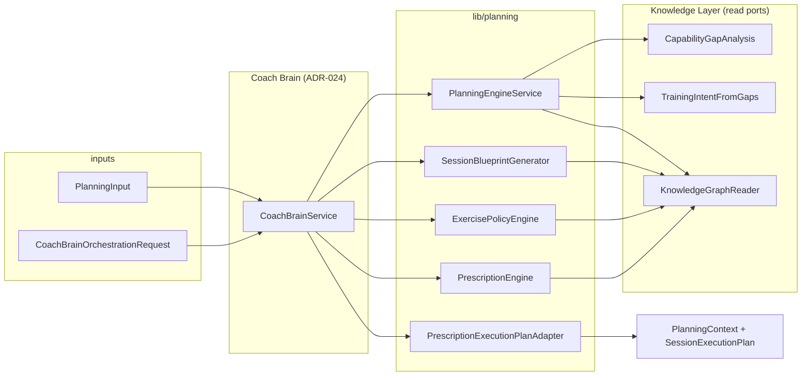
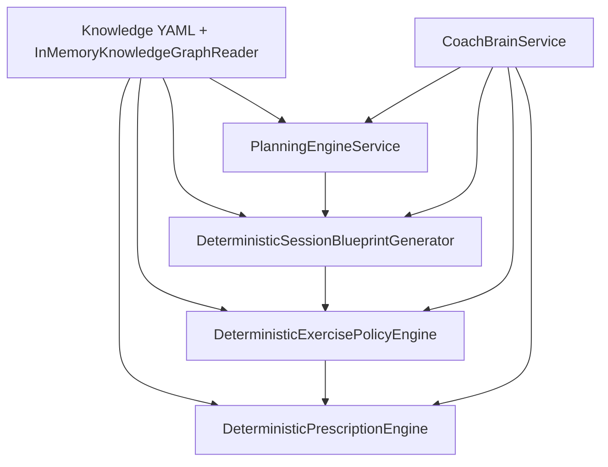

# Architecture Freeze v1 — Deterministic Coaching Engine (Phase 4.5)

**Date:** 2026-07-29  
**Scope:** Phase 4 Sprints 1–5 (Planning → Blueprint → Exercise Policy → Prescription → Coach Brain orchestration)  
**Ontology:** Knowledge bundle **1.3.0** (`knowledge/reference/`)  
**Status:** **Frozen for Phase 5 integration** — no new coaching logic in this review.

---

## Architecture Overview

The deterministic coaching engine is a **linear pipeline** of pure(ish) engines behind **application ports**, composed by **Coach Brain** for a single run artifact: **`PlanningContext`**.

**Hand-off chain (immutable stage results on `PlanningContext`):**

`PlanningInput` → `PlanningRecommendation` → `SessionBlueprint` → `ExercisePolicyResult` → `PrescriptionResult` → M7 `SessionExecutionPlan`

Day-of **session adaptation** (ADR-020) remains a **separate** path and is **not** wired in Phase 4 Sprint 5.

---

## Layer Ownership Matrix

| Concern | Owner module | Port | Must not |
|---------|--------------|------|----------|
| Gap scoring & capability ontology | `lib/knowledge/gap_analysis/` | `CapabilityGapAnalysisReader` | Live in Planning Engine merge |
| Training intent from gaps | `lib/knowledge/training_intent/` | `TrainingIntentResolutionReader` | Change in Exercise Policy |
| Programme semantics (phase/block/week) | Knowledge + Planning merge | via `PlanningEngineService` | Re-rank gaps in downstream stages |
| Planning merge & explainability | `lib/planning/planning_engine_service.dart` | `PlanningEngineReader` | Select exercises, prescribe loads |
| Session structure semantics | `lib/planning/session_blueprint/` | `SessionBlueprintGenerator` | Call Planning Engine internally |
| Movement selection & substitution | `lib/planning/exercise_policy/` | `ExercisePolicyEngine` | Change intent, phase, archetype |
| Sets/reps/tempo prescription | `lib/planning/prescription/` | `PrescriptionEngine` | Re-run gap analysis |
| Pipeline orchestration & diagnostics | `lib/planning/orchestration/` | `CoachBrainOrchestrator` | Embed YAML loaders, gap formulas, exercise ranking |
| M7 execution projection | `lib/planning/prescription/prescription_execution_plan_adapter.dart` | (adapter) | Own coaching science |
| Persistence / UI / scheduling | Out of scope Phase 4 | — | — |

---

## Dependency Graph

**Allowed direction:** Knowledge (read) ← Engines ← Ports ← Coach Brain ← Application/UI (future).

**Enforced by architecture tests (`test/architecture/architecture_dependency_test.dart`):**

- Coach Brain imports **ports only** for engines (not concrete `PlanningEngineService` construction inside orchestrator).
- Planning Engine does **not** import exercise policy or prescription.
- Exercise Policy does **not** import prescription.
- Session Blueprint generator does **not** import Planning Engine.
- Prescription does **not** import Exercise Policy engine type.

---

## ADR Compliance Matrix

| ADR | Title | Implementation evidence | Test / doc gate |
|-----|-------|-------------------------|-----------------|
| **023** | Planning Engine owns merge | `PlanningEngineService`, `PlanningEngineReader` | `test/planning/planning_engine_service_test.dart` |
| **024** | Coach Brain orchestrates planning | `CoachBrainService`, `CoachBrainOrchestrator` | `architecture_dependency_test.dart` (no gap/YAML in Brain) |
| **025** | Exercise Policy owns movement; no intent change | `DeterministicExercisePolicyEngine`, intent/archetype assertions | `architecture_contract_test.dart`, `exercise_policy_engine_test.dart` |
| **026** | PlanningRecommendation — no exercises | Model + source audit | `architecture_contract_test.dart` |
| **027** | SessionBlueprint bridge; no prescription | `SessionBlueprint`, `SessionBlueprintContract` | `session_blueprint_generator_test.dart`, contract test |
| **020** | Day-of adaptation authority | Unchanged; separate from planning pipeline | Documented boundary in freeze (not merged) |

**Partial / deferred ADR-024 items:** Recovery downgrade, travel simplification, and coach override **policies** are described in ADR-024 but implemented primarily in stage engines and request context (`SessionBlueprintGenerationContext`), not as a separate policy module inside Coach Brain.

---

## Public API Review

| Port | Method | Input | Output | Stability |
|------|--------|-------|--------|-----------|
| `PlanningEngineReader` | `createRecommendation` | `PlanningInput` | `PlanningRecommendation` | **Stable** — ADR-026 contract |
| `SessionBlueprintGenerator` | `generate` | `PlanningRecommendation` + optional context | `SessionBlueprint` | **Stable** — ADR-027 |
| `ExercisePolicyEngine` | `evaluate` | `ExercisePolicyRequest` | `ExercisePolicyResult` | **Stable** — semantic plan distinct from M7 plan |
| `PrescriptionEngine` | `prescribe` | `PrescriptionRequest` | `PrescriptionResult` | **Stable** — templates in code |
| `CoachBrainOrchestrator` | `run` | `CoachBrainOrchestrationRequest` | `PlanningContext` | **Stable** — aggregate explainability + stages |

**Internal adapters (not public ports):**

- `PrescriptionExecutionPlanAdapter` → `SessionExecutionPlan` (M7)
- Validators: `PlanningInputValidator`, `SessionBlueprintValidator`, `ExercisePolicyValidator`, `PrescriptionValidator`, `PlanningContextValidator`

**Breaking-change policy for Phase 5:** Bump `contractVersion` on `PlanningRecommendation` and blueprint/policy result types before altering field semantics.

---

## Explainability Audit

| Stage | Source type | Aggregated on `PlanningContext` |
|-------|-------------|-----------------------------------|
| Planning | `PlanningExplainability` | `aggregatedExplainability.planning` |
| Blueprint | Blueprint explainability factors | Merged via stage handlers |
| Exercise policy | Policy explainability | Merged on success/partial |
| Prescription | Prescription explainability | Merged on success/partial |
| Orchestration | `combinedNarrative` | Cross-stage narrative string |

Architecture tests assert **non-empty** combined narrative and **planning provenance** present after a reference scenario run.

**Gap:** LLM summarization hooks and UI presenters are **not** implemented (by design in Phase 4).

---

## Performance Baseline

**Environment:** Local `flutter test`, reference ontology loaded from `knowledge/`, scenario `cohort.scenario.general_fat_loss_a`, commercial gym equipment.

| Metric | Threshold (CI gate) | Observed |
|--------|---------------------|----------|
| Full pipeline median (10 runs) | &lt; 500 ms | **Pass** (`architecture_performance_baseline_test.dart`) |
| Full pipeline p95 | &lt; 800 ms | **Pass** |
| Deterministic re-run (same request) | Identical status & exercise ids | **Pass** |

**Note:** Baseline is in-process, single isolate — not representative of mobile cold start or network-backed knowledge. Phase 5 should re-baseline on device with cached ontology.

---

## Architecture Risks

| Risk | Severity | Mitigation |
|------|----------|------------|
| Archetype / prescription templates live in Dart, not full ontology YAML | Medium | Track ontology migration; avoid duplicating semantics in UI |
| Small exercise catalogue; outdoor running needs environment id | Medium | Expand reference catalogue; document equipment/environment on request |
| Two `SessionExecutionPlan` concepts (M7 vs semantic) | Low | Adapter boundary documented; types namespaced |
| ADR-024 policy centralization incomplete | Medium | Phase 5: explicit policy module or document engine-local policy ownership |
| No persistence of `PlanningContext` | High for prod | Phase 5 persistence + audit trail |
| Coach Brain constructs default engine graph only in tests/app wiring | Low | DI registration checklist for Phase 5 |

---

## Technical Debt Register

| ID | Item | Introduced | Owner phase |
|----|------|------------|-------------|
| TD-4.1 | Recovery/week modifiers via blueprint context, not on `PlanningRecommendation` | Sprint 2 | Phase 5 API alignment |
| TD-4.2 | Prescription templates code-local | Sprint 4 | Ontology-backed templates |
| TD-4.3 | `resumeFromStage` metadata only — no auto-retry | Sprint 5 | Orchestration hardening |
| TD-4.4 | Limited scenario coverage in architecture tests (single golden scenario for contracts) | Phase 4.5 | Expand matrix |
| TD-4.5 | No dependency graph static analysis (custom string tests only) | Phase 4.5 | Optional `dependency_validator` package |
| TD-4.6 | Duplicate import removed in `planning_context.dart` during freeze | Phase 4.5 | — |

---

## Production Readiness Checklist

| Criterion | Status |
|-----------|--------|
| Deterministic pipeline end-to-end | ✅ |
| Port boundaries for all stages | ✅ |
| Contract tests (no exercises in planning/blueprint) | ✅ |
| Orchestration without embedded coaching science in Brain | ✅ |
| Explainability aggregation | ✅ |
| M7 execution plan adapter | ✅ |
| Persistence / scheduling | ❌ Phase 5 |
| UI / athlete-facing surfaces | ❌ Phase 5 |
| Feature flags & handler registration (ADR-024) | ❌ Phase 5 |
| Day-of adaptation integration with planning output | ❌ Phase 5+ |
| Production performance on device | ⚠️ Re-baseline |
| Observability (structured logs, trace ids) | ⚠️ Partial (`orchestrationId`, stage timings) |

---

## Architecture Test Suite

Location: **`test/architecture/`**

| File | Covers |
|------|--------|
| `architecture_ownership_test.dart` | Module + port + ADR file presence |
| `architecture_dependency_test.dart` | Dependency direction, Coach Brain isolation |
| `architecture_contract_test.dart` | ADR-026/027/025 invariants, explainability, hand-offs |
| `architecture_performance_baseline_test.dart` | Latency + determinism smoke |

**Combined run (2026-07-29):** `flutter test test/architecture/ test/planning/ test/knowledge/` → **111 passed**.

---

## Final Recommendation for Phase 5

**Proceed to Phase 5 (integration)** with architecture **frozen** as documented:

1. **Wire DI** — Register `CoachBrainService` and engines in application composition root; keep UI on ports only.
2. **Persistence** — Store `PlanningContext` (or projections) with `orchestrationId`, ontology version, and stage diagnostics for audit.
3. **Policy module** — Either implement ADR-024 centralized policies (recovery, travel, override) or publish an explicit “engine-local policy” annex to avoid Brain creep.
4. **Ontology depth** — Migrate blueprint archetypes and prescription templates from code to knowledge where representative data exists (workspace rule).
5. **Expand architecture tests** — HYROX/military/injury scenarios already in `coach_brain_orchestration_test.dart`; mirror critical invariants in `test/architecture/` for regression gates in CI.
6. **Do not** merge day-of adaptation (ADR-020) into the planning pipeline without a separate ADR amendment.

**Verdict:** Phase 4 deterministic coaching engine meets **architecture freeze criteria** for bounded Phase 5 work. Remaining gaps are **integration and operational**, not core boundary violations.

---

## Related documents

- [Planning_Engine_v1.md](./Planning_Engine_v1.md)
- [../planning/README.md](../planning/README.md)
- ADRs [023](./adrs/ADR-023-planning-engine-ownership.md)–[027](./adrs/ADR-027-session-blueprint-contract.md)
