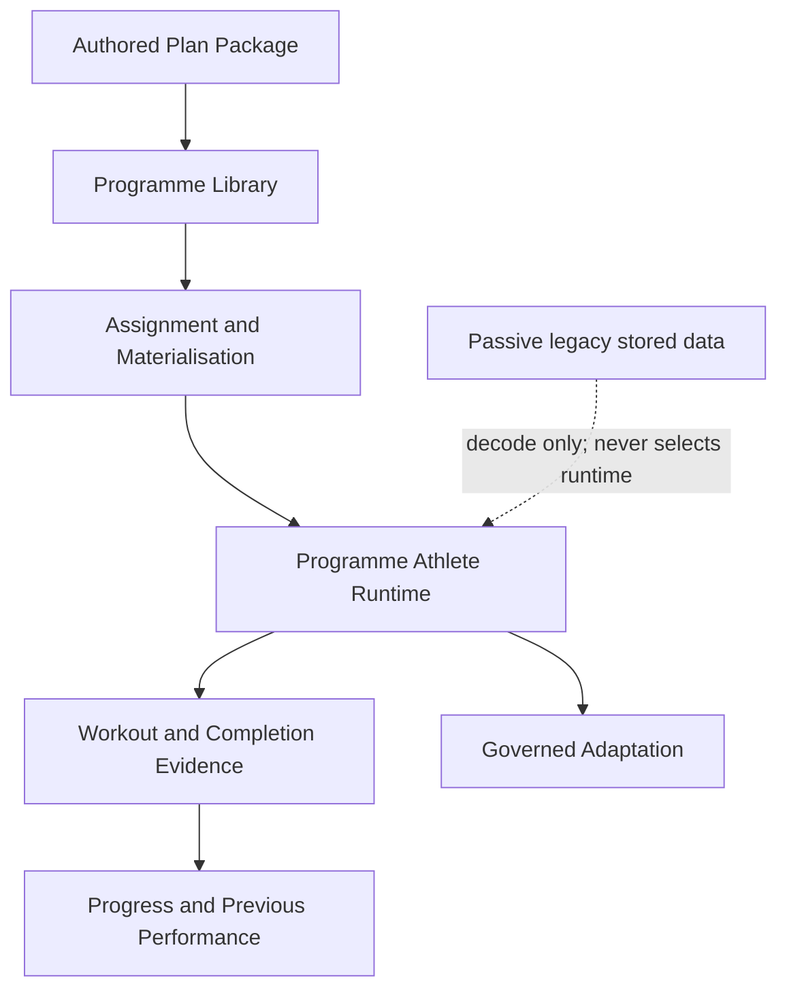

# Canonical Programme Architecture Freeze v1

**Status:** Binding — frozen at Phase 2 closure  
**Recorded:** 2026-08-09  
**Companion closure:** [`Phase_2_Closure_v1.md`](./Phase_2_Closure_v1.md)  
**Not this document:** [`Architecture_Freeze_v1.md`](./Architecture_Freeze_v1.md) is the historical Phase 4.5 coaching-engine freeze.

```text
CANONICAL_ARCHITECTURE_FROZEN=true
PHASE_2_CLOSED=true
ONE_OPERATIONAL_AUTHORITY_PER_RESPONSIBILITY=true
PASSIVE_LEGACY_STATE_SELECTS_RUNTIME=false
```

---

## Plain English

An **authored programme** is a coach-designed Plan Package: weeks, days, and
sessions written ahead of time. Athletes do not invent that programme at
runtime.

An athlete **gets a programme** by browsing the catalogue, enrolling, and
starting (materialising) it. That creates a canonical assignment and prepares
authored content for use.

**Today’s session** is the programmed slot for the athlete’s current place in
that programme — not a generated “legacy plan” and not chosen by an old
`hasActivePlan` flag.

The athlete **performs** the workout in the shared Workout Player. On
**completion**, Cohort records what the athlete actually did. **Progress** is
built from that completion evidence. **Previous performance** is only from
athlete-entered completed values — never from planned loads.

**Adaptations** are recommendations. They require athlete agreement before they
change what will be executed. They do not rewrite the authored programme as a
second authoring authority.

**Old saved data** (legacy PlanAssignment / `hasActivePlan`) may still exist on
disk so we do not silently erase user records. It is **inert**: it cannot pick
Home, Progress, completion, or start a retired Plan Library runtime.



---

## Frozen technical contracts

1. **One operational authority per domain responsibility.**
2. Programmes are **authored**; runtime services do not invent programme progression.
3. A **programme version and programmed slot** define the intended session.
4. **Materialisation** prepares authored content for athlete use; it is not a second authoring authority.
5. **Home authority** derives from canonical programme materialisation evidence, never `hasActivePlan`.
6. **Stored legacy state cannot select runtime behaviour.**
7. **Completion** records athlete-performed evidence.
8. **Previous performance** comes only from athlete-entered completed values.
9. Planned or prescribed values are **never** treated as completed performance.
10. Comparison is like-for-like using canonical comparison identity.
11. **Progress** is derived from canonical completion / programme-slot evidence.
12. Programme progression remains **authored**.
13. **Adaptations** are recommendations constrained by authored permissions and protected invariants.
14. **Athlete agreement** is required before an adaptation changes execution.
15. Shared **Workout Player** infrastructure does not own programme authority.
16. **Founder authoring** belongs to the canonical Plan Package / programme system.
17. **Passive compatibility** may decode old data but cannot create product behaviour.
18. Schema or stored-data retirement requires **separate authorisation**.
19. Changing a frozen rule requires: explicit architecture decision; migration plan; updated behavioural protection; identified product owner; evidence that no second authority is introduced.

---

## Authority matrix (operational)

| Responsibility | Canonical authority | Forbidden competing authority |
|----------------|---------------------|-------------------------------|
| Programme definition | Authored Plan Package / programme model | Generated legacy plan |
| Catalogue | Athlete programme catalogue | Legacy Plan Library screens |
| Assignment | Canonical programme assignment | PlanStartService / legacy PlanAssignment as authority |
| Materialisation | `AthletePlanMaterialisationService` | Legacy runtime start |
| Home | `AthleteHomeRuntimeAuthorityResolver` | DailyBriefing / HomeAdaptFlow / `hasActivePlan` |
| Preparation / restore | Phase 1 prepare + restore services | Legacy today preparation as Home authority |
| Workout execution | Shared Workout Player | Deleted legacy orchestration |
| Completion | Canonical completion / evidence | AdaptiveProgression |
| Previous performance | Athlete-entered completed values | Planned / prescribed values |
| Progress | Programme-slot evidence builder | `ProgressSummaryService` |
| Adaptation | Recommendation buffer + policy + agreement | Automatic legacy progression |
| Authoring / import | Canonical Plan Package tooling | Legacy founder Plan Library |

---

## Passive legacy data (outside the operational flow)

| Survivor | Classification |
|----------|----------------|
| `PlanAssignment` model + local repository + hydrator | `RETAIN_PASSIVE_DATA_COMPATIBILITY` |
| `AthleteProfileSession.hasActivePlan` | `RETAIN_PASSIVE_DATA_COMPATIBILITY` |
| `PlanCatalog` / `PlanLibraryFilters` / `PlanDefinition` | Catalog data / filters — not product Plan Library UI |
| `SessionCompletion` / `CapabilityTimeline` under `adaptive_progression/models` | `RETAIN_SHARED_NEUTRAL` (historical path) |
| `CoachBrainWorkoutPlan` / `WorkoutPlayerLauncher` | `RETAIN_SHARED_NEUTRAL` |
| `AthleteProgrammeGenerationService` | `RETAIN_ONBOARDING_DEPENDENCY` |
| `ChoosePlanEntryCard` file path `athlete_generated_today_section.dart` | `RETAIN_CANONICAL` UI + `RETAIN_HISTORICAL_NAME_ONLY` path |
| `HomeTodaySessionSection` (unmounted) | Unmounted widget; deferred orphan cleanup — not runtime authority |

---

## Enforcement

```bash
./tool/testing/run_phase2_consolidation_safety_gate.sh
```

Protects INV-01..INV-20 and Phase 2.4–2.10 tripwires: Home authority, catalogue
entry, completion without AdaptiveProgression, Progress programme evidence,
adaptation agreement, deleted legacy symbols.

---

## Changing this freeze

Any change to the rules above is an architecture change, not a routine feature
edit. Follow rule 19. Do not reintroduce a second operational authority “for
compatibility.”
