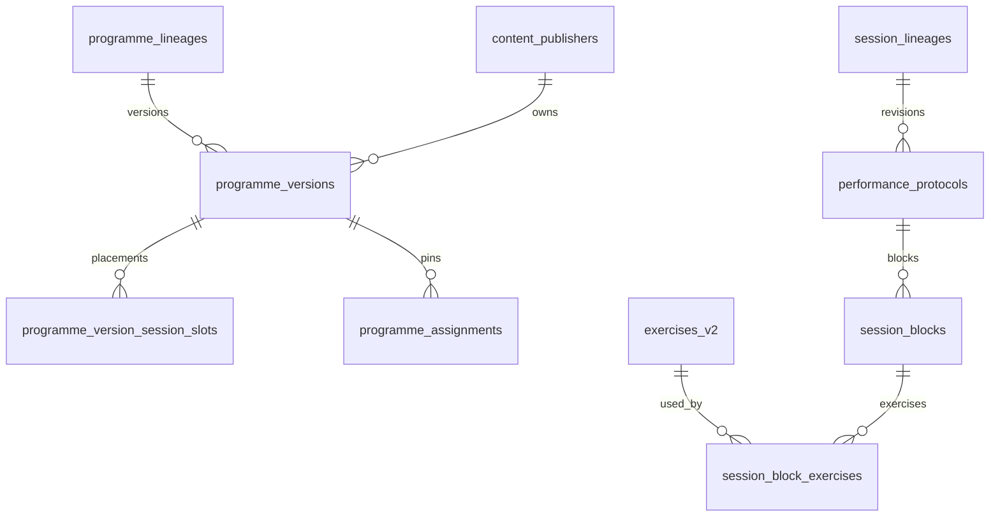

# M9 schema proposal (not applied)

**Do not apply to Field Manual in Sprint 1.** Additive only, after founder approval.

Proposed additive objects (later migration, not in `supabase/migrations` yet):

1. `content_publishers` (id, namespace, first_party, display_name)
2. FK `session_block_exercises.exercise_id → exercises_v2.exercise_id` (validate before add; unresolved remain flagged)
3. Optional `content_graph_manifests(programme_version_id UNIQUE, format_version, sha256, canonical_json)` — published immutability trigger
4. Indexed views (not caches of results):
   - `content_exercise_used_by_session` (exercise_id, protocol_id, block_id)
   - `content_session_used_by_programme` (protocol_id, programme_version_id, slot_id, week, day, order)
   - `content_version_active_assignment_counts` (programme_version_id, active_count)
5. Check: assignment pin cannot change after insert except via authorised reassignment RPC
6. Unique catalogue default per lineage (already approximated by approved_for_global partial unique index)

No destructive rewrite. Idempotent backfill from existing tables. RLS by publisher namespace later with M10 isolation.
