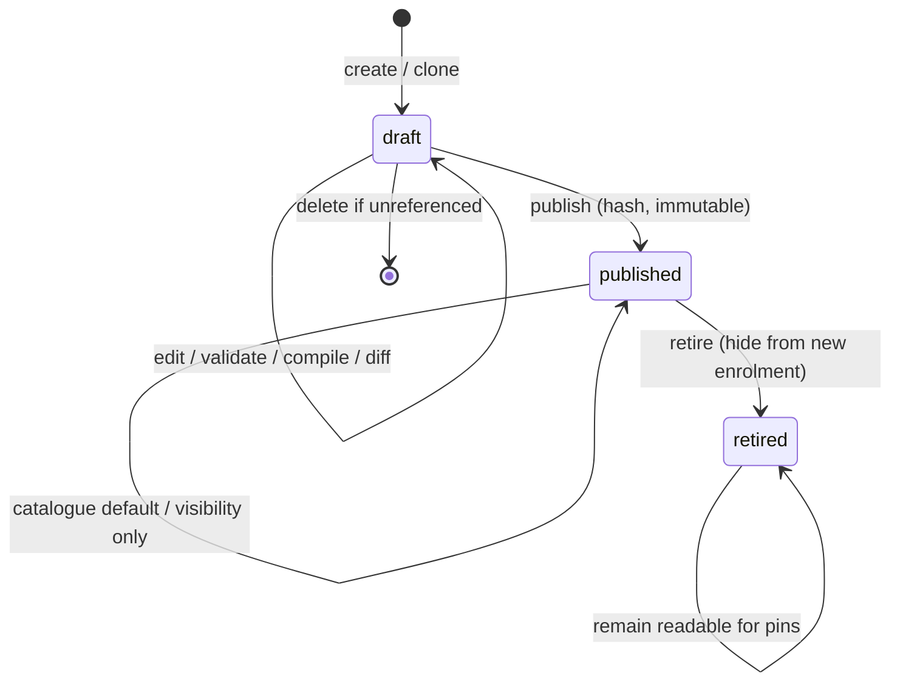

# M9 version lifecycle

Legal: draft edits; draft→published; published→retired; catalogue visibility toggles that do not mutate hashed content.

Illegal: published content edit; published→draft; hard-delete while assignments exist; dynamic “follow latest” at execution.

Authorization: first-party publisher for `cohort_global`; external publisher only inside own namespace; readers have no mutations.
