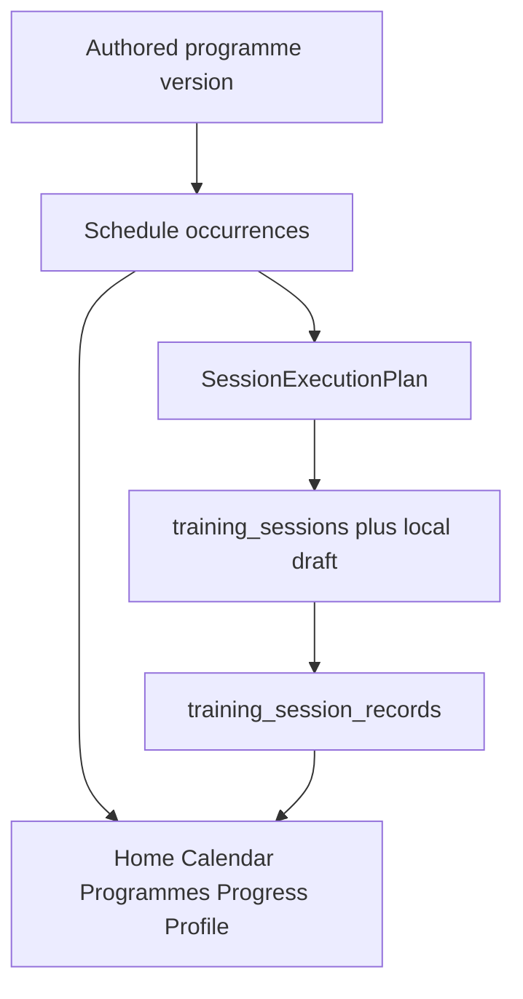

# Phase 1 implemented architecture

**Status:** Authoritative for the production athlete path at dogfood HEAD  
**Does not:** invent a second block/session/execution model  
**Companion freeze:** [Canonical_Programme_Architecture_Freeze_v1.md](./Canonical_Programme_Architecture_Freeze_v1.md)

One canonical chain:

```text
authored content
  → assigned schedule (occurrences)
    → prepared execution (SessionExecutionPlan)
      → live execution state
        → performance evidence
          → athlete projections
```

Calendar occurrences are schedule authority for fixed-schedule athletes.
Authored prescription remains prescription authority. Adaptation is a
proposal. Assignment cursor is compatibility history on the fixed path and
must not select Home Today.



## 1. Authored content

- Canonical exercises live in `public.exercises_v2` (`EX-*`). Transitional IDs
  resolve only through the founder-approved bridge.
- Blocks and sessions are authored as programme version structure plus
  published protocols. Apollo Build 12-week is the dogfood package.
- Plan Package v1 compiles programme structure. It still has **no** exercise
  identities; do not manufacture that dependency here.
- Programme versions are immutable after publish.

## 2. Assigned schedule

- One active `programme_assignments` row per athlete in dogfood.
- `programme_schedule_occurrences` carry scheduled date, original scheduled
  date, week/day/slot identity, and disposition.
- Move / swap / skip / undo / Train today / explicit terminal skip are
  schedule operations, not adaptation and not completion.
- Multiple sessions per date are supported.

## 3. Prepared execution

- `SessionExecutionPlan` is the runtime prescription snapshot.
- Authored loads, intervals, and circuit/EMOM targets stay authored.
- Adaptation permissions travel with the package; absence fails closed.
- Legacy `protocol_steps` remain a compatibility decode path, not a second
  product model.

## 4. Live execution state

- `training_sessions` is the M8 workout container.
- Local draft (`generated_session` / execution-plan codec) holds in-progress
  capture, including timer configuration after the EMOM fix.
- Start/resume RPCs are idempotent. Completion is explicit.
- Timer is optional where the format allows manual result entry.

## 5. Performance evidence

- `training_session_records` plus block/exercise/set results are the actuals
  tree.
- Circuit/EMOM scores use `completedRounds` / interval count on circuit
  result data. Stations are prescription templates, not one row per minute.
- `entry_mode` distinguishes live vs Backfill. Backfill uses `performed_on`
  (date precision). Comparison uses performed chronology, never Backfill
  entry time.
- Correction is audited and does not reopen a session as live work.

Programme completion RPCs write records and slot outcomes. Parent
`training_sessions.status` is closed by
`20260914120000_terminalize_training_session_from_completed_record.sql`
once that migration is present. Historical hosted rows may still show the
pre-trigger orphan shape; see
[Phase_1_Lifecycle_Inconsistencies_v1.md](./Phase_1_Lifecycle_Inconsistencies_v1.md).

## 6. Athlete projections

| Surface | Authority | Rule |
|---------|-----------|------|
| Home | Today's calendar occurrence | Today only. Begin/Resume primary. Adapt Session secondary where lawful. Completed today remains visible. No week agenda, incomplete backlog, or programme-wide Progress. |
| Calendar | Occurrences | Month grid. Day, authored name, explicit status. Incomplete (not athlete-facing Overdue/Missed). Train today / Backfill / Reschedule for eligible past incomplete sessions. |
| Programmes | Assignment + catalogue | Active programme identity and enrolment, not a second calendar. |
| Progress | Completed records + slot outcomes | Evidence-based. First-performance honesty. Comparable prescriptions only. PBs need valid completed evidence. Performed time/date. Participation is not capability improvement. |
| Profile | Auth + build provenance | Signed-in athlete. Inspectable environment/version/commit. No secrets. |

## Product rules (founder-approved)

**Progression.** Authored programmes contain progression. The engine records
and displays evidence. It does not force load/pace. Previous performance is
observational. Athlete actuals never silently rewrite authored prescriptions.

**Adaptation.** Suggestions only. Explicit acceptance. No automatic apply.
Missing permission fails safely. Authored vs accepted adaptation stay
distinguishable.

**Incomplete sessions.** No automatic skip or cascade. No block on
today/future. Late training uses the original occurrence. Backfill is
truthful. Explicit terminal skip is distinct.

**Execution.** One player across supported capture modes. Incremental
persistence and resume. Idempotent start/completion. Truthful partial and
end-early outcomes.
