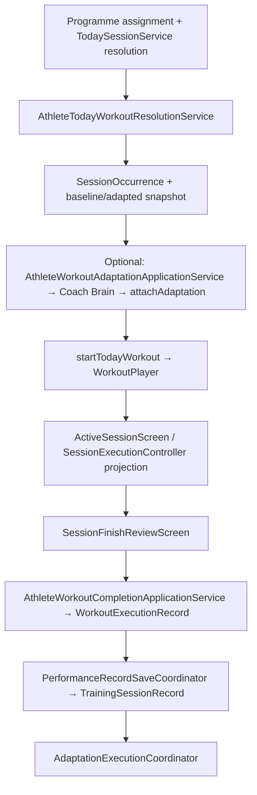

# Phase 2 — Architecture Consolidation — Completion Report

**Sprint:** 10 (verification and closure)  
**Branch:** `refactor/architecture-alignment`  
**Date:** 2026-07-29

---

## 1. Phase objective

Consolidate athlete programme execution around a single domain lifecycle:

**Programme → SessionOccurrence → Coach Brain / SessionAdaptationPipeline → WorkoutPlayer → WorkoutExecutionRecord → M8 persistence adapters → programme post-completion adaptation**

Without changing Supabase schema, athlete-visible UX, or introducing new product features.

---

## 2. Original architecture problems

| Problem | Phase 2 response |
|---------|------------------|
| Dual day-of adaptation (`AdaptationDecisionService` vs domain pipeline) | Removed service; Home → `AthleteWorkoutAdaptationApplicationService` → Coach Brain |
| Home owned adaptation evaluation directly | Presenter maps Brain outcomes only |
| No canonical workout identity separate from M8 row | `SessionOccurrence` + materializer |
| M7 controller owned execution without domain player | `WorkoutPlayer` + launch context (Sprints 7–8) |
| Finish owned by M8 path only; no domain completion aggregate | `completeTodayWorkout` + M8 coordinator (Sprint 9) |
| Domain / features / models import tangles | Domain purity enforced; adapters documented |

---

## 3. Sprints completed

| Sprint | Focus |
|--------|--------|
| 6 / 6B | Unified day-of adaptation; delete `AdaptationDecisionService` |
| 7 | `SessionOccurrence` launch context; Home START → player |
| 8 | `WorkoutPlayer` runtime; controller as UI adapter |
| 9 | Unified completion; `WorkoutExecutionRecord`; finish review ordering |
| 10 | Repository verification, docs, ADRs, adapter classification |

---

## 4. Final canonical lifecycle (programme Home)

---

## 5. Dependency rules (verified)

| Rule | Status |
|------|--------|
| `lib/domain` does not import `features`, `models`, or `data` implementations | **Pass** — domain imports only domain packages |
| Features do not own domain adaptation algorithms | **Pass** — Home uses application + Brain |
| Home does not own workout lifecycle terminal state | **Pass** — orchestrator + coordinator; controller projects UI |
| `WorkoutPlayer` runtime authority for programme launches | **Pass** when `WorkoutSessionLaunchContext` present |
| `WorkoutExecutionRecord` canonical domain completion | **Pass** on Home finish path |
| `SessionOccurrence` canonical identity | **Pass** for programme Home |
| Coach Brain sole day-of authority | **Pass** (ADR-020; ADR-011 superseded) |

**Documented exceptions:**

| Exception | Classification |
|-----------|------------------|
| `AthleteTodayWorkoutResolutionService` imports `features/programme` DTOs + `TodaySessionService` | **B** — application bridge to programme engine |
| `WorkoutExecutionOutcomeMapper` in `features/performance` | **B** — M8 draft → domain outcomes at finish |
| Legacy `SessionExecutionController.completeSession` without launch context | **B** — manual/non-programme path |
| `SessionPlayerScreen` / interval legacy flows | **E** — pre-M7 engines; not Phase 2 programme path |

---

## 6. Major architectural decisions

See [adrs/README.md](./adrs/README.md) (ADR-017–ADR-022) and [Architecture_Blueprint_v2.md §17](./Architecture_Blueprint_v2.md).

---

## 7. Components deleted or renamed

| Item | Action |
|------|--------|
| `AdaptationDecisionService` | **Deleted** (Sprint 6B) |
| Presenter dual `ConstraintEvaluator` gate | **Removed** |
| Duplicate `finishWorkout` in completion application service | **Removed** (Sprint 9) |
| Domain aggregate naming vs M8 | **Renamed/clarified** — domain `WorkoutExecutionRecord` vs M8 `TrainingSessionRecord` (Sprint 2+) |

---

## 8. Remaining intentional adapters

See §3 in verification deliverables (adapter classification table below).

---

## 9. Known limitations

| Limitation | Notes |
|------------|--------|
| **In-memory occurrence index** | Lost on process restart; no Supabase occurrence table |
| **In-memory `WorkoutExecutionRecordStore`** | Optional save in orchestrator; not production Supabase |
| **Resume active workout** | M7 `AthleteSessionMemoryStore` restores UI state; domain occurrence/player not rehydrated from DB |
| **Abandon workout** | Player/controller can mark abandoned in session memory; no orchestrator `abandonTodayWorkout` parity with completion |
| **Dual record at finish** | Domain record + M8 record from draft; not a single merged persistence tree |
| **`SessionExecutionPlan` from Supabase** | Still required for M7 block UI; not purely snapshot-driven |

---

## 10. Deferred work by future phase

| Phase | Work |
|-------|------|
| **Phase 4** | Persist occurrences + domain execution records; shrink plan/snapshot duplication; optional domain→M8 mapper |
| **Phase 4+** | Retire legacy controller fallback when all launches use `WorkoutSessionLaunchContext` |
| **Phase 5** | Retire `SessionPlayerScreen` / step engines where replaced |
| **Ongoing** | Fix widget test harness / Supabase init for flaky suites |

---

## 11. Test and analysis results (Sprint 10)

### 11.1 `dart format`

- **Command:** `dart format lib/ test/ tool/`
- **Result:** 955 files processed; **2 files reformatted** (`home_workout_launch_service_test.dart`, `workout_player_session_execution_controller_test.dart`).

### 11.2 `flutter analyze` (full repo incl. `test/`, `tool/`)

| Severity | Count |
|----------|------:|
| **Errors** | **10** (all in `test/` — const constructor misuse) |
| **Warnings** | **~100** |
| **Info** | **~217** |
| **Total issues** | **327** |
| **Exit code** | 0 (analyzer completed; errors reported but not blocking CLI exit) |

**Errors (pre-existing / unrelated to Phase 2 domain work):**

| File | Issue |
|------|--------|
| `test/home_today_session_labels_test.dart:9` | `const` with non-const constructor |
| `test/session_builder/embedded_session_builder_screen_test.dart:200` | same |
| `test/training_library/training_library_service_test.dart:19,40,41` | const list / constructor |

**Warning themes (sample, pre-existing):** unused imports, duplicate import (fixed in `programme_version_impact_store.dart`), dead code in `adaptation_constraint.dart`, invalid null-aware operators in programme version stores, deprecated `anonKey` in `supabase_service.dart`.

### 11.3 Full Flutter test suite

| Metric | Value |
|--------|------:|
| **Passed** | **1329** |
| **Failed** | **26** |
| **Duration** | ~56s |

**Failing tests (all documented — none introduced as Sprint 10 code changes):**

| # | Test | Likely cause |
|---|------|----------------|
| 1 | `test/home/athlete_daily_experience_test.dart` — START SESSION CTA | Widget expectation (`Recovery Flow` text not found); loader/mock mismatch |
| 2–3 | `test/auth/auth_gate_widget_test.dart`, `auth_sign_in_transition_test.dart` | Auth/routing widget harness |
| 4 | `test/session_builder/embedded_session_builder_screen_test.dart` — **load failure** | Analyze error / const in test file |
| 5 | `test/home_today_session_labels_test.dart` — **load failure** | Analyze error / const |
| 6 | `test/training_library/training_library_service_test.dart` — **load failure** | Analyze error / const |
| 7–9 | `test/training_library/training_library_screen_test.dart` (3 tests) | Widget / tab expectations |
| 10–13 | `test/coach_studio/programme_catalogue_widget_test.dart` (4 tests) | Coach Studio widget harness |
| 14–15 | `test/coach_studio/programme_editor_publish_test.dart` (2 tests) | Snackbar/context lifecycle |
| 16–20 | `test/home_today_session_section_refresh_test.dart` (5 tests) | Home refresh wiring / mock loader |
| 21–23 | `test/programme_editor/programme_editor_widget_test.dart` (3 tests) | Editor widget expectations |
| 24–26 | `test/coach_operations/coach_home_dashboard_test.dart` (3 tests) | Dashboard widget harness |

**Environment-dependent behaviour observed:** Home widget tests log `Supabase.instance` not initialized when programme loader hits real stores — tests should inject fakes (`loadOverride` / mock services).

**Phase 2–relevant suites (spot check):** `test/application/athlete_workout/`, `test/session/workout_player_session_execution_controller_test.dart` — **pass**.

---

## 12. Legacy-reference audit (summary)

| Reference | Locations | Class |
|-----------|-----------|-------|
| `AdaptationDecisionService` | `07 Documentation/41`, `66` historical notes only | **C** |
| M8 `TrainingSessionRecord` | `features/performance`, M8 docs | **B/E** — intentional M8 persistence model |
| Home → `TodaySessionService` | `HomeTodaySessionServices`, loader via resolution service | **B** — programme resolution bridge |
| Home → legacy adaptation eval | None active in `lib/` | — |
| Duplicated terminal completion | Home path: orchestrator + `applyDomainCompletionProjection` only | **Resolved** |
| Legacy execution ownership | `SessionExecutionController` without launch context | **B** |
| Domain imports `lib/models` | None in `lib/domain` | — |
| Domain imports `lib/features` | None in `lib/domain` | — |
| `legacy` in launch/API names | `WorkoutSessionLaunchContext.legacyProtocolId`, protocol stable ids | **B/D** |
| `@Deprecated` | Supabase `anonKey` usage | **D** — SDK migration |
| TODO/FIXME | Internal tools, analyzer, session player | **D/E** — not Phase 2 blockers |
| `bridge` / `compatibility` comments | Metadata merge, interval leave coordinator, home loader | **B/C** |

**Category A removals in Sprint 10:** duplicate import in `lib/data/repositories/programme_version_impact_store.dart`.

---

## 13. Remaining adapter classification

| Component | Responsibility | Target arch? | Temporary? | Before removal | Phase |
|-----------|----------------|--------------|------------|----------------|-------|
| `SessionExecutionLauncher` | Wire plan load + push `ActiveSessionScreen` | Partial | Yes | Snapshot-native plan or unified loader | 4 |
| `SessionExecutionPlan` | M7 block UI projection from DB protocol | Partial | Yes | Drive UI from `AdaptedSessionExecutionSnapshot` only | 4–5 |
| `SessionExecutionController` fallback | Plan-owned state without player | No | Yes | All launches provide launch context | 4 |
| `WorkoutPlayerActiveSessionProjection` | Player → `ActiveSessionState` | Yes | Yes | Native player UI | 5 |
| `WorkoutSessionLaunchContext` | Domain bundle for M7 session | Yes | Maybe | Occurrence id in deep links only | 4 |
| `PerformanceRecordSaveCoordinator` | M8 + progression + post-completion | Yes | No | Even after domain record port | 4+ |
| `WorkoutExecutionOutcomeMapper` | Draft → domain outcomes | Yes | Yes | Single capture model at finish | 4 |
| `AthleteTodayWorkoutResolutionService` | Programme today → occurrence bridge | Yes | Yes | Occurrence from persisted index | 4 |
| `ProgrammeOccurrenceMaterializer` | Build occurrence from resolved session | Yes | Maybe | Stable occurrence ids in DB | 4 |
| `HomeWorkoutExecutionContext` | In-memory Home bridge | Yes | Yes | Persisted execution session | 4 |
| `HomeWorkoutLaunchService` | adapt commit + prepare launch | Yes | Maybe | Thin orchestrator facade only | 4 |
| In-memory occurrence repo/index | Occurrence lookup by date | Yes | Yes | Supabase or local DB port | 4 |
| In-memory `WorkoutExecutionRecordStore` | Optional domain record save | Yes | Yes | Durable store | 4 |
| `AdaptationExecutionCoordinator` | Post-completion programme rules | Yes | No | N/A — permanent programme concern | — |

---

## 14. Lifecycle verification summary

### A. Standard programme workout (no adaptation)

1. `HomeTodaySessionLoader` → `AthleteTodayWorkoutResolutionService.resolve` → materialized occurrence + baseline snapshot.  
2. START → `HomeWorkoutLaunchService.prepareForLegacyLaunch` → `startTodayWorkout` → `WorkoutSessionLaunchContext`.  
3. `SessionExecutionLauncher` → `ActiveSessionScreen` → player-driven navigation.  
4. Finish → domain `completeTodayWorkout` → M8 `completeSession` → progression → `AdaptationExecutionCoordinator`.  
5. UI → `applyDomainCompletionProjection`.

### B. Accepted day-of adaptation

1. Sheet accept → `commitDayOfAdaptation` → Coach Brain pipeline → `attachAdaptation` on occurrence.  
2. Player opened with adapted snapshot on context.  
3. Completion uses same path as A with adapted snapshot on record.

### C. Declined adaptation

- Sheet dismissed without accept → **no** `commitDayOfAdaptation`; occurrence keeps baseline snapshot; internal consistency preserved.

### D. Abandoned workout

- **Terminal:** `SessionExecutionController.abandonSession` → `WorkoutPlayer.abandon` when launch context present; legacy state marked abandoned otherwise.  
- **Persisted:** No domain occurrence abandon orchestration; M8 partial save only if athlete reached finish flow (typically none).

### E. Resume / refresh

- **In session:** `AthleteSessionMemoryStore` restores expanded/completed blocks + syncs player block index.  
- **App restart:** Domain occurrence/player not restored from Supabase; known gap.

### F. Manual / non-programme workout

- Launch without `WorkoutSessionLaunchContext` → controller-owned state; finish uses `completeSession` only (no domain record). **Intentional** until manual entry supplies occurrence context.

---

## 15. Definition of Done checklist

| Criterion | Met? |
|-----------|------|
| Single day-of adaptation authority (Coach Brain) | Yes |
| Single runtime authority for programme launches (WorkoutPlayer) | Yes |
| Single domain completion aggregate (WorkoutExecutionRecord) on Home finish | Yes |
| M8 persistence API unchanged | Yes |
| Post-completion adaptation unchanged entry point | Yes |
| Documentation reflects canonical vs compatibility paths | Yes |
| ADRs for Phase 2 decisions | Yes (ADR-017–022) |
| Full test suite green | **No** — 26 pre-existing failures |
| Zero analyzer issues | **No** — 327 issues; 10 test errors |

---

## 16. Final recommendation

### **Phase 2 complete with documented exceptions**

**Rationale:**

- No duplicate **architectural authority** remains on the programme Home path for day-of adaptation, runtime transitions, or domain completion terminal state.
- Intentional compatibility adapters are classified and documented; they are required for M7 UI and M8 Supabase parity.
- **Exceptions** are verification debt, not architectural regression: 26 failing widget/harness tests (many environment/mock related), 10 analyzer errors confined to unrelated test files, and known in-memory persistence limits explicitly deferred to Phase 4.

**Not recommended:** marking Phase 2 incomplete solely due to legacy manual session paths or M8 adapters — those are explicit ADR-021 scope.

**Follow-up before production hardening:** fix const test compile errors; stabilize Home widget tests with Supabase fakes; track occurrence persistence in Phase 4.

---

## Files added or updated (Sprint 10)

| Action | Path |
|--------|------|
| Added | `docs/architecture/README.md` |
| Added | `docs/architecture/adrs/README.md` |
| Added | `docs/architecture/adrs/ADR-017` … `ADR-022` (6 files) |
| Added | `docs/architecture/Phase_2_Architecture_Consolidation_Completion.md` |
| Updated | `docs/architecture/Architecture_Blueprint_v2.md` (Phase 2 closure §) |
| Updated | `07 Documentation/66_V2_0_End_To_End_Execution_And_Adaptation.md` (prior sprint) |
| Fixed | `lib/data/repositories/programme_version_impact_store.dart` (duplicate import) |
| Formatted | 2 test files via `dart format` |

**Deleted:** none in Sprint 10 verification pass.
