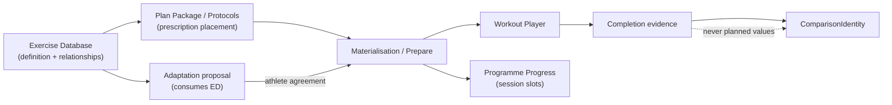

# Phase 3.1A — Exercise Database Discovery and Domain Design

**Status:** COMPLETE and **ACCEPTED** (discovery only — no implementation)  
**Recorded:** 2026-08-09  
**Baseline commit:** `71b5a54623e584fb667b96617178fe1af591b787`  
**Binding freeze:** [`Canonical_Programme_Architecture_Freeze_v1.md`](./Canonical_Programme_Architecture_Freeze_v1.md)  
**Founder decisions:** §16 LOCKED for Phase 3.1B+

```text
PHASE_2_CLOSED=true
CANONICAL_ARCHITECTURE_FROZEN=true
PHASE_3_STARTED=true
PHASE_3_1A_DISCOVERY_COMPLETE=true
PHASE_3_1A_ACCEPTED=true
PHASE_3_1_IMPLEMENTATION_STARTED=false
PRODUCT_BEHAVIOUR_CHANGED=false
SCHEMA_CHANGED=false
HOSTED_ENVIRONMENT_CONTACTED=false
```

---

## 1. Plain-English findings

Cohort already has an exercise library (`exercises_v2`) that athletes and founders see, and a separate knowledge ontology (`cohort.exercise.*`) that adaptation and planning use for equipment swaps. Those two systems are not one authority.

Today Cohort can:

* name and show exercises;
* attach structured strength prescriptions on session blocks;
* run workouts and record some completed evidence;
* compare previous performance only when the **exact same exercise id** returns;
* propose a small set of curated equipment substitutions (YAML rules) after athlete agreement.

Today Cohort cannot yet:

* treat hotel-room / hotel-gym as a first-class day-of adaptation planner;
* distinguish “same movement, different setup” from “related but not comparable”;
* use free-text regression/progression fields as a real substitution graph;
* keep comparison honest after a substitution (history stays on the old id);
* give adaptation a single structured exercise knowledge source that matches the athlete catalogue.

Phase 3 must create one canonical Exercise Database that serves authoring, execution, adaptation, and honest progression — without becoming a second programme writer or an autonomous workout generator.

---

## 2. Confirmed baseline

| Check | Result |
|-------|--------|
| `HEAD` | `71b5a54623e584fb667b96617178fe1af591b787` |
| Worktree | clean at start |
| Safety gate | `PHASE2_CONSOLIDATION_SAFETY_GATE=PASS` (6/6) |
| Focused baseline | Home authority + Phase 2 tripwires PASS |
| Hosted contact | none |

---

## 3. Complete exercise representation inventory

### 3.1 Dual identity (primary finding)

| Authority | Identity | Role today |
|-----------|----------|------------|
| Platform catalogue | `exercises_v2.exercise_id` (`EX-*`) + slug | Athlete/founder library, session block links, Workout Player hydrate |
| Knowledge ontology | `cohort.exercise.*` (+ optional `platform_exercise_id`) | Exercise Policy, day-of adaptation substitutions, Journey D contracts |

Link field `platform_exercise_id` exists in knowledge schema but is sparsely curated. Day-of adaptation currently selects knowledge ids; applying a swap can leave the prepared plan with an id the catalogue cannot hydrate.

### 3.2 Definition layer

| Symbol | File | Layer | Responsibility | Identity | Classification |
|--------|------|-------|----------------|----------|----------------|
| `Exercise` | `lib/models/exercise.dart` | domain/data | Platform coaching + soft taxonomy | `exerciseId` | Canonical runtime catalogue (free-text heavy) |
| `ExerciseRepository` / `ExerciseCatalogueService` | `lib/data/repositories/…`, `lib/features/exercises/…` | data/features | Load published catalogue | `exercise_id` / slug | Canonical loaders |
| `ExerciseKnowledge` | `lib/knowledge/models/…` | knowledge | Structured ontology exercise | `meta.id` | Shared-neutral / reference |
| YAML exercises | `knowledge/reference/exercises_reference.yaml` | knowledge | Representative set (~21) | `cohort.exercise.*` | Reference_only |
| Movement/equipment/env YAML | `knowledge/reference/*.yaml` | knowledge | Ontology vocabulary | ontology ids | Shared-neutral |
| Domain adaptation enums | `lib/domain/adaptation/vocabulary/*` | domain | Matching vocabulary | `dbValue` | Shared-neutral contracts |
| `ExerciseAdaptationMetadata` | `lib/domain/adaptation/contracts/adaptation_metadata_contracts.dart` | domain | Intended structured metadata | `exerciseId` | Transitional (not populated on propose) |
| Importer `Exercise` | `tool/importer/lib/models/exercise.dart` | tooling | Resolve import names → catalogue | slug → `exercise_id` | Tooling duplicate |

### 3.3 Prescription layer

| Symbol | File | Responsibility | Classification |
|--------|------|----------------|----------------|
| `SessionBlockExerciseLink` + `StrengthExercisePrescription` | `lib/models/…` | Block→exercise + sets/reps/load/tempo | Canonical Plan Package prescription |
| `SessionBlock` | `lib/models/session_block.dart` | Session unit containing links | Canonical |
| `ProtocolStep` / `SessionStep` | `lib/models/…` | Legacy step programming | Legacy / transitional |
| `SessionExecutionPlan` / `SessionExecutionExerciseSummary` | `lib/features/session/models/…` | Prepared execution projection | Canonical prepared state |
| `WorkoutPlayerExerciseStep` | `lib/features/workout_player/models/…` | Flattened player step | Shared-neutral player |
| `CircuitMovementPrescription` | `lib/models/…` | Circuit movement Rx | Transitional |
| `IntervalModality` | `lib/models/interval_modality.dart` | run/bike/row/ski | Shared-neutral modality (not exercise row) |
| Planning `ExercisePrescription` / policy models | `lib/planning/…` | Coach Brain dose / selection | Transitional engine |

### 3.4 Performed evidence / comparison

| Symbol | Identity key | Classification |
|--------|--------------|----------------|
| `ExerciseExecutionResult` (+ strength/interval/timed) | `exerciseId` | Transitional local evidence |
| `PreviousPerformanceSnapshot` / resolver | exact `exerciseId` | Canonical player previous-perf (narrow) |
| M8 `ExercisePerformanceSnapshot` / drafts | `sourceExerciseId` | Canonical M8 path |
| `StrengthSetPerformance` / `training_session_sets` | `exerciseId` (+ step) | Legacy/parallel strength path |
| Interval/circuit previous | protocol/modality/format | Session-level, not exercise-id |
| `SessionCompletion` | session-level | Shared-neutral session aggregate |
| `PlanPackageComparisonIdentity` | **session lineage** | Canonical programme progress identity — **not exercise** |

### 3.5 Relationships / substitutions

| Symbol | Status |
|--------|--------|
| `substitutions_reference.yaml` / `SubstitutionRuleKnowledge` | Live curated rules for day-of equipment path |
| `Exercise.regression` / `.progression` | Free-text display only |
| `ExerciseSubstitutionRelationship` (+ types) | Domain contract; not persisted as live graph for day-of |
| `ExerciseRelationshipStore` | **Usage/lineage** (where exercise appears), not substitution |

### 3.6 Persistence

| Store | Content |
|-------|---------|
| `exercises_v2` | Platform catalogue (DDL in local baseline fixture; Wave 1 seed migration) |
| `session_block_exercises` | Links + prescription JSONB |
| `protocol_steps` | Legacy steps |
| `training_exercise_results` | M8 evidence + snapshot |
| `training_session_sets` | Legacy strength sets |
| Knowledge YAML | Ontology + substitutions (not Supabase exercise graph) |
| No Supabase substitution-relationship table | Absent |

---

## 4. Current exercise lifecycle

```text
Authored Plan Package
  └─ session catalogue references protocol_id (not exercise ids)
       ↓
Compiled / imported programme
  └─ performance_protocols + session_blocks + session_block_exercises.exercise_id (EX-*)
       ↓
Athlete assignment + materialisation
  └─ schedule/cursor only — does not copy exercise definitions
       ↓
Session preparation
  └─ SessionExecutionLoader hydrates Exercise from exercises_v2
  └─ SessionExecutionPlan / ExerciseSummary
       ↓
Optional acceptance-gated adaptation
  └─ SessionAdaptationPlanner uses knowledge substitutions (cohort.exercise.*)
  └─ ProgrammeAdaptationPlanApplier may rewrite plan exerciseId
       ↓
Workout Player
  └─ flattened steps; previous perf by exact exerciseId
       ↓
Completion evidence
  └─ parallel: M8 results / local ExerciseExecutionResult / legacy sets
       ↓
Previous performance + Progress
  └─ previous: exact exerciseId
  └─ programme Progress: slot outcomes — not exercise identity
```

### Representative transition notes

| Example | Identity retained? | Comparison after adapt? | Safe alternative today? |
|---------|--------------------|-------------------------|-------------------------|
| Loaded strength (back squat) | `EX-*` on block | Yes if same id | YAML equipment swap (knowledge id) — hydrate risk |
| Bodyweight / unilateral | Soft free-text attrs | Exact id only | Limited curated rules |
| Timed interval / erg / run | Often modality + few running slugs | Interval previous by protocol/modality | Not exercise-graph driven |
| HYROX station | Knowledge exercise entities | Exact id | Station identity not first-class |
| Hotel env change | Heuristic `hotelFriendly` | N/A | **No** day-of env substitution planner |
| Shared non-programme workout | Player plan exerciseIds | Exact id | No programme adaptation |

---

## 5. Authority and duplication findings

| Concept | Authorities today | Risk |
|---------|-------------------|------|
| Exercise identity | `EX-*` vs `cohort.exercise.*` | Swap/apply namespace mismatch |
| Taxonomy (pattern/muscle/equipment/env) | Free-text catalogue vs structured knowledge | Adaptation ignores catalogue text |
| Substitutions | YAML rules vs free-text regression/progression vs unused domain contracts | Incomplete / conflicting |
| Prescription | Block prescription (canonical) vs legacy protocol steps | Dual carriers |
| Performed evidence | M8 + local player + legacy sets | Parallel previous-perf UX |
| Comparison | Exact exercise id vs session lineage comparison identity | Easy to confuse in design |
| Selection | ADR-025 Exercise Policy (planning) vs day-of SessionAdaptationPlanner | Two selection contexts |

**Frozen constraint reminder:** Exercise Database must not become a second programme, prescription, completion, or progress authority.

---

## 6. Capability matrix

| # | Capability | Classification |
|---|------------|----------------|
| 1 | Exercise identity | `REPRESENTED_BY_MULTIPLE_AUTHORITIES` |
| 2 | Display name | `SUPPORTED_PARTIALLY` |
| 3 | Aliases / search terms | `SUPPORTED_PARTIALLY` (knowledge only) |
| 4 | Exercise family | `ABSENT` |
| 5 | Movement pattern | `REPRESENTED_BY_MULTIPLE_AUTHORITIES` |
| 6 | Training purpose | `FREE_TEXT_ONLY` |
| 7 | Primary/secondary muscles | `REPRESENTED_BY_MULTIPLE_AUTHORITIES` |
| 8 | Required/optional equipment | `REPRESENTED_BY_MULTIPLE_AUTHORITIES` |
| 9 | Training environment | `REPRESENTED_BY_MULTIPLE_AUTHORITIES` |
| 10 | Unilateral / bilateral | `ABSENT` on Dart `Exercise` (DB column exists unmapped) |
| 11 | Technical complexity | `REPRESENTED_BY_MULTIPLE_AUTHORITIES` |
| 12 | Impact level | `SUPPORTED_PARTIALLY` (contracts/evaluator; not full catalogue) |
| 13 | Loading possibilities | `SUPPORTED_PARTIALLY` / free-text |
| 14 | Valid prescription units | `SUPPORTED_PARTIALLY` (strength Rx) |
| 15 | Valid performance-recording fields | `SUPPORTED_PARTIALLY` |
| 16 | Regressions | `REPRESENTED_BY_MULTIPLE_AUTHORITIES` |
| 17 | Progressions | `REPRESENTED_BY_MULTIPLE_AUTHORITIES` |
| 18 | Lateral substitutions | `SUPPORTED_PARTIALLY` (YAML kinds; limited use) |
| 19 | Equipment-specific substitutions | `SUPPORTED_PARTIALLY` (day-of curated rules) |
| 20 | Environment-specific substitutions | `SUPPORTED_PARTIALLY` (tags unused by day-of planner) |
| 21 | Intent-preservation requirements | `SUPPORTED_PARTIALLY` (stamped, not selection filter) |
| 22 | Non-substitutable characteristics | `SUPPORTED_PARTIALLY` (block flag only) |
| 23 | Comparison identity | `SUPPORTED_CANONICALLY` (narrow: exact exercise id) |
| 24 | Movement standards | `ABSENT` |
| 25 | Coaching instructions | `FREE_TEXT_ONLY` |
| 26 | Coaching cues | `FREE_TEXT_ONLY` (+ Rx cue) |
| 27 | Common faults | `FREE_TEXT_ONLY` |
| 28 | Safety considerations | `FREE_TEXT_ONLY` |
| 29 | Media references | `SUPPORTED_PARTIALLY` |
| 30 | Sport-specific standards | `ABSENT` |
| 31 | Versioning / retirement | `SUPPORTED_PARTIALLY` (knowledge status; no exercise row versions) |
| 32 | Founder ownership / editing authority | `ABSENT` at exercise entity |

---

## 7. Adaptation-readiness assessment

Intended hierarchy (product doctrine — preserve):

1. Retain original session when executable  
2. Substitute individual exercises when limited elements are affected  
3. Use authored whole-session alternative when substantially compromised  
4. Postpone / skip / escalate when adaptation would destroy purpose  

### Scenario analysis (summary)

| Scenario | Intent to preserve | May change | Must not change | Current readiness |
|----------|-------------------|------------|-----------------|-------------------|
| Full gym → hotel gym | Primary stimulus / session purpose | Equipment-limited exercises | Authored progression, testing intent | Partial (equipment rules; env planner absent) |
| Full gym → hotel room | Continuity with safe stimulus | Many exercises | Key tests / non-substitutable | Weak — env path not planned |
| Barbell unavailable | Same pattern / loading intent | Implement | Session goal / progression claim | Partial — curated YAML |
| Machine unavailable | Same pattern | Implement | False “same exercise” history | Partial |
| Limited DB load / bands / BW | Stimulus within constraints | Load/implement | Invent new programme | Weak structured metadata |
| Reduced time | Session purpose under shorter duration | Volume/accessories | Auto progression rewrite | Partial (time compression) |
| Fatigue / recovery | Continuity with reduced cost | Volume/accessories | Silent prescription rewrite | Partial (policy kinds) |
| Movement restriction / discomfort | Safety + continuity | Specific exercise | Clinical diagnosis claims | Weak — no structured contraindications in runtime path |
| Outdoor run → treadmill | Locomotion intent | Modality/surface | Treat as identical race standard without rules | Weak |
| Rower unavailable | Conditioning stimulus | Erg alternative | False erg PR comparison | Partial at best |
| Key testing session | Exact test protocol | Prefer postpone | Substitution that falsifies test | Needs explicit non-substitutable + escalate |
| HYROX station-critical | Station identity | Limited | Replace station with unrelated pattern silently | Weak — no station type |

**Athlete explanation required (all substitutions):** what changed, why, what is preserved, what comparisons remain valid.  
**Evidence:** record performed exercise id + original programmed id (proposed future field — not implemented).  
**Progression resume:** return to authored exercise when constraints clear; do not treat substitute history as original PR.

---

## 8. Progression / comparison-readiness assessment

| Situation | Direct previous-performance | Exercise-specific progress | Session-intent continuity | Programme adherence | Broader capability | No comparison |
|-----------|----------------------------|----------------------------|---------------------------|---------------------|--------------------|---------------|
| Same exercise + same protocol | Yes | Yes | Yes | Yes | Optional | — |
| Same exercise, material setup change | Only if comparison protocol says so | Caution | Yes | Yes | Optional | When setup breaks like-for-like |
| Related not comparable (back squat vs goblet) | **No** | Separate series | Yes (if intent preserved) | Yes | Optional trend | Default |
| Regression/progression relationship | **No** (unless marked comparable variant) | Separate | Yes | Yes | Optional | Default |
| Substitution for continuity only | **No** on original id | Track substitute separately | Yes | Yes | Optional | Direct PR |
| Prescribed vs completed | Never treat planned as completed | Completed only | — | — | — | Planned alone |
| Programme Progress tab | Slot outcomes | Not exercise PRs | — | Primary | — | — |

**Rule:** substitution relationships alone must never imply like-for-like performance.

---

## 9. Gaps preventing hotel-gym / hotel-room adaptation

1. Day-of planner has **no environment substitution builder** (policy allows environment; planner does not).  
2. Session env compatibility is heuristic (`hotelFriendly` / labels), not exercise `suitableEnvironmentIds`.  
3. Dual catalogue: athlete `exercises_v2` free-text vs knowledge structured equipment/env.  
4. Permissions are change-kind scoped, not “hotel room profile”.  
5. Post-swap comparison breaks (exact id); display may fall back to raw id.  
6. Hotel-capable planning exists in Exercise Policy engine but is **not** the acceptance-gated programme adaptation path.  
7. No first-class athlete equipment/environment profiles for day-of context.  
8. Incomplete bridge `platform_exercise_id` ↔ `EX-*`.

---

## 10. Proposed domain model (design only — not implemented)

Names are proposals; Phase 3.1B will freeze contracts.

### 10.1 Core concepts

| Concept | Responsibility | Must not store |
|---------|----------------|----------------|
| **ExerciseDefinition** | Global movement identity, stable id, lifecycle, founder ownership | Sets/reps/load/rest/schedule/completion |
| **ExerciseAlias** | Search/display aliases | Prescription |
| **ExerciseFamily** | Optional family grouping for navigation | Comparison claims |
| **ExerciseClassification** | Structured refs: pattern, muscles, category, characteristics | Free-text-only as sole authority |
| **EquipmentRequirement** | Required/optional equipment tokens | Athlete inventory |
| **EnvironmentSuitability** | Suitable environments (hotel_room, hotel_gym, commercial_gym, …) | Session scheduling |
| **ExerciseRelationship** | Typed edges between definitions | Automatic programme rewrite |
| **SubstitutionConstraint** | When a relationship may be used (equipment/env/time/permissions) | Athlete agreement outcome |
| **ComparisonIdentity** | Like-for-like performance series key + protocol | Session lineage (stays Plan Package) |
| **MovementStandard** | Optional standards (sport/test) | Generic cues only |
| **CoachingContent** | Setup/execution/cues/faults/safety | Performed values |
| **MediaReference** | Demo media | Binary blobs in row |
| **SportStandard** | HYROX/station/race-specific rules | Generic exercise defaults |
| **ExerciseLifecycleStatus** | draft/published/deprecated/retired | Soft-delete without history |

### 10.2 Relationship types (minimum)

```text
progression
regression
lateral_alternative
equipment_alternative
environment_alternative
related_non_comparable
directly_comparable_variant   # rare; explicit only
```

Each relationship must carry: from/to ids, type, intent-preservation notes, comparison eligibility (default **false**), constraints, explanation template keys.

### 10.3 Separation of concerns

```text
ExerciseDefinition     → what the movement is
SessionBlockExerciseLink + StrengthExercisePrescription → what was authored
Adapted execution snapshot → temporary accepted change to prepared execution
ExerciseExecutionResult / M8 evidence → what was performed
ComparisonIdentity → whether two performances may be compared
PlanPackageComparisonIdentity → session-lineage progress (unchanged)
```

---

## 11. Proposed canonical authority

**Proposal:** One **Exercise Knowledge Authority** owned by the Exercise Database, with:

* stable platform id as the sole runtime/authoring identity (`EX-*` or successor — decide in 3.1B);  
* knowledge ontology fields as structured metadata **on or linked 1:1** to that identity (retire parallel selectable namespaces for day-of);  
* relationships/substitutions as first-class persisted graph (replacing free-text regression/progression as authority);  
* ADR-025 Exercise Policy and day-of SessionAdaptationPlanner both **consumers** of this authority, not second catalogues.

### Interactions

| System | Interaction |
|--------|-------------|
| Plan Package authoring | References exercise ids on blocks; never embeds full definition copies as authority |
| Programme compilation / import | Resolves names/slugs → canonical ids |
| Session templates / embedded sessions | Same id + prescription separation |
| Materialisation | Does not invent exercises; prepares authored protocol content |
| Workout Player | Hydrates definition for display/cues; does not own programme authority |
| Completion evidence | Stores performed exercise id + original programmed id (future) |
| Previous performance | Uses ComparisonIdentity, not mere relationship edges |
| Progress | Programme Progress remains slot-based; exercise PR series optional separate |
| Adaptation | Reads relationships + constraints; proposes; athlete agrees; applies to prepared execution only |
| Founder tools | Sole editors of definitions/relationships under lifecycle rules |

### Must not create

* second programme authority  
* second prescription authority  
* second completion authority  
* second progress authority  
* runtime exercise generator  
* automatic programme progression  

---

## 12. Integration boundaries



Passive legacy PlanAssignment / `hasActivePlan` remain outside this diagram and must not select exercise authority.

---

## 13. Migration implications

| Topic | Implication |
|-------|-------------|
| Identity unify | Map `cohort.exercise.*` ↔ `EX-*` before day-of swaps write knowledge ids into prepared plans |
| Free-text taxonomy | Curate to structured tokens; keep display strings |
| Free-text regression/progression | Convert to relationships or demote to coaching notes |
| Evidence tables | Additive fields (e.g. `programmed_exercise_id`) — **separate authorised migration** |
| YAML substitutions | Seed initial relationship graph; then single authority |
| Dual importer models | Sync or generate from one source |
| No hosted access in 3.1A | Migrations only when a later sprint authorises |

---

## 14. Proposed Phase 3.1 implementation sprints

### Phase 3.1B — Canonical Exercise Domain Contracts
* **Goal:** Freeze identities, field ownership, relationship types, comparison rules in binding docs/contracts.  
* **Include:** Contract docs, ADR if needed, authority matrix, open product decisions resolved or listed.  
* **Exclude:** Schema, seeding, UI, behaviour change.  
* **Tests:** Architecture tripwires for “definition ≠ prescription ≠ evidence”.  
* **Migration:** none.  
* **STOP:** Unresolved dual-id strategy; attempt to redesign adaptation UX.

### Phase 3.1C — Persistence and Repository Skeleton
* **Goal:** Canonical repository ports for definition + relationships (read path first).  
* **Include:** Local/in-memory + Supabase ports as designed; no athlete UX change.  
* **Exclude:** Auto-substitution, founder redesign.  
* **Migration:** only if additive and separately authorised.  
* **STOP:** Destructive rewrite of `exercises_v2`; hosted contact without authority.

### Phase 3.1D — Identity Bridge and Namespace Unification
* **Goal:** One selectable runtime id for authoring + adaptation consumers.  
* **Include:** Mapping table/curation; adapt planner reads platform ids; hydrate after swap.  
* **Exclude:** New substitution AI; Progress redesign.  
* **Tests:** Swap apply retains hydratable catalogue id.  
* **STOP:** Dual selectable namespaces remain after sprint success criteria.

### Phase 3.1E — Relationship Graph (substitutions)
* **Goal:** Persist typed relationships + constraints; supersede free-text as authority.  
* **Include:** Seed from YAML; founder-readable structure.  
* **Exclude:** Autonomous generation of relationships.  
* **Tests:** Equipment scenario selects constrained candidates; comparison eligibility default false.  
* **STOP:** Relationship implies like-for-like PR.

### Phase 3.1F — Comparison Identity and Evidence Linkage
* **Goal:** Explicit comparison protocols; evidence records programmed vs performed ids.  
* **Include:** Previous-performance resolver uses ComparisonIdentity.  
* **Exclude:** Changing programme Progress slot math.  
* **Migration:** additive evidence fields when authorised.  
* **STOP:** Planned values treated as completed.

### Phase 3.1G — Adaptation Consumer Integration
* **Goal:** Day-of planner uses Exercise Database for equipment **and** environment profiles (hotel gym/room) within existing agreement gate.  
* **Include:** Scenario fixtures; explanation fields; hierarchy retain→substitute→authored alternative→postpone.  
* **Exclude:** Workout generator; bypassing athlete agreement.  
* **STOP:** Adaptation invents programme progression; second authoring authority.

### Phase 3.1H — Catalogue Seeding and Founder Management
* **Goal:** Curated initial catalogue + founder editing under lifecycle.  
* **Include:** Ownership, publish/retire, relationship editing.  
* **Exclude:** Athlete UX redesign; payments.  
* **STOP:** Seed without contracts; hosted prod write without authority.

### Phase 3.1I — Protection Freeze
* **Goal:** Safety-gate / tripwires for Exercise Database invariants alongside Phase 2 gate.  
* **Include:** Docs reconciliation; residual dual-path inventory.  
* **Exclude:** Phase 4 product features.  
* **STOP:** Gate green without dual-authority proof.

---

## 15. Risks and STOP conditions

| Risk | STOP if |
|------|---------|
| Dual identity persists into adaptation apply | Prepared plans reference unhydratable ids |
| Substitution treated as comparable | Previous-perf shows substitute as original PR |
| Exercise DB writes programmes | Materialisation/adapt invent sessions |
| Scope expands to UX redesign | Sprint absorbs athlete/founder redesign |
| Schema without authority | Migration/hosted contact unauthorised |
| Free-text remains sole taxonomy | Adaptation cannot prove constraint satisfaction |

---

## 16. Founder decisions — LOCKED (accepted for Phase 3.1B+)

These decisions close the open questions from discovery and bind Phase 3.1B
contracts. They do not migrate live consumers or change athlete behaviour.

1. **Canonical runtime exercise ID**
   - `EX-*` is the sole canonical exercise identity.
   - Existing `cohort.exercise.*` identifiers are transitional aliases only.
   - Do not introduce a third exercise ID system.
   - Do not migrate live identities during Phase 3.1B.

2. **Comparison**
   - A substitution does not imply direct comparability.
   - Related exercises may preserve training intent without sharing a performance series.
   - Directly comparable variants must be rare, explicit, and supported by an authored comparison protocol.
   - Never infer comparability from exercise family, movement pattern, or substitution suitability.

3. **Adaptation hierarchy** (model knowledge for; do not implement planner in 3.1B)
   1. Retain the original session when executable.
   2. Substitute individual exercises when limited changes preserve intent.
   3. Select an authored whole-session alternative when essential or multiple elements are compromised.
   4. Postpone, skip, or escalate when adaptation would invalidate the session’s purpose.

4. **Ownership**
   - Only the founder can publish exercise definitions and relationships at launch.
   - Relationships must be explicit, typed, versioned, reviewable, and retirable.
   - A future visual editor may operate on these same contracts but cannot become another authority.

5. **Media and standards**
   - Include movement-standard, coaching-content, media, and sport-standard reference contracts in 3.1B.
   - Full media population is not required.
   - Do not begin Phase 3.2 content production.

6. **Modalities**
   - Strength, bodyweight, locomotion, running, ergs, and HYROX movements belong to the same Exercise Knowledge Authority.
   - Use typed classifications, not separate exercise databases.
   - “HYROX station” is a sport classification/standard, not a second identity.

7. **Completion evidence**
   - Do not change completion evidence in Phase 3.1B.
   - Additive evidence changes remain deferred to Phase 3.1F.
   - The future model must distinguish programmed exercise, performed exercise, comparison protocol, and accepted adaptation.

8. **Authoring boundary**
   - Exercise knowledge owns reusable facts.
   - Programme code owns contextual coaching decisions.
   - Completion evidence owns what the athlete actually performed.
   - Do not place sets, reps, load, tempo, rest, scheduling, session position, or athlete-entered results inside the global exercise definition.

### Remaining open (not blocking 3.1B contracts)

* Exact hotel-room product preference among substitute / authored alternate / postpone for specific HYROX or test sessions (planner sprint).
* Timing of additive `programmed_exercise_id` evidence migration (Phase 3.1F authority).

---

## 17. Recommended next sprint

**Phase 3.1B — Canonical Exercise Domain Contracts**

Freeze the domain contracts, identity strategy, relationship types, and comparison rules before any schema or seeding work.

---

## Files inspected (primary)

* `lib/models/exercise.dart`, `session_block*.dart`, `strength_exercise_prescription.dart`, `protocol_step.dart`  
* `lib/features/session/models/session_execution_plan.dart`, loaders  
* `lib/features/workout_player/**` (steps, previous performance, flattener, complete)  
* `lib/domain/adaptation/**` (planner, contracts, pipeline)  
* `lib/application/adaptation/**` (proposal, adapter, plan applier, Journey D)  
* `lib/planning/exercise_policy/**`, `lib/knowledge/**`  
* `lib/features/authored_plan_package/plan_package_manifest.dart`  
* `lib/features/progress/**`, `lib/features/exercise_relationship/**`  
* `knowledge/schemas/exercise.schema.yaml`, `knowledge/reference/*`  
* `docs/knowledge/Vocabulary_Reconciliation_v1.md`, Founder Exercise Library docs  
* `docs/architecture/Canonical_Programme_Architecture_Freeze_v1.md`, Phase 2 closure  
* Supabase fixtures/migrations referencing `exercises_v2` / session_block_exercises / training_exercise_results  

## Tests run

```bash
./tool/testing/run_phase2_consolidation_safety_gate.sh   # 6/6 PASS
flutter test \
  test/architecture/phase2_consolidation_safety_tripwires_test.dart \
  test/features/home/athlete_home_runtime_authority_test.dart   # PASS
```

No product behaviour changes. No schema changes. No hosted contact. No Phase 3.1 implementation begun.
