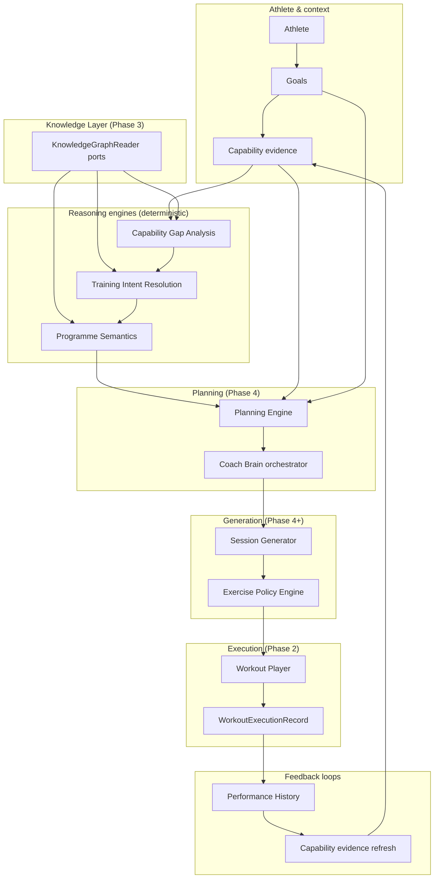
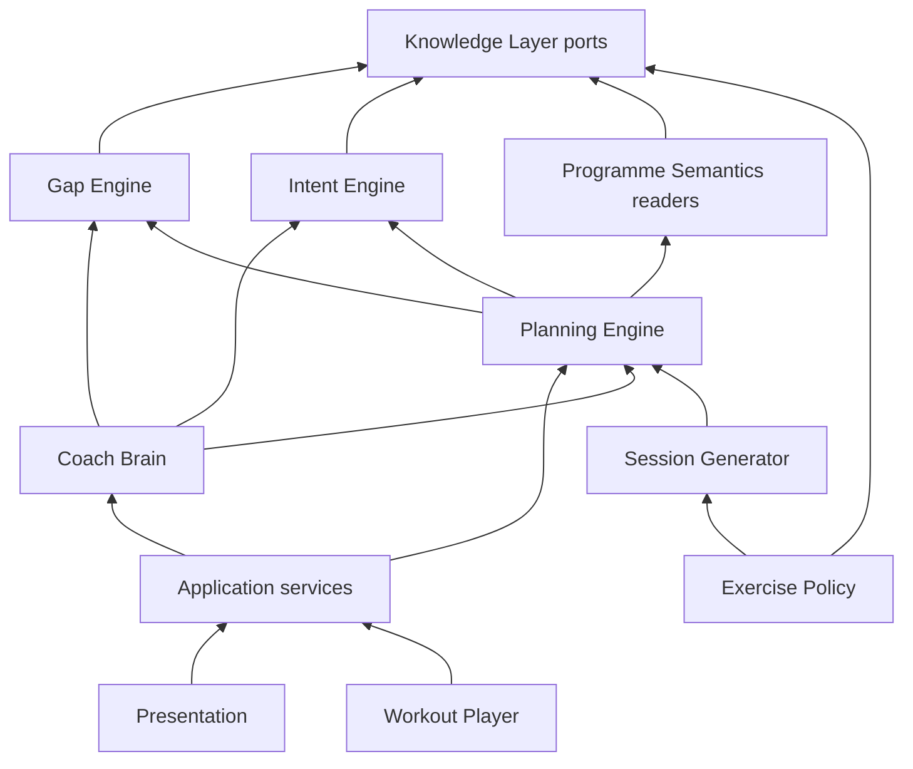
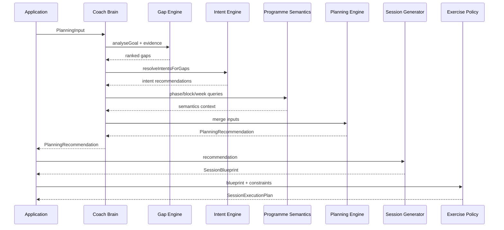
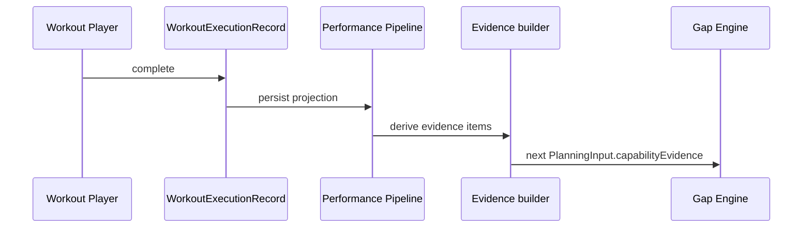

# Planning Engine Architecture v1

**Status:** Canonical blueprint (Phase 3.5 — architecture only)  
**Scope:** Connect Phase 3 **Knowledge Layer** to Phase 2 **execution architecture**  
**Implements in:** Phase 4+ (no production code in Phase 3.5)  
**Related:** [Architecture_Blueprint_v2.md](./Architecture_Blueprint_v2.md), [Phase_2_Architecture_Consolidation_Completion.md](./Phase_2_Architecture_Consolidation_Completion.md), Phase 3 docs under `docs/knowledge/`

---

## Document map

| § | Topic |
|---|--------|
| 1 | Vision |
| 2 | Architecture overview |
| 3 | Component responsibilities |
| 4 | Decision ownership |
| 5 | Planning input contract |
| 6 | Planning output contract |
| 7 | Session Generator |
| 8 | Exercise Policy Engine |
| 9 | Coach Brain (planning role) |
| 10 | Explainability |
| 11 | Future integrations |
| 12 | Dependency direction |
| 13 | Sequence diagrams |
| 14 | Extension strategy |
| 15 | Future phases |
| 16 | Risks |
| 17 | Migration strategy |
| 18 | ADR index |

---

## 1. Vision

### Purpose

The **Planning Engine** answers:

> **What should this athlete train next?**

It does **not** answer:

> Which exercise should we prescribe?

Planning coordinates **existing reasoning engines** (gap analysis, training intent, programme semantics) and **execution adapters** (session generator, exercise policy, workout player). It **must not** embed curated coaching knowledge—that remains in the **Knowledge Layer** (`knowledge/` + read ports).

### Design stance

| Principle | Meaning |
|-----------|---------|
| **Knowledge is data, not code** | Capabilities, intents, phases, blocks, archetypes live in YAML + validators |
| **Single owner per decision** | See §4 — no duplicate ranking or intent selection |
| **Intent before movement** | Programme and session **intent** is fixed before exercise policy runs |
| **Explainability by construction** | Each layer appends rationale; Planning Recommendation aggregates |
| **Phase 2 execution stays canonical** | `SessionOccurrence` → `WorkoutPlayer` → `WorkoutExecutionRecord` (ADR-017–019) |

---

## 2. Architecture overview

### End-to-end pipeline



### Boundary summary

| Boundary | Crosses | Must not cross |
|----------|---------|----------------|
| Knowledge → Reasoning | Read-only ports, bundle version | DB writes, UI, exercise IDs |
| Reasoning → Planning | Ranked gaps, intent recommendations, phase/block/week semantics | Exercise lists |
| Planning → Session Generator | `PlanningRecommendation` | Movement names |
| Session Generator → Exercise Policy | `SessionBlueprint` | Changing training intent |
| Exercise Policy → Workout Player | `SessionExecutionPlan` / projection | Programme phase logic |
| Player → Performance | `WorkoutExecutionRecord` | Gap re-ranking |
| Performance → Evidence | Derived metrics, coach flags | Automatic YAML edits |

---

## 3. Component responsibilities

### Goal Model

| | |
|--|--|
| **Responsibilities** | Represent athlete/programme **outcome targets**; link to ontology goal ids and required capabilities |
| **Inputs** | Assignment, coach programme metadata, athlete-declared goal (future) |
| **Outputs** | `GoalContext` (goal id, label, required/optional capabilities) |
| **Owns** | Goal selection for planning run; mapping to `GoalRequirementKnowledge` |
| **Must never own** | Gap ranking, intent taxonomy, exercises |

**Implementation note:** Today — `GoalRequirementKnowledge` + assignment; Phase 4 — explicit `GoalContext` port input.

---

### Capability Gap Engine

| | |
|--|--|
| **Responsibilities** | Compare goal requirements to **ephemeral evidence**; rank capability gaps; deterministic rationale |
| **Inputs** | `goalId`, `AthleteCapabilityEvidenceProfile`, `KnowledgeGraphReader` |
| **Outputs** | `CapabilityGapAnalysisResult` / ranked `CapabilityGap` list |
| **Owns** | Adequacy threshold, priority scoring, prerequisite blockers in gap output |
| **Must never own** | Training intents, programme phases, exercises, persistence |

**Code seam (Phase 3):** `CapabilityGapAnalysisReader`, `CapabilityGapAnalysisService`.

---

### Training Intent Engine

| | |
|--|--|
| **Responsibilities** | Map capability gaps → **training intent** recommendations (semantic stimulus type) |
| **Inputs** | Ranked gaps, capability→intent mappings from knowledge |
| **Outputs** | `TrainingIntentRecommendation` list |
| **Owns** | Suitability weighting vs gap score; mapping selection per gap |
| **Must never own** | Programme phase, blocks, exercises, session structure |

**Code seam (Phase 3):** `TrainingIntentGraphReader`, `TrainingIntentFromGapsService`.

---

### Programme Semantics Engine

| | |
|--|--|
| **Responsibilities** | Long-horizon **phase**, **block**, **week type**, **progression path** semantics |
| **Inputs** | Knowledge bundle; optional active phase/block/week from planner state |
| **Outputs** | Phase priorities, suitable blocks, week types, progression steps |
| **Owns** | Phase transition rules in data; block↔phase compatibility |
| **Must never own** | Calendar dates, gap scores, exercise selection |

**Code seam (Phase 3):** `ProgrammeSemanticsGraphReader`.

---

### Planning Engine

| | |
|--|--|
| **Responsibilities** | **Compose** reasoning outputs + athlete context into one **`PlanningRecommendation`**; enforce contract; no exercise content |
| **Inputs** | Planning input contract (§5) |
| **Outputs** | Planning recommendation contract (§6) |
| **Owns** | Merge order, conflict rules at **planning** layer (not adaptation ontology) |
| **Must never own** | Knowledge curation, exercise library, in-session state machine |

**Phase 4:** New application/domain module; **pure function** preferred for core merge where possible.

---

### Session Generator

| | |
|--|--|
| **Responsibilities** | Translate `PlanningRecommendation` → **`SessionBlueprint`** (objective, archetype, volume/intensity **targets**, constraints)—**no exercise list** |
| **Inputs** | `PlanningRecommendation`, knowledge archetypes |
| **Outputs** | `SessionBlueprint` |
| **Owns** | Session-level structure template, desired adaptations at session grain |
| **Must never own** | Exercise picks, equipment substitution algorithms |

See §7.

---

### Exercise Policy Engine

| | |
|--|--|
| **Responsibilities** | Final **movement** translation: selection, substitution, environment/equipment/injury/fatigue/preference |
| **Inputs** | `SessionBlueprint`, exercise knowledge, constraints |
| **Outputs** | `SessionExecutionPlan` (or adapter to existing M7 projection) |
| **Owns** | Movement diversity, swaps, variation |
| **Must never own** | Changing programme intent, phase, or training intent emphasis |

See §8.

---

### Coach Brain

| | |
|--|--|
| **Responsibilities (Phase 4 planning)** | **Orchestrator:** collect inputs, invoke engines, resolve conflicts, apply **adaptation policies**, return `PlanningRecommendation` |
| **Responsibilities (Phase 2 — unchanged)** | Day-of **session adaptation** authority (ADR-020); route handlers |
| **Inputs** | Planning input contract; optional day-of adaptation input |
| **Outputs** | `PlanningRecommendation` or adaptation snapshot |
| **Owns** | Handler routing, conflict resolution **policy**, audit envelope |
| **Must never own** | Gap formulas, intent taxonomy YAML, exercise catalogue content |

See §9. **ADR-024** extends Brain for planning without superseding ADR-020.

---

### Workout Player

| | |
|--|--|
| **Responsibilities** | Canonical in-session runtime (ADR-018) |
| **Inputs** | Execution projection from plan + adaptations |
| **Outputs** | Live state → completion handoff |
| **Owns** | Step navigation, timers, set logging UX state |
| **Must never own** | Planning, gap analysis, exercise policy ranking |

---

### Adaptation Pipeline

| | |
|--|--|
| **Responsibilities** | Day-of evaluate → plan → apply on **planned session** (ADR-020, ADR-022 distinct from post-completion) |
| **Inputs** | `PlannedSessionAdaptationInput`, constraints |
| **Outputs** | `AdaptedSessionExecutionSnapshot` |
| **Owns** | Adaptation ontology actions at session/prescription grain |
| **Must never own** | Macro programme phase selection, knowledge YAML |

---

### Performance Pipeline

| | |
|--|--|
| **Responsibilities** | Persist and project M8 performance tree; feed history |
| **Inputs** | `WorkoutExecutionRecord`, platform save coordinators |
| **Outputs** | Performance history, aggregates |
| **Owns** | Immutability after completion |
| **Must never own** | Re-writing coach programme structure |

---

### Knowledge Layer

| | |
|--|--|
| **Responsibilities** | Curated ontology; validation; **read-only** ports |
| **Inputs** | YAML manifests, future sync jobs |
| **Outputs** | Typed knowledge models via `KnowledgeGraphReader` |
| **Owns** | Entity definitions, reference data quality |
| **Must never own** | Athlete state, scheduling, UI |

---

## 4. Decision ownership

**Rule:** Exactly one **owner** per decision type. Other components may **consume** or **constrain**, not re-decide.

| Decision | Owner | Consumers (non-owning) |
|----------|--------|-------------------------|
| Capability gap ranking | **Capability Gap Engine** | Training Intent Engine, Planning Engine, explainability |
| Training intent selection (from gaps) | **Training Intent Engine** | Planning Engine, Session Generator |
| Programme **phase** emphasis | **Programme Semantics Engine** | Planning Engine |
| Training **block** suitability | **Programme Semantics Engine** | Planning Engine |
| **Week type** emphasis | **Programme Semantics Engine** | Planning Engine |
| Progression **path** step (semantic) | **Programme Semantics Engine** | Planning Engine |
| Merge gaps + intents + phase into next session focus | **Planning Engine** | Coach Brain, Session Generator |
| Conflict resolution **policy** (which engine wins when signals clash) | **Coach Brain** | UI |
| Session **archetype** & session objective | **Session Generator** | Exercise Policy |
| Session volume/intensity **targets** (semantic) | **Session Generator** | Exercise Policy |
| **Exercise** selection | **Exercise Policy Engine** | Workout Player |
| **Substitution** (movement-preserving) | **Exercise Policy Engine** | Adaptation Pipeline (when swap action) |
| Day-of **session adaptation** (pre-start) | **Coach Brain** → Adaptation Pipeline | Home, Player |
| Post-completion **programme** adaptation | **AdaptationExecutionCoordinator** | Programme engine |
| **Workout execution** runtime | **Workout Player** | Performance pipeline |
| **Completion** canonical record | **WorkoutExecutionRecord** domain | M8 adapters |
| Knowledge entity truth | **Knowledge Layer** | All readers |

---

## 5. Planning input contract

Canonical type: **`PlanningInput`** (Phase 4 — Dart contract + JSON schema for tools).

### Required (v1)

| Field | Source | Purpose |
|-------|--------|---------|
| `athleteId` | Identity | Correlation (no PII in knowledge) |
| `goalContext` | Goal model | Ontology goal id + required capabilities |
| `capabilityEvidence` | Ephemeral profile | Gap analysis |
| `knowledgeOntologyVersion` | Bundle | Reproducibility |
| `asOf` | Clock | Explainability timestamp |

### Optional (v1)

| Field | Purpose |
|-------|---------|
| `activeProgrammePhaseId` | Semantics engine context |
| `activeTrainingBlockId` | Block-aware planning |
| `activeWeekTypeId` | Weekly emphasis |
| `progressionPathId` | Macro path selection |
| `priorGapAnalysis` | Skip recompute if fresh |
| `priorIntentRecommendations` | Skip recompute if fresh |
| `environmentId` | Constraint for policy (later) |
| `availableEquipmentIds` | Policy input (passed through) |
| `availableTimeMinutes` | Session generator cap |
| `recoveryStateSummary` | Coach Brain policy (e.g. reduce intensity) |
| `injuryFlags` | Policy constraints |
| `travelFlag` | Policy / adaptation |
| `preferences` | Policy only — never changes intent owner |

### Future

| Field | Integration |
|-------|-------------|
| Wearable readiness (WHOOP, Garmin HRV) | Normalized → `recoveryStateSummary` |
| Sleep / nutrition scores | Recovery policy input |
| Medical clearance flags | Hard constraints on policy |
| Coach override directives | Brain policy layer |
| LLM-derived summaries | **Advisory only** — must not bypass owners |

---

## 6. Planning output contract

Canonical type: **`PlanningRecommendation`** — **no exercises**.

### Core fields

| Field | Type (conceptual) | Owner layer |
|-------|-------------------|-------------|
| `capabilityPriorities` | Ordered refs + scores + rationale | Gap engine + planning merge |
| `trainingIntents` | Ordered intent ids + suitability + rationale | Intent engine |
| `programmePhaseId` | Phase id + label | Programme semantics |
| `trainingBlockId` | Block id (optional) | Programme semantics |
| `weekTypeId` | Week emphasis id | Programme semantics |
| `sessionArchetypeId` | Archetype id | Session generator **or** planning default |
| `adaptationRationale` | List of human-readable strings | All layers |
| `constraints` | Tags (equipment, injury, time) | Input + Brain policy |
| `confidence` | 0–1 aggregate | Planning engine heuristic |
| `explainability` | Structured tree (§10) | Planning engine |

### Explicit exclusions

- Exercise ids, sets, reps, loads  
- Supabase row ids for movements  
- Coach Brain handler internals  

**ADR-026** formalizes this contract.

---

## 7. Session Generator

### Responsibility

Turn **`PlanningRecommendation`** into a **`SessionBlueprint`**: what kind of session, what adaptations it seeks, at what semantic intensity/volume—still **no movements**.

### Session Blueprint (contract)

| Field | Description |
|-------|-------------|
| `blueprintId` | Stable id for traceability |
| `sessionObjective` | One-line coaching objective (from intents + phase) |
| `desiredAdaptations` | Capability/intent targets for this session |
| `sessionArchetypeId` | From knowledge `session_archetypes` |
| `intensityTarget` | Semantic band (e.g. low / moderate / high / peak) |
| `volumeTarget` | Semantic band or relative scale |
| `requiredCapabilityIds` | Must be addressed in policy selection |
| `allowedSubstitutionPolicy` | Tags for exercise policy (preserve intent, preserve pattern) |
| `constraints` | Time, equipment, environment caps |
| `planningRecommendationRef` | Link back for explainability |

**ADR-027** formalizes Session Blueprint.

### Boundaries


---

## 8. Exercise Policy Engine

### Responsibilities

| Area | Detail |
|------|--------|
| **Exercise selection** | Choose movements from knowledge + platform `Exercise` catalogue |
| **Equipment compatibility** | Filter/require equipment ids |
| **Environment compatibility** | Gym, home, hotel, outdoor |
| **Movement diversity** | Balance patterns across week (policy) |
| **Injury constraints** | Exclude/constrain patterns |
| **Fatigue constraints** | Reduce volume/intensity selection, not intent |
| **Preferences** | Swap within intent-preserving set |
| **Substitutions** | Rank via `KnowledgeGraphReader.querySubstitutions` |
| **Movement balancing** | Push/pull, hinge/squat distribution |
| **Variation** | Rotation without changing `SessionBlueprint` intent |

### Invariant

> **Exercise Policy never changes programme intent, training intent emphasis, or session archetype.**  
> If impossible to satisfy blueprint + constraints, return **failure with explainability** — do not silently retarget intent.

**ADR-025** formalizes ownership.

---

## 9. Coach Brain (planning orchestrator)

### Phase 2 (current)

- Routes **day-of adaptation** decisions (ADR-020).  
- Handlers delegate to domain pipelines.  
- Does **not** implement gap or intent algorithms.

### Phase 4 (target)

Coach Brain becomes the **planning orchestrator**:

1. Validate `PlanningInput`  
2. Invoke **Capability Gap Engine** (if needed)  
3. Invoke **Training Intent Engine**  
4. Read **Programme Semantics** (phase/block/week)  
5. Invoke **Planning Engine** merge  
6. Apply **policies**: recovery downgrade, coach override, travel simplification  
7. Return **`PlanningRecommendation`** + explainability envelope  

**Knowledge stays in Knowledge Layer.** Brain holds **policies and wiring**, not YAML taxonomy.

### Relationship to Planning Engine

| Component | Role |
|-----------|------|
| **Planning Engine** | Pure composition + contract enforcement |
| **Coach Brain** | IO, policies, handler registration, conflict resolution |

Day-of adaptation remains a **separate handler path** after a plan exists (ADR-020).

**ADR-024** documents this split.

---

## 10. Explainability model

### Structure

```text
PlanningRecommendation.explainability
├── summary: string
├── factors: [
│     { layer, decision, rationale, evidenceRefs[], confidence }
│   ]
└── sessionFocus: string
```

### Example (narrative)

Today's session prioritises **Threshold Development** because:

- Goal **HYROX Sub-60** requires **threshold** (goal model)  
- Gap analysis: threshold adequacy below threshold; grip unknown (gap engine)  
- Intent mapping: tempo / threshold progression suitable (intent engine)  
- Programme phase: **Specific Preparation** (semantics)  
- Active block: **Threshold block** (semantics)  
- Recovery policy: allows **high** systemic load (Brain policy input)  
- Week type: **Intensification** (semantics)  

Each bullet maps to a **`factors[]` entry** with `layer` ∈ {goal, evidence, gap, intent, semantics, policy, generator}.

### Rules

1. Lower layers **append** rationale; Planning Engine **does not invent** coaching copy when knowledge provides strings.  
2. Unknown evidence → explicit "no evidence on file" factor (aligns with gap analysis v1).  
3. UI and LLM assistants **consume** the same tree — LLMs must not be sole owner of any decision (§4).

---

## 11. Future integrations

| Source | Enters pipeline at | Normalized as |
|--------|-------------------|---------------|
| **Garmin** | Performance → evidence | Tests, HR zones → evidence items |
| **WHOOP** | Recovery input | `recoveryStateSummary` |
| **Apple Health** | Sleep / activity | Recovery + optional evidence |
| **TrainerRoad** | External plan compare (future) | Advisory overlay — not owner |
| **Intervals.icu** | Load metrics | Fatigue constraints for policy |
| **Nutrition** | Recovery | Recovery policy |
| **Sleep** | Recovery | Recovery policy |
| **Medical** | Constraints | Injury/medical flags → policy |
| **Coach review** | Brain policy | Overrides with audit |
| **LLMs / AI assistants** | Explainability + advisory | Must not rank gaps or select exercises without engine owners |

**Rule:** External data **never writes** knowledge YAML automatically in v1; it updates **evidence** or **policy inputs** only.

---

## 12. Dependency direction



**Forbidden:**

- Knowledge Layer → Supabase athlete tables (direct)  
- Exercise Policy → Gap Engine (reverse rank)  
- Workout Player → Planning Engine (feedback via Performance → Evidence only)  

---

## 13. Sequence diagrams

### 13.1 Planning run (greenfield session)



### 13.2 Closed loop after workout



---

## 14. Extension strategy

1. Add knowledge entities in `knowledge/` + validator tests.  
2. Extend **read ports** — no Planning Engine fork of YAML.  
3. Add **Coach Brain handler** for new policy (travel, medical).  
4. Keep **contracts** backward compatible (version field on recommendations).  
5. Feature-flag Phase 4 paths beside legacy M7 rendering until parity.

---

## 15. Future phases

| Phase | Focus |
|-------|--------|
| **Phase 4a** | `PlanningInput` / `PlanningRecommendation` types + Planning Engine merge (no UI) |
| **Phase 4b** | Session Generator + Session Blueprint |
| **Phase 4c** | Exercise Policy Engine behind feature flag |
| **Phase 4d** | Coach Brain planning handler + explainability UI |
| **Phase 4e** | Evidence persistence + performance → evidence adapter |
| **Phase 5** | Scheduling engine (optional calendar) — **downstream** of semantics |

---

## 16. Risks

| Risk | Mitigation |
|------|------------|
| Coach Brain becomes "god object" | Strict §4 ownership; Brain = orchestration only (ADR-024) |
| Duplicate gap/intent logic in UI | Single application entry via Brain |
| Exercise policy changes intent silently | ADR-025 invariant + blueprint diff audit |
| LLM bypasses deterministic engines | Advisory channel only; contract tests |
| Phase 2 dual stack confusion | SessionExecutionPlan adapter doc; feature flags |
| Knowledge drift vs platform Exercise | Reconciliation doc + alias map (Phase 3 backlog) |

---

## 17. Migration strategy

1. **Keep** ADR-017–022 execution paths live.  
2. **Introduce** planning contracts as new packages/modules — no breaking changes to `WorkoutPlayer`.  
3. **Wire** Home "today" gradually: optional `PlanningRecommendation` drives **intent labels** before policy generates plan.  
4. **Retain** coach-authored programmes as default until planning parity proven.  
5. **Measure** explainability completeness in internal tools before athlete-facing copy.

---

## 18. ADR index (Phase 3.5)

| ID | Title |
|----|--------|
| [ADR-023](./adrs/ADR-023-planning-engine-ownership.md) | Planning Engine owns planning merge, not knowledge or exercises |
| [ADR-024](./adrs/ADR-024-coach-brain-planning-orchestrator.md) | Coach Brain orchestrates planning; ADR-020 day-of authority preserved |
| [ADR-025](./adrs/ADR-025-exercise-policy-semantic-boundary.md) | Exercise Policy owns movement selection; never changes intent |
| [ADR-026](./adrs/ADR-026-planning-recommendation-contract.md) | PlanningRecommendation canonical output (no exercises) |
| [ADR-027](./adrs/ADR-027-session-blueprint-contract.md) | SessionBlueprint between generator and exercise policy |

---

## Recommendation for Phase 4

1. Implement **`PlanningInput`** / **`PlanningRecommendation`** as immutable Dart types + JSON schema in `docs/architecture/schemas/` (optional).  
2. Build **`PlanningEngineService`** (pure merge) with unit tests using Phase 3 scenario fixtures.  
3. Add **`PlanningCoachDecisionHandler`** to Coach Brain — calls engines, not YAML.  
4. Define **`SessionBlueprint`** and stub **`SessionGenerator`** returning archetype-only blueprints.  
5. Spike **`ExercisePolicyEngine`** interface consuming blueprint + `KnowledgeGraphReader` — behind flag.  
6. Internal **debug screen** (coach-only) showing explainability tree — not athlete UI until trusted.  
7. Do **not** persist athlete evidence until decay policy ADR exists.

This document is the **canonical reference** for all Phase 4 planning work; update via new ADRs when ownership changes.
