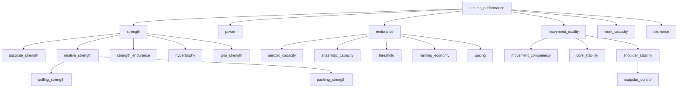

# Athletic Capability Ontology v1

**Status:** Phase 3 Sprint 3 — implemented in `knowledge/reference/capabilities.yaml` (ontology **1.1.0**)  
**Related:** [Knowledge_Blueprint_v1.md](./Knowledge_Blueprint_v1.md), [Capability_Model_Guide_v1.md](./Capability_Model_Guide_v1.md)

---

## 1. Capability philosophy

### What capabilities are

**Capabilities** are trainable athletic qualities — changes in what the athlete can do over time. They are the primary semantic layer between **goals**, **prescription**, and (eventually) **Coach Brain** reasoning.

Capabilities describe **what changes in the athlete**.

### What capabilities are not

| Not a capability | Why |
|------------------|-----|
| **Exercise** | Exercises *develop* capabilities; they are prescriptions, not qualities |
| **Muscle group** | Anatomy labels; may *emphasize* development but are not trainable qualities themselves |
| **Movement pattern** | Biomechanical archetype; exercises *express* patterns while developing capabilities |

### Design principles

1. **Sport-independent core** — hierarchy lives under `cohort.capability.*`; sport-specific leaves use extension namespace metadata (e.g. HYROX burpee efficiency).  
2. **Goals require capabilities** — programme goals declare required capabilities (metadata), not exercise lists.  
3. **Exercises develop capabilities** — primary / secondary / supporting roles on exercise knowledge; no inferred athlete scores.  
4. **Evidence is separate** — assessment *methods* are documented; athlete measurements are a future persistence concern.  
5. **Coach Brain later** — this sprint builds ontology + read API only.

---

## 2. Capability hierarchy

### Graph structure

### Edge types

| Edge | Field | Meaning |
|------|--------|---------|
| **Parent** | `parent_ids` | Taxonomic hierarchy (multi-parent allowed sparingly) |
| **Prerequisite** | `prerequisite_ids` | Readiness — develop before heavy emphasis |
| **Supporting** | `supporting_capability_ids` | Reinforces another capability |
| **Conflicting** | `conflicting_capability_ids` | Rare — simultaneous peak emphasis tension |

### Relationship vocabulary (semantic)

Used in documentation and future graph edges:

| Type | Direction | Example |
|------|-----------|---------|
| `develops` | Exercise → capability | Pull-up develops pulling strength |
| `requires` | Goal → capability | HYROX sub-60 requires threshold |
| `supports` | Capability → capability | Scapular control supports pulling strength |
| `limited_by` | Capability → constraint | Overhead tolerance limited by shoulder irritability (future) |
| `expressed_by` | Pattern → exercise family | Squat pattern expressed by back squat |
| `measured_by` | Capability → assessment method | Absolute strength measured by 1RM |

---

## 3. Machine-readable schema

- **Schema:** `knowledge/schemas/capability.schema.yaml`  
- **Data:** `knowledge/reference/capabilities.yaml`  
- **Goals:** `knowledge/reference/goal_requirements.yaml` + `goal_requirement.schema.yaml`

Each capability includes: stable id, name, description, aliases, parents, prerequisites, supporting/conflicting links, related movement patterns / energy systems / training intents, typical assessment methods, confidence, provenance, status.

**Deprecated Sprint 2 flat ids** (e.g. `max_strength`) remain with `replaces_id` pointing to hierarchical nodes.

---

## 4. Exercise → capability mapping

Exercises declare:

| Role | Meaning |
|------|---------|
| **primary_capabilities** | Main qualities trained in typical prescription |
| **secondary_capabilities** | Meaningful but not primary emphasis |
| **supporting_capabilities** | Accessory qualities that enable primary work |

**Example — pull-up**

| Role | Capabilities |
|------|----------------|
| Primary | `pulling_strength` |
| Secondary | `grip_strength` |
| Supporting | `scapular_control`, `core_stability` |

This mapping does **not** infer an athlete’s current ability.

---

## 5. Capability assessment model (design only)

Assessment connects **evidence types** to capabilities without storing athlete data in Sprint 3.

| Capability | Possible evidence (not exhaustive) |
|------------|-------------------------------------|
| Absolute strength | 1RM, estimated 1RM, velocity-based estimate, coach assessment |
| Relative strength / pulling strength | Bodyweight max reps, relative load tests, coach assessment |
| Aerobic capacity | Threshold test, time trial, pace vs HR, coach assessment |
| Running economy | Pace vs HR, race performance, coach assessment |
| Core stability | Plank / side plank holds, observation |
| Threshold | Field tests, lab-style proxy, coach assessment |

**Rules**

- Evidence types are **labels** in YAML (`typical_assessment_methods`), not scores.  
- Multiple evidence types may support one capability.  
- Conflicting evidence resolution is a future application concern.  
- No athlete persistence, no inferred scoring in this sprint.

---

## 6. Goal → capability requirements (metadata)

Representative goals in `goal_requirements.yaml`:

| Goal id | Required capabilities (summary) |
|---------|----------------------------------|
| `cohort.goal.hyrox_sub_60` | Aerobic capacity, threshold, strength endurance, grip strength, running economy, pacing, burpee efficiency, work capacity |
| `cohort.goal.general_fat_loss` | Relative strength, work capacity, movement competency, aerobic capacity |
| `cohort.goal.military_selection` | Loaded carry capacity, aerobic capacity, pushing/pulling strength, resilience, work capacity |

These are **metadata only** — no programme generation or gap analysis engine in Sprint 3.

---

## 7. Validation rules

Enforced by `KnowledgeOntologyValidator` + tests:

- Unique capability ids  
- Acyclic **parent** hierarchy  
- Acyclic **prerequisite** graph  
- Valid parent/prerequisite/supporting/conflicting refs  
- Active capabilities reachable from root (`athletic_performance`)  
- Exercise capability refs exist  
- Goal required capabilities exist  

---

## 8. Read-only API

See [Knowledge_Read_Seam_v1.md](./Knowledge_Read_Seam_v1.md) — `CapabilityGraphReader` on `InMemoryKnowledgeGraphReader`.

---

## 9. Known limitations

- Representative dataset (~40 capability nodes, 20 exercises, 3 goals).  
- No athlete profile or assessment storage.  
- No Coach Brain or substitution ranker integration.  
- `compromised_qualities` on substitutions may mix capability ids and qualitative tags.  
- Legacy `ExerciseTrainingEffect` enum not fully migrated — map via reconciliation doc.

---

## 10. Sprint 4 direction

Wire capability-aware **gap analysis** (goal requirements vs planned session capabilities) in tests only; expand HYROX/running extension pack; alias map from platform `Exercise.primary_capability` strings.
