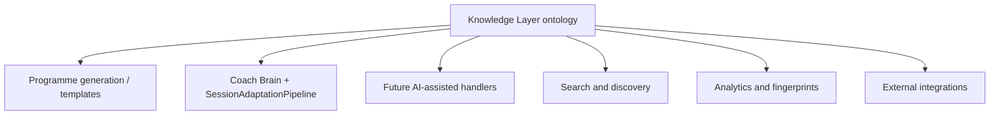
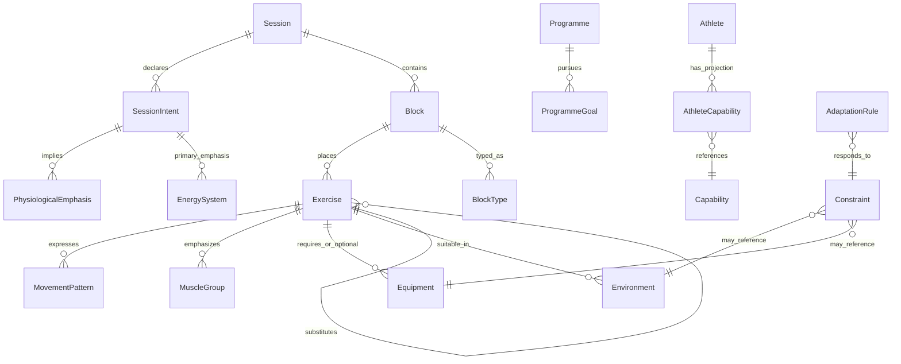
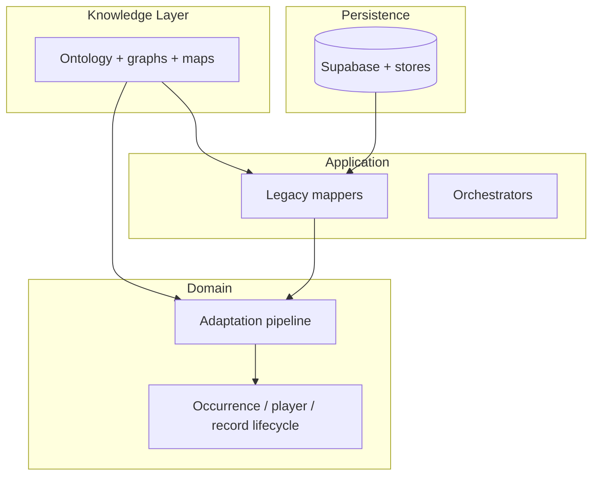
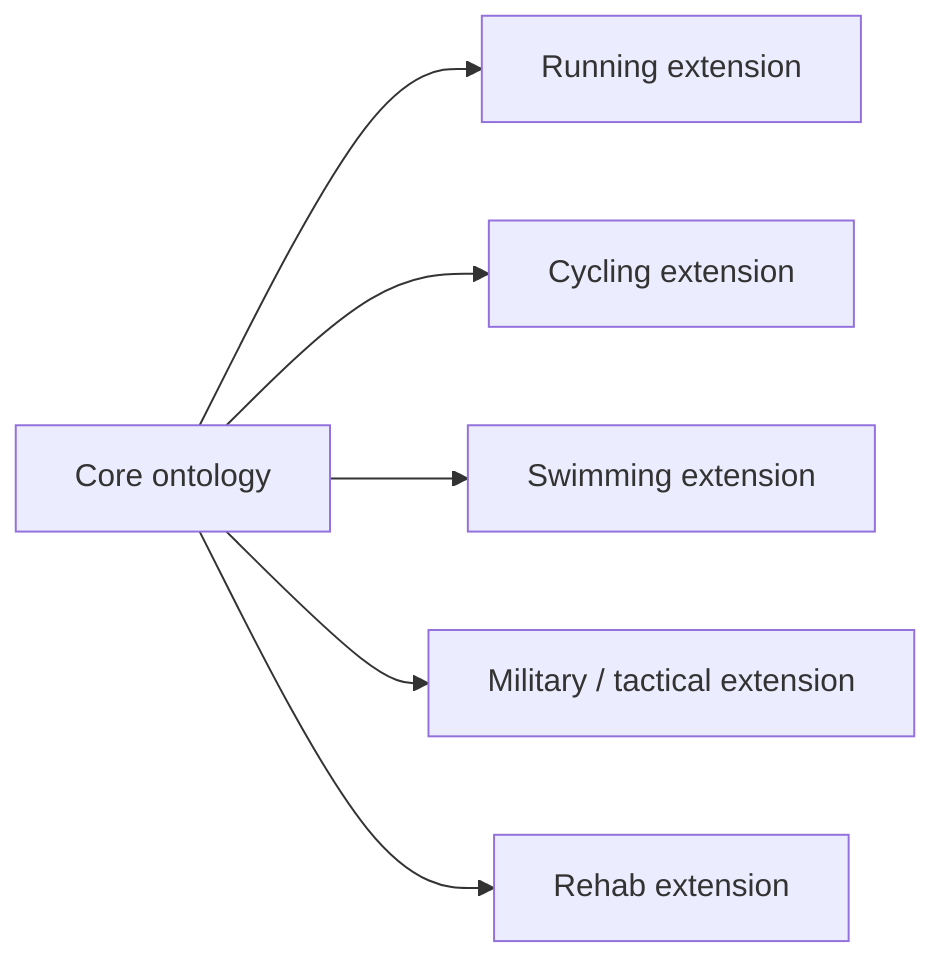

# Cohort Knowledge Layer — Blueprint v1

**Status:** Phase 3 Sprint 1 — design only (no production code)  
**Audience:** Product, coaching science, engineering, future AI integrations  
**Scope:** Semantic model of **training reality** — not Flutter widgets, Supabase tables, or Dart package layout  
**Related:** [Architecture_Blueprint_v2.md](../architecture/Architecture_Blueprint_v2.md) §12–13, [79_Adaptation_Ontology_V1.md](../../07%20Documentation/79_Adaptation_Ontology_V1.md), [48_Training_Library.md](../../07%20Documentation/48_Training_Library.md)

---

## Document map

| § | Topic |
|---|--------|
| 1 | Vision and goals |
| 2 | Knowledge philosophy |
| 3 | Core entities |
| 4 | Relationships |
| 5 | Ownership by layer |
| 6 | Naming conventions |
| 7 | Extension strategy (multi-sport) |
| 8 | AI reasoning principles |
| 9 | Versioning |
| 10 | Future phases |
| A | Alignment with current platform |
| B | Glossary |

---

## 1. Vision and goals

### 1.1 Vision

The **Knowledge Layer** is Cohort’s shared, durable description of what training *is*: movements, stimuli, constraints, capabilities, environments, and the rules that connect them. It answers questions coaches ask in plain language—“what kind of session is this?”, “what can substitute here?”, “what does this cost the athlete?”—in a form that **programme design**, **Coach Brain**, **deterministic adaptation**, **search**, **analytics**, and **future AI** can all consume without each inventing its own taxonomy.

The layer describes **training reality**, not application wiring. A squat is a hip-and-knee dominant pattern whether it appears in a JSON row, a PDF, or a model prompt.

### 1.2 Goals

| Goal | Success criterion |
|------|-------------------|
| **Stable over time** | Core entity types and relationship *kinds* change rarely; value sets grow additively |
| **Extensible** | New sports, equipment, and constraint types attach without rewriting the core graph |
| **Domain-first** | Knowledge concepts are defined before persistence or UI; apps *project* knowledge |
| **AI-friendly** | Concepts have clear definitions, bounded enums where needed, and explicit uncertainty |
| **UI-independent** | Athlete/coach labels are views; canonical identifiers and semantics live in knowledge |
| **Persistence-independent** | Same ontology whether stored in Supabase, graph DB, files, or in-memory tests |

### 1.3 Non-goals (v1 blueprint)

- Implementing repositories, migrations, or Coach Brain handlers  
- Replacing curated **Exercise** coaching copy (setup, cues, execution) — that remains authored content bound to knowledge IDs  
- Clinical diagnosis, medical clearance, or nutrition prescription  
- Defining exact load algorithms (e.g. 1RM percentages) as universal truth — those stay programme- or coach-specific unless promoted to knowledge later

### 1.4 Consumers (planned)

Execution lifecycle aggregates (`SessionOccurrence`, `WorkoutPlayer`, `WorkoutExecutionRecord`) **consume** knowledge for decisions; they are not part of the knowledge layer itself (see §5).

---

## 2. Knowledge philosophy

### 2.1 Three strata

| Stratum | What it holds | Example |
|---------|----------------|---------|
| **Canonical knowledge** | Stable concepts, enums, relationship types | `MovementPattern.hinge`, `SessionIntent.thresholdRun` |
| **Curated content** | Human-authored text and media tied to IDs | Exercise execution paragraph, protocol block instruction |
| **Derived knowledge** | Computed from canonical + content + history | Session fingerprint, similarity score, athlete trend |

**Rule:** Derived knowledge must declare its inputs and must not silently override canonical constraints (hard limits stay hard).

### 2.2 Intent before inventory

Cohort preserves **training intent** before **exercise inventory**. Substitution, scaling, and programme generation rank candidates by intent compatibility and constraint satisfaction first; exercise lists are outputs, not the ontology center.

This aligns with Adaptation Ontology principles: smallest valid change, hard constraints eliminate, soft preferences rank (`79_Adaptation_Ontology_V1.md`).

### 2.3 Qualitative load and cost

Knowledge expresses **qualitative** load potential, fatigue cost, and recovery cost unless a specific programme contract defines quantitative prescriptions. The layer supports “heavy hinge stress” or “high neuromuscular demand” without mandating global tonnage formulas.

### 2.4 Explainability by design

Every knowledge-backed decision path should be able to cite:

1. Which **constraints** applied (hard vs soft)  
2. Which **intents** were preserved or traded off  
3. Which **entities** (exercise, block, session) were involved  

Audit vocabulary (`AdaptationAuditEventType`, plan rationale) is an **application/domain output** shaped by knowledge, not a duplicate ontology.

### 2.5 Separation from performance history

**What happened** (M8 performance trees, domain `WorkoutExecutionRecord`) is historical fact. **What things mean** (movement pattern, session intent) is knowledge. Analytics may join them; knowledge must not mutate completed performance.

---

## 3. Core entities

Entities below are **conceptual**. Many already have partial counterparts in `lib/domain/adaptation/vocabulary/` or legacy string fields on `Exercise` / protocols; v1 blueprint names the target semantic model.

### 3.1 Entity catalogue

| Entity | Definition | Notes |
|--------|------------|--------|
| **Exercise** | A named, coach-curated movement prescription unit with identity, coaching content, and knowledge metadata | Not every drill is an Exercise; variants may link via substitution graph |
| **Movement Pattern** | Biomechanical / task pattern (squat, hinge, push, pull, carry, run, cycle, swim stroke, etc.) | Structured enum + optional tags; supersedes free-text `movement_pattern` over time |
| **Joint Action** | Fine-grained articulation (hip extension, shoulder flexion, ankle dorsiflexion) | Used for rehab/prehab and substitution safety; optional on Exercise |
| **Muscle Group** | Anatomical grouping for emphasis and volume accounting | Primary/secondary emphasis on Exercise; not a prescription |
| **Capability** | Trainable quality or skill domain (aerobic capacity, max strength, running economy, grip endurance) | Distinct from **Session Intent** (see below); bridges legacy `primary_capability` |
| **Equipment** | Implement or station required or optional for an Exercise or Environment | Tokens + categories (barbell, kettlebell, erg, pool, trail) |
| **Environment** | Where training occurs and what it implies | Aligns with `TrainingEnvironment` (gym, home, hotel, outdoor, track, pool) |
| **Energy System** | Primary metabolic emphasis for a stimulus (aerobic, anaerobic lactic, alactic, mixed) | Often derived from Session Intent + modality; explicit for conditioning |
| **Session Intent** | Stimulus taxonomy for a session or block (e.g. threshold run, upper hypertrophy) | Canonical enum — `SessionIntent` |
| **Programme Goal** | Macro outcome of a programme phase (build, deload, peaking, return-to-run) | Related to `ProgrammeIntent`; may gain structured enum later |
| **Training Intent** | Umbrella: any declared purpose at programme, day, session, block, or placement level | Specialised by level (Programme Goal vs Session Intent vs block intent) |
| **Session Modality** | How work is organised (continuous, intervals, circuits, strength sets, skill practice) | `SessionModality` |
| **Physiological Emphasis** | Dominant system or quality stressed | `PhysiologicalEmphasis` |
| **Recovery Cost** | Expected impact on readiness for subsequent sessions (low → high) | Qualitative; feeds day-of and weekly planning |
| **Fatigue Cost** | Acute demand within a session (local vs systemic, CNS vs muscular) | Distinct from recovery cost (inter-session) |
| **Constraint** | Hard or soft limit on feasible training | `AdaptationConstraint` + kinds; athlete input maps here |
| **Adaptation Rule** | Declarative or procedural rule for changing prescriptions, swaps, or schedule | Split: **day-of** (pipeline) vs **post-completion** (programme slots) — same vocabulary, different mutation scope |
| **Athlete Capability** | Individual level or trend on a Capability or Movement Pattern | Profile / projection — not global knowledge; references canonical Capability |
| **Block Type** | Structural role of a session block (warm-up, strength, conditioning, cooldown) | Platform `SessionBlockType` + `BlockAdaptationPolicy` |
| **Substitution Relationship** | Directed or symmetric link between Exercises (regression, progression, lateral swap) | Curated graph; fidelity checks use Movement Pattern + intent |
| **Prescription Shape** | Qualitative structure of reps/time/load (strength sets, EMOM, distance, RPE band) | Authoring + execution; knowledge defines *allowed* shapes per block type |

### 3.2 Entity detail (selected)

#### Exercise

- **Identity:** stable `exercise_id` (platform) maps to knowledge node `Exercise`.  
- **Knowledge facets:** movement pattern(s), muscle emphasis, equipment, environment suitability, technical complexity, impact, training effects, loading potential, movement characteristics.  
- **Content facets:** setup, execution, cues, safety — authored prose; AI must not invent when record exists (product rule).  
- **Placement:** Exercises appear in **Session** structure via block links; knowledge graph also links protocols ↔ exercises for discovery (`knowledge_relationships` today).

#### Movement Pattern vs Capability vs Session Intent

| Concept | Question it answers |
|---------|---------------------|
| **Movement Pattern** | What movement archetype is this? |
| **Capability** | What quality does this develop over weeks? |
| **Session Intent** | What is today’s session trying to achieve? |

Legacy **Capability** vocabulary (Capacity, Engine, etc.) does not 1:1 map to Session Intent; knowledge maintains an explicit **mapping table** (curated, versioned) rather than silent equivalence.

#### Recovery Cost vs Fatigue Cost

| | Recovery Cost | Fatigue Cost |
|--|---------------|--------------|
| **Horizon** | Hours to days between sessions | Within session / same day |
| **Use** | Weekly plan, deload, travel weeks | In-session ordering, density caps |
| **Example** | Heavy hinge day → elevated next-day recovery cost | High-rep deadlift block → local fatigue cost |

Both are **ordinal or banded** (e.g. low / moderate / high) in v1; numeric models may attach in later phases (wearables).

#### Constraint vs Adaptation Rule

- **Constraint:** boundary on the feasible set (“no running”, “hotel gym”, “30 minutes available”).  
- **Adaptation Rule:** transformation on a feasible plan (“reduce sets before swap”, “substitute run with bike if environment = hotel and intent = aerobic base”).  

Coach Brain **handlers** execute rules; knowledge stores rule *definitions* and priorities, not UI state.

#### Athlete Capability

Individual snapshot or trend: e.g. “squat pattern: competent”, “aerobic base: developing”. Used for scaling and programme entry — stored in athlete profile projections, defined relative to canonical Capability / Movement Pattern enums.

---

## 4. Relationships

Knowledge is a **typed graph**. Relationship kinds are stable; payloads may extend.

### 4.1 Core relationship diagram

### 4.2 Relationship catalogue

| From | Relationship | To | Semantics |
|------|--------------|-----|-----------|
| Exercise | `expresses` | Movement Pattern | Primary and secondary patterns |
| Exercise | `emphasizes` | Muscle Group | Primary / secondary |
| Exercise | `requires` / `optional_for` | Equipment | Hard vs soft equipment need |
| Exercise | `suitable_in` | Environment | Feasibility, not preference only |
| Exercise | `substitutes` | Exercise | Type: regression / progression / lateral; fidelity metadata |
| Session | `declares` | Session Intent | Primary required; secondary optional |
| Session | `contains` | Block | Authoring order + dependencies |
| Block | `places` | Exercise | Role, replaceable flags, prescription ref |
| Block | `typed_as` | Block Type | Warm-up, strength, etc. |
| Session Intent | `implies` | Physiological Emphasis / Energy System | Default inference; overridable |
| Programme | `pursues` | Programme Goal | Phase-level |
| Session / Block | `carries` | Recovery Cost / Fatigue Cost | Qualitative bands |
| Athlete | `has` | Athlete Capability | Projection, time-stamped |
| Constraint | `limits` | Session / Block / Exercise set | Scope + severity |
| Adaptation Rule | `applies_when` | Constraint + Intent context | Ordered rule sets |
| Protocol (content) | `contains` | Exercise | Discovery graph (existing `knowledge_relationships`) |

### 4.3 Cardinality and ambiguity

- **Multi-valued:** Exercise → Movement Pattern, Muscle Group, Training Effect (list).  
- **Directed:** Substitution edges may be asymmetric (A regresses to B does not imply B progresses to A).  
- **Scoped:** Constraints carry scope (session, block, placement, programme) per adaptation vocabulary.

---

## 5. Ownership by layer

| Layer | Owns | Must not own |
|-------|------|----------------|
| **Knowledge Layer (this blueprint)** | Entity definitions, relationship kinds, enums, mapping tables, substitution fidelity rules, qualitative cost bands | Workout runtime state, calendar dates, M8 set/rep logs |
| **Domain (`lib/domain/`)** | Execution/adaptation **invariants** that *reference* knowledge IDs/enums; evaluate/plan/apply; Coach Brain routing contracts | Authoring UI; Supabase SQL; ad hoc exercise invention |
| **Application** | Orchestration, mapping legacy strings → knowledge enums, presenter copy | New unconstrained taxonomy without knowledge review |
| **Features / UI** | Labels, questionnaires (`AdaptationReason`), screens | Canonical enum definitions duplicated in widgets |
| **Persistence (`lib/data/`, Supabase)** | Storage of exercises, protocols, relationships, optional JSONB policy blobs | Business meaning of enums (meaning lives in knowledge + domain) |
| **Curated content** | Exercise/Protocol prose, media URLs | Algorithmic substitution without graph + constraints |

**Coach Brain** reasons using **domain pipelines** fed by knowledge projections — Brain does not embed a second ontology.

---

## 6. Naming conventions

### 6.1 Identifiers

| Kind | Convention | Example |
|------|------------|---------|
| **Stable ID** | `snake_case` or platform UUID for persisted entities | `exercise_id`, `protocol_id` |
| **Knowledge enum value** | `camelCase` in Dart; `snake_case` in DB persistence | `SessionIntent.upperBodyHypertrophy` → `upper_body_hypertrophy` |
| **Relationship type** | `snake_case` verb phrase | `substitutes`, `declares`, `expresses` |
| **Human label** | Title case in UI; not used as API key | “Upper body hypertrophy” |

### 6.2 Namespaces

- Prefix **programme-** vs **session-** intents when adding enums (`ProgrammeGoal` vs `SessionIntent`).  
- Avoid overloading **Capability** — use `SessionIntent` for session stimulus and `Capability` for trainable quality.  
- **Environment** (knowledge) vs **AdaptationSessionEnvironment** (questionnaire) — map explicitly; do not merge enums.

### 6.3 Documentation

- Each new enum value requires: definition, typical exercises/sessions, incompatible constraints, example athlete message.  
- Breaking renames go through versioning (§9), not silent string edits in content.

---

## 7. Extension strategy (multi-sport and domains)

### 7.1 Pattern: core + extensions

- **Core:** Movement Pattern (generic), Session Intent families, Constraint kinds, Equipment categories, Environment, Energy System, substitution fidelity ladder.  
- **Extension pack:** Sport-specific Movement Patterns (e.g. `runningStride`, `freestyleSwim`), Session Intents (race pace, open water), Equipment (bike, wetsuit), Environment (pool, open water, range), optional **Capability** entries (FTP zone semantics as capability, not session intent).

### 7.2 Extension rules

1. **Add, don’t fork** — new values and relationship subtypes; avoid duplicate concepts (“run” vs “running” as separate roots).  
2. **Intent family first** — new sport enters via Session Intent + Modality extensions before bespoke rule engines.  
3. **Substitution graph is local** — running swaps don’t require strength exercise nodes; cross-modality swap rules are explicit Adaptation Rules.  
4. **Rehab / pain** — Joint Action + Constraint kinds; no diagnostic entities; language stays non-clinical (aligned with Ontology §1).  
5. **Military / HYROX** — Conditioning intent family + station-specific intents already sketched in `SessionIntent`; extend with event-specific Equipment and Environment.

### 7.3 Programme generation

Generators select **Session Intent + Programme Goal + slot context**, then query knowledge for candidate sessions/exercises satisfying Equipment, Environment, and Athlete Capability — not flat protocol lists.

---

## 8. AI reasoning principles

Future AI features (Architecture §13) **propose**; domain **disposes**.

### 8.1 Reason over graph, not over lists

| Avoid | Prefer |
|-------|--------|
| “Pick from these 50 exercise names” | Filter graph: intent → pattern → equipment → constraints → rank substitutes |
| Single-shot session rewrite | Ordered adaptation ladder matching `AdaptationActionType` |
| Invented coaching cues | Retrieve Exercise content by ID; null if missing |

### 8.2 Hard vs soft separation

1. Apply **hard constraints** — eliminate candidates (AI must not override).  
2. Score **soft preferences** — similarity, equipment fit, duration — with explainable weights.  
3. Emit **structured proposals** — JSON matching domain plan steps + rationale strings cite knowledge entities.

### 8.3 Uncertainty and confidence

- Knowledge-backed outputs carry **confidence** (`AdaptationConfidence`) when inference chains are partial (missing metadata).  
- Low confidence → narrower changes (prescription tweak only) or human confirmation — policy in application, not in LLM prompt alone.

### 8.4 Coach Brain seam

- **Deterministic handlers** (session adaptation today) remain authoritative for v1 paths.  
- **AI-assisted handlers** register alongside stubs (`substitution`, `scaling`, `rescheduling`) and call the same validators/appliers.  
- AI never writes directly to Supabase authoring tables without human or validator gate.

### 8.5 Representative data rule

Training copy shown to athletes/coaches comes from **stored Protocol/Exercise** records linked to knowledge IDs. AI may summarize or rephrase only where product policy explicitly allows — default is retrieval, not generation.

### 8.6 Prompt-relevant entity bundles

When AI is invoked, context bundles should include:

- Session/block **Intent** + **Constraint** set (structured)  
- Candidate Exercise **metadata** (patterns, effects, costs) — not full DB row dump  
- **Substitution edges** within hop limit  
- **Explicit non-goals** (pain diagnosis, medical advice)

---

## 9. Versioning

### 9.1 Ontology version

- **`KnowledgeOntologyVersion`** (conceptual): semver `MAJOR.MINOR.PATCH`  
  - **MAJOR:** breaking relationship or entity removal / rename of enum meaning  
  - **MINOR:** new enum values, new extension pack, new relationship optional fields  
  - **PATCH:** documentation, non-semantic curation  

Published programmes and performance history record **which ontology minor version** they were authored/executed against when metadata is persisted (future column or snapshot blob).

### 9.2 Migration policy

| Change type | Action |
|-------------|--------|
| New Session Intent value | Add enum; map founder content; no breaking change |
| Rename enum value | Deprecate old DB value; mapping table old → new; retain read support |
| Split entity | New type + migration graph; old type deprecated |
| Constraint kind change | Domain evaluator version bump; replay tests |

### 9.3 Curation vs code

- **Founder / coach curation** (exercise graph, intent on protocols) can move faster than enum releases — stored as data tagged with ontology minor version.  
- **Code/domain** releases lag until migrations and mappers exist (`79` §9 sequence).

### 9.4 Compatibility with Adaptation Ontology V1

Treat **`79_Adaptation_Ontology_V1.md`** as the first **domain-facing projection** of this knowledge layer for adaptation. Knowledge Blueprint v1 is the **superset**; domain vocabulary should track knowledge releases via explicit import/version notes in future sprints.

---

## 10. Future phases

Knowledge areas deliberately **out of Phase 3 early sprints** (design hooks only):

| Area | Phase (indicative) | Hook in v1 ontology |
|------|--------------------|---------------------|
| **Wearables / HR / HRV** | Phase 3+ / 4 | Fatigue/recovery as numeric overlays on bands; no new core entity required |
| **Nutrition** | Later | Separate domain; optional `Constraint` kind “fueling” without meal plans |
| **Medical / clinical** | Later / exclude | No diagnosis entities; refer out-of-band |
| **Psychology / readiness surveys** | Phase 3+ | Map to Recovery Cost + Constraint, not new diagnostic types |
| **Biomechanics video analysis** | Later | Links to Exercise ID + Joint Action refinement |
| **Vector / semantic search** | Phase 3+ | Embeddings on curated content + knowledge node labels |
| **External APIs (TrainingPeaks, etc.)** | Integrations phase | Map external workouts → Session Intent + Modality |
| **Slot-level programme intents** | Programme engine | Programme Goal + per-slot intent on schedule |
| **Persisted substitution graph** | Knowledge sprint 2+ | `Exercise` ↔ `Exercise` edges in DB |
| **Programme generation AI** | After deterministic MVP | Same graph reasoning as §8 |

**In scope for Phase 3 (follow-on sprints, not this document’s implementation):** formalise knowledge package layout, persist intent + block policies, exercise graph, mapper from `Exercise` strings to enums, search indexing plan.

---

## Appendix A — Alignment with current platform

| Knowledge concept | Current platform anchor |
|-------------------|-------------------------|
| Session Intent, Environment, constraints | `lib/domain/adaptation/vocabulary/`, `79_Adaptation_Ontology_V1.md` |
| Exercise metadata strings | `lib/models/exercise.dart`, `exercises_v2` |
| Protocol ↔ exercise graph | `knowledge_relationships`, `KnowledgeRepository` |
| Exercise usage / regression (coach) | `ExerciseRelationshipStore` (M9) |
| Day-of adaptation | Coach Brain → `SessionAdaptationPipeline` |
| Post-completion rules | `AdaptationExecutionCoordinator` (programme slots) |
| Session fingerprint | Derived; `ProtocolAnalyzer` — transitional |

**Gap (expected):** unified knowledge API, versioned graph, full enum backfill from Exercise strings, programme generation consumer.

---

## Appendix B — Glossary

| Term | Meaning |
|------|---------|
| **Knowledge Layer** | Canonical semantic model of training concepts and relationships |
| **Curated content** | Author-owned text/media bound to Exercise/Protocol IDs |
| **Derived knowledge** | Fingerprint, similarity, trends — computed |
| **Session Intent** | Stimulus classification for a session or block |
| **Programme Goal** | Macro phase objective |
| **Capability** | Trainable quality; athlete-specific level = Athlete Capability |
| **Constraint** | Hard or soft limit on feasible training |
| **Adaptation Rule** | Knowledge-level rule for plan transformation |
| **Extension pack** | Sport-specific additive enum and graph bundle |
| **Ontology version** | Semver for breaking vs additive knowledge changes |

---

## Deliverable checklist (Sprint 1)

| Item | Status |
|------|--------|
| Vision and goals | §1 |
| Knowledge philosophy | §2 |
| Core entities | §3 |
| Relationships | §4 |
| Ownership | §5 |
| Naming conventions | §6 |
| Extension strategy | §7 |
| AI reasoning principles | §8 |
| Versioning | §9 |
| Future phases | §10 |
| No production code | ✔ design only |

---

## Implementation (Sprint 2)

Machine-readable foundation:

- Ontology files: [`knowledge/manifest.yaml`](../../knowledge/manifest.yaml) (version **1.0.0**)  
- Reconciliation: [Vocabulary_Reconciliation_v1.md](./Vocabulary_Reconciliation_v1.md)  
- Curation: [Exercise_Curation_Playbook_v1.md](./Exercise_Curation_Playbook_v1.md)  
- Read seam: [Knowledge_Read_Seam_v1.md](./Knowledge_Read_Seam_v1.md)  

Reference exercises are **representative and incomplete** — not the full library.
