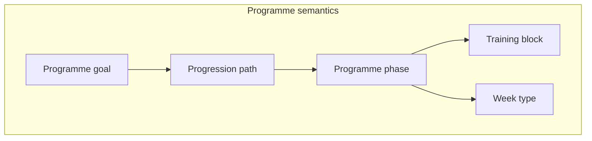

# Programme Semantics v1

Phase 3 Sprint 6 — how **capabilities** and **training intents** evolve over time inside a programme, without calendars, sessions, or exercises.

## Semantic hierarchy

| Level | Purpose | Capability emphasis | Intent emphasis | Progression expectation |
|-------|---------|---------------------|-----------------|-------------------------|
| **Programme** | Long-horizon adaptation arc toward a **programme goal** | Derived from goal requirements + phase sequence | Derived from gap resolution + phase priorities | Follows a **progression path** (semantic, not dated) |
| **Macrocycle** | Full arc (e.g. foundation → competition → recovery) | Shifts by phase | Shifts by phase | Encoded as `programme_progression.yaml` paths |
| **Mesocycle** | **Training block** (e.g. aerobic base block, threshold block) | Block `primary_capability_ids` | Block `supported_training_intent_ids` | Entry/exit criteria on block |
| **Microcycle** | **Week type** (accumulation, intensification, …) | Week `capability_emphasis_ids` | Week `intent_emphasis_ids` | Fatigue/recovery targets |
| **Week** | Container for microcycle emphasis (not scheduled here) | Inherited from week type + phase | Inherited from week type + phase | Compatible with active **programme phase** |
| **Session** | Single training unit (future layer) | Session intent + archetype | Platform `SessionIntent` (Sprint 6+ integration) | Out of scope for semantics YAML |



## Programme phases

Machine-readable: `knowledge/reference/programme_phases.yaml`

Ids: `cohort.programme_phase.*` — Foundation, General preparation, Specific preparation, Performance, Peak, Taper, Competition, Recovery, Transition, Deload.

Each phase declares:

- Typical duration range (weeks, semantic only)
- Capability and training intent **priority lists**
- Fatigue/recovery expectations
- Progression characteristics
- **Allowable next phases** (directed graph)

## Training blocks

`knowledge/reference/training_blocks.yaml` — mesocycle-scale reusable concepts (Aerobic base, Strength, Hypertrophy, Threshold, VO₂max, Race preparation, Recovery, Mixed development, Loaded carry).

## Week types

`knowledge/reference/week_types.yaml` — Accumulation, Intensification, Realisation, Deload, Assessment, Recovery.

## Progression model

`knowledge/reference/programme_progression.yaml` — ordered **steps** with:

- `recommended_duration_weeks_min` / `max`
- `rationale`
- `optional_alternate_phase_ids` (e.g. deload, transition)

Default path: `cohort.progression_path.competition_standard`.

Example sequence:

Foundation → General preparation → Specific preparation → Performance → Peak → Taper → Competition → Recovery

Alternate path: `cohort.progression_path.general_fitness` (shorter loop without peak/competition).

## Position in stack

```
Capability Gap Analysis → Training Intent Engine → Programme Semantics → Coach Brain → Session Generation
```

Sprint 6 implements the **Programme Semantics** box only (read-only).

## Read-only API

`ProgrammeSemanticsGraphReader` on `KnowledgeGraphReader` — see [Knowledge_Read_Seam_v1.md](./Knowledge_Read_Seam_v1.md).

## Version

Ontology **1.3.0**.
