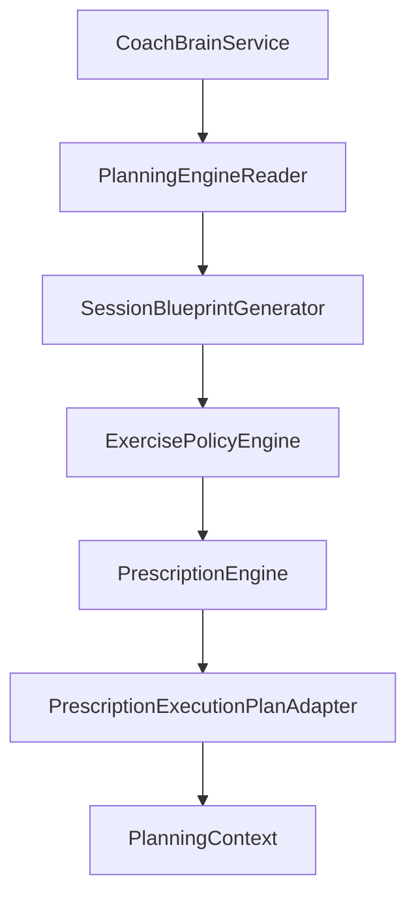

# Coach Brain orchestration v1

Phase 4 Sprint 5 — implements [ADR-024](../architecture/adrs/ADR-024-coach-brain-planning-orchestrator.md): **sequencing only**, no coaching science.

## Orchestration diagram

Engines do not depend on Coach Brain.

## PlanningContext

Immutable snapshot (`lib/planning/orchestration/models/planning_context.dart`):

| Field | Set after stage |
|-------|-----------------|
| `PlanningInput` | start |
| `PlanningRecommendation` | planning |
| `SessionBlueprint` | blueprint |
| `ExercisePolicyResult` | policy |
| `PrescriptionResult` | prescription |
| `SessionExecutionPlan` | adapter |

Also: `orchestrationStatus`, `stages`, `diagnostics`, `warnings`, `aggregatedExplainability`, `resumeFromStage`.

Each stage returns a **new** `PlanningContext` via `withStage` — no mutation.

## Stage model

`PlanningStageId`: planningEngine → sessionBlueprint → exercisePolicy → prescription → executionPlanAdapter.

`PlanningStageResult`: status (succeeded / partial / failed), timings, warnings, errors.

## Failure model

| Condition | Stop after | Status |
|-----------|------------|--------|
| `invalidInput` / infeasible recommendation | planning | invalidInput / failed |
| invalid / infeasible blueprint | blueprint | failed |
| invalidBlueprint / infeasible policy | policy | failed |
| invalid / infeasible prescription | prescription | failed |

Partial statuses continue with warnings where engines allow; final orchestration may be `partial` if any stage was partial.

## Explainability aggregation

`AggregatedOrchestrationExplainability` holds **references** to each engine’s explainability object unchanged. `sectionOrder` supports UI sections (Planning → Blueprint → Policy → Prescription). `combinedNarrative` concatenates stage narratives — not rewritten by LLM.

## Diagnostics

`PipelineDiagnostics`: `stageTimings`, `outcome`, `failedStageId`, `validationMessages` from `PlanningContextValidator`.

## Retry model (v1)

No automatic retries. On failure, `resumeFromStage` indicates where a future run could restart (last successful boundary). Caller must supply fresh inputs.

## Future hooks

- Coach override policies **before** planning (without moving formulas into Brain)  
- Adaptive loading injection at prescription stage only  
- Persistence / audit log of `PlanningContext`  
- Separate ADR-020 day-of adaptation handler (unchanged)

## Port

`CoachBrainOrchestrator.run(CoachBrainOrchestrationRequest)` — implemented by `CoachBrainService`.

Request bundles `PlanningInput`, optional `SessionBlueprintGenerationContext`, and policy context (equipment, environment, travel).

## Known limitations

- No persistence or scheduling  
- No LLM narrative synthesis  
- Resume/restart not implemented — metadata only  
- HYROX outdoor running may fail policy without environment/outdoors in request  

## Related docs

- [Planning_Engine_Implementation_v1.md](./Planning_Engine_Implementation_v1.md)  
- [Session_Blueprint_Implementation_v1.md](./Session_Blueprint_Implementation_v1.md)  
- [Exercise_Policy_Implementation_v1.md](./Exercise_Policy_Implementation_v1.md)  
- [Prescription_Engine_Implementation_v1.md](./Prescription_Engine_Implementation_v1.md)  
