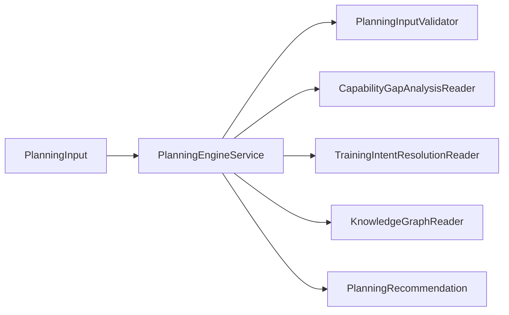

# Planning Engine implementation v1

Phase 4 Sprint 1 — implements [Planning_Engine_v1.md](../architecture/Planning_Engine_v1.md) contracts only. Architecture blueprint remains canonical.

## Service responsibilities

`PlanningEngineService` (`lib/planning/planning_engine_service.dart`):

- Validates `PlanningInput` via `PlanningInputValidator`
- Reuses or invokes **Capability Gap Analysis** and **Training Intent Resolution**
- Resolves programme **phase**, **block**, **week type**, and **session archetype** via **Programme Semantics** readers
- Applies deterministic **conflict policies**
- Builds **explainability** and **PlanningRecommendation** (ADR-026)

Does **not**: sessions, exercises, Coach Brain, persistence, scheduling.

## Dependency graph



Port: `PlanningEngineReader.createRecommendation` (sync).

## Planning flow

1. Validate input + ontology version  
2. Resolve gaps (supplied or computed)  
3. Resolve intents (supplied, computed, or goal fallback)  
4. Resolve phase  
5. Resolve block  
6. Resolve week type  
7. Apply conflict policies  
8. Resolve session archetype  
9. Assign status + confidence + narrative  

## Phase resolution policy

Precedence:

1. `policyOverrides.forceProgrammePhaseId`
2. `activeProgrammePhaseId` when valid
3. Progression path step index from default or `progressionPathId`:
   - unknown ratio ≥ 0.5 → step 0
   - critical blockers → step 0
   - zero gaps → later step (~performance index)
   - gap count thresholds → GPP/SPP indices
4. Goal default phase map (HYROX → SPP, fat loss/military → GPP)
5. Foundation fallback when unknown/blockers conflict with default

No calendar dates.

## Block scoring

For each candidate from `recommendedBlocks(phaseId)`:

```
score = Σ (gap.priorityScore × 2) for primary capability match
      + Σ (gap.priorityScore × 1) for secondary capability match
      + 0.5 if block supports top training intent id
```

Sort: score desc, then `block.id` asc.

Explicit active block preserved when `suitable_programme_phase_ids` contains phase; otherwise warning + rescored selection.

## Week-type policy

Precedence:

1. Policy override / explicit week type (when phase-compatible)
2. Poor recovery → recovery week (or deload)
3. Unknown ratio ≥ 0.5 on required goal capabilities → assessment
4. Foundation/GPP → accumulation
5. Peak → realisation
6. Performance/SPP → intensification
7. First compatible week for phase, else accumulation fallback

## Archetype resolution

1. Poor recovery → `cohort.session_archetype.recovery_session` when available
2. Else candidates = intent `common_session_archetype_ids` ∪ `archetypesForIntent`
3. Score = `intent.priorityScore × (1.0 if on intent list else 0.85)`
4. Tie-break: score desc, archetype id asc

## Conflict policies (initial)

| Policy | Effect |
|--------|--------|
| Poor recovery | Recovery week + recovery archetype |
| Critical blockers + peak phase | Warning factor |
| Injury flags | Constraint + explainability factor |
| Injury + competition phase | Status `infeasible` |
| Explicit phase/block | Outrank inferred unless incompatible block |

## Recommendation statuses

| Status | Semantics |
|--------|-----------|
| `complete` | Phase, block, week, intents, archetype resolved; unknown ratio < 0.5 |
| `partial` | Valid strategy but missing block/archetype or unknown ratio ≥ 0.5 |
| `insufficientEvidence` | Unknown ratio ≥ 0.75 and no intents |
| `infeasible` | Hard constraint conflict (e.g. injury at competition phase) |
| `invalidInput` | Validation failure |

## Explainability

Factors use layers: `goal`, `evidence`, `capability_gap`, `training_intent`, `programme_semantics`, `planning_policy`.

Metadata `source`: `supplied` | `computed` | `computed_goal_fallback` on gap/intent factors.

Narrative = concatenation of factor summaries by layer order (deterministic templates).

## Known limitations

- Goal fallback intents use mapping suitability only (no gap weighting)
- Progression path step index is heuristic (not athlete history)
- No fatigue load engine — recovery is input enum only
- Block scoring ignores entry/exit criteria strings
- No Coach Brain policy overrides beyond `PlanningPolicyOverrides`

## Extension strategy

- Add policies as explainability factors, not hidden branches
- Version `PlanningRecommendation` via `ontologyVersion` + future `contractVersion`
- Wire Coach Brain handler to call `PlanningEngineReader` without moving merge logic

## Tests

`test/planning/planning_engine_service_test.dart` — scenarios + edge cases.

Run: `flutter test test/planning/ test/knowledge/`
