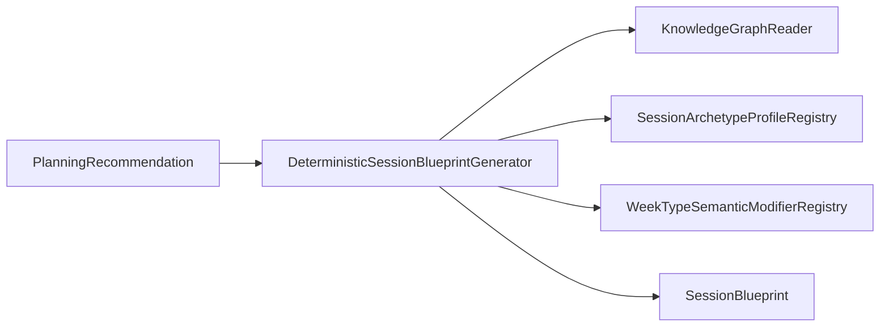

# Session Blueprint implementation v1

Phase 4 Sprint 2 — implements [ADR-027](../architecture/adrs/ADR-027-session-blueprint-contract.md) and extends [Planning_Engine_Implementation_v1.md](./Planning_Engine_Implementation_v1.md).

Canonical architecture remains [Planning_Engine_v1.md](../architecture/Planning_Engine_v1.md).

## Separation from execution models

| Layer | Model | Contains |
|-------|--------|----------|
| Planning | `PlanningRecommendation` | Phase, block, week type, intents, archetype |
| **Blueprint (this sprint)** | `SessionBlueprint` | Semantic session shape, no movements |
| Exercise policy (future) | `SessionExecutionPlan` / player | Exercises, sets, loads, steps |

`SessionIntent` (adaptation vocabulary) and `SessionExecutionPlan` (Workout Player) are **not** embedded in `SessionBlueprint`. Blueprint uses knowledge **training intent ids** and **session archetype ids** only.

## SessionBlueprint contract

Location: `lib/planning/session_blueprint/models/session_blueprint.dart`

Describes **why** (objective, adaptations), **what** (archetype, intents, capabilities), **how hard / how much / how dense** (semantic bands), **structure** (components), and **downstream policy** (constraints, substitution tags).

Explicit exclusions enforced by model shape: no exercise ids, prescriptions, calendar dates, or workout steps.

## Generator responsibilities

`DeterministicSessionBlueprintGenerator`:

1. Validates recommendation + ontology version  
2. Preserves planning selections (phase, block, week type, archetype, primary intent)  
3. Maps capability priorities → desired adaptations (no gap recomputation)  
4. Applies archetype semantic profile + week-type modifiers + constraint policies  
5. Builds structural components and explainability  
6. Returns `SessionBlueprint` with status  

Does **not** call `PlanningEngineService`, Coach Brain, YAML loaders, or exercise catalogues.

Port: `SessionBlueprintGenerator.generate(PlanningRecommendation, {SessionBlueprintGenerationContext})`.

Optional context carries recovery/equipment/environment not present on `PlanningRecommendation`.

## Dependency graph

## Semantic intensity model

`SemanticIntensityLevel`: restorative → maximal + `variable`.

Optional `SemanticDomainEmphasis` (aerobic, threshold, maximalStrength, etc.).

Adjusted via week-type deltas and recovery caps (`cap()`), never %1RM / pace / HR.

## Semantic volume model

`SemanticVolumeLevel`: minimal → veryHigh.

Optional `SemanticVolumeDescriptor` (extended duration, repeated exposure, etc.).

No minutes, km, sets, or reps.

## Semantic density model

`SemanticDensityLevel`: sparse → variable.

Describes work–recovery character for a future prescription layer, not intervals.

## Structural components

`SessionStructuralComponent` with ordered `sequence`, `SessionStructuralComponentType`, emphasis, optionality, fatigue contribution, targeted capabilities, and associated intents.

Built from archetype profile templates; assessment/recovery weeks inject required components; deload/realisation strip optional high-fatigue pieces.

## Archetype profiles

Isolated table: `lib/planning/session_blueprint/session_archetype_semantic_profiles.dart`

Covers all nine ontology archetypes (`long_easy_run` … `mixed_engine`).

Future migration: move profile fields into `session_archetypes.yaml` metadata.

## Week-type modifiers

`lib/planning/session_blueprint/week_type_semantic_modifiers.dart`

| Week type | Effect (summary) |
|-----------|------------------|
| Accumulation | +volume, primary emphasis |
| Intensification | +intensity, −volume |
| Realisation | +intensity, −volume, strip optional high fatigue |
| Deload | −intensity/volume/density, strip optional high fatigue |
| Assessment | assessment component + integrity tag |
| Recovery | −intensity/volume/density, recovery component |

## Constraint propagation

Planning `PlanningConstraint` → `SessionConstraint` with semantic consequence text.

Context `PlanningRecoverySummary.poor` → caps intensity/volume/density + `fatigueReduced` tag.

Injury → `lowImpactRequired`, optional `noOverheadLoading`; may warn on high-fatigue archetypes without changing archetype.

## Substitution policy tags

`SessionSubstitutionPolicyTag` enum — inputs for Exercise Policy Engine only (no substitute exercises).

## Status semantics

| Status | Meaning |
|--------|---------|
| `complete` | Core semantic fields + structure resolved |
| `partial` | Valid blueprint; missing supporting intents or optional structure |
| `infeasible` | Planning recommendation infeasible — blueprint not offered as executable |
| `invalidRecommendation` | Ontology mismatch, intent/archetype incompatibility, invalid planning status |

Ordinary outcomes are returned, not thrown.

## Explainability

Layers: planningRecommendation, sessionObjective, desiredAdaptation, archetype, intensity, volume, density, structure, constraintPolicy, substitutionPolicy.

Template narrative (no LLM).

## Validation

`SessionBlueprintValidator` — recommendation + blueprint checks.

`SessionBlueprintContract.assertNoPrescriptionContent` — audits string fields for forbidden prescription patterns.

## No-prescription invariant

Types exclude exercise and prescription fields by design; contract test guards narrative/component text.

## Known limitations

- Archetype profiles are code-local, not yet in ontology YAML.  
- Recovery must often be supplied via `SessionBlueprintGenerationContext` (not on `PlanningRecommendation`).  
- Supporting intents capped at two; block compatibility uses `supportedTrainingIntentIds` when present.  
- Time constraint only reduces semantic volume one step.  

## Future handoff — Exercise Policy Engine (Phase 4 Sprint 3+)

Coach Brain (future):

`PlanningEngineReader.createRecommendation` → `SessionBlueprintGenerator.generate` → accept/reject/alternate at recommendation level.

Exercise Policy: `SessionBlueprint` → movement selection preserving tags and structural components.

## Coach Brain preparation

Generator is stateless and immutable-output friendly; Coach Brain must not mutate blueprints in place — request a new recommendation if strategy changes.
